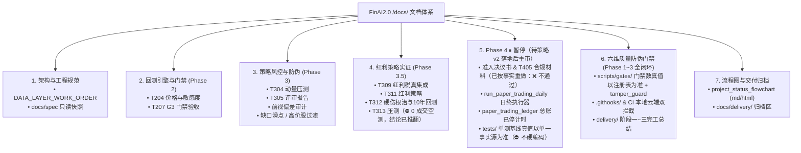

# FinAI2.0 · 文档全景导航索引（Documentation Index）

> 更新日期：2026-09-10  
> 对应项目版本：Phase 0~3.5 与门禁体系完成；Colab 云端链路验收；T312 全周期诊断完成（P0=仓位不足）；**Phase 4 ⏸ 暂停，待策略 v2 落地后重审**；基线**真值以 `scripts/gates/constants.py` 的 `TEST_BASELINE_PASSED` 为单一事实源（⛔ 不硬编码具体数值）**
> 外部计划与理论权威：`D:\Projects\research-finai\`（00–17 号报告 + `specs\001-a-stock-longonly-daily-quant\`）

---

> **✅ 2026-09-10 批注（M4' 口径统一后更新）**：`docs/compliance/` 全套报备材料与 `docs/T312_FINAL_SUMMARY.md`、`docs/t313_dividend_stress_report.md`、`docs/delivery/PHASE4_ADMISSION_RESOLUTION.md` 中的结论性数字**已按权威产物 `experiments/runs/20260907-150402-t312-dividend-v1-noseed.json` 逐项更正并复跑 `G-DOC-1` / `G-REF-1`**（详见各文件顶部状态横幅与 [`audit/roadmap_decision.md`](audit/roadmap_decision.md) §5）。**Phase 4 状态统一为「⏸ 暂停，待策略 v2 落地后重审」**。⛔ 仍不可提交的部分：① 权威产物回撤超限（实测 43.08% 高于 35% 上限，`G-MDD-1` FAIL）；② T313「压力测试」为 0 成交空测；③ 引用动量/T304/T305 结论的 5 份文档在 `experiments/runs/` 无对应机读产物，已加 `gate-doc-void` 标记并登记于 [`audit/void_documents.md`](audit/void_documents.md)。

## 快速导航分类

---

## 一、 架构与工程规范（地基与红线）

| 文档 | 说明 | 对应阶段 / 编号 |
|---|---|---|
| [`engineering/DATA_LAYER_WORK_ORDER.md`](engineering/DATA_LAYER_WORK_ORDER.md) | **数据层最高工程红线与工单**：复权口径显式化、停牌过滤、凭据统一管理 | Phase 0–1 |
| [`spec/001-a-stock-longonly-daily-quant/`](spec/001-a-stock-longonly-daily-quant/) | 计划仓 spec/plan/tasks 的**只读镜像快照**（防挪走失锚，权威在 research-finai） | 全生命周期 |
| [`compliance/`](compliance/) | 个人程序化交易合规报备材料留痕目录 | 合规硬门禁 |

---

## 二、 回测引擎核心设计与门禁（Phase 2）

| 文档 | 说明 | 对应阶段 / 编号 |
|---|---|---|
| [`../backtest/T201_design.md`](../backtest/T201_design.md) | 事件驱动回测引擎核心架构设计：七态状态机、双账本、撮合 8 规则 | T201 |
| [`t204_price_model_sensitivity.md`](t204_price_model_sensitivity.md) | 价格模型显式声明与 3 口径 × 3 滑点档敏感度对比分析报告 | T204 |
| [`t204_sensitivity_curve.svg`](t204_sensitivity_curve.svg) | 敏感度九宫格净值对比曲线矢量图 | T204 |
| [`t207_g3_gate_acceptance.md`](t207_g3_gate_acceptance.md) | **G3 门禁验收报告**：5 必挂用例全绿 + 成本六科目逐项分厘核对 | T207 (G3) |

---

## 三、 策略研发、风控防伪与评审（Phase 3）

| 文档 | 说明 | 对应阶段 / 编号 |
|---|---|---|
| [`t304_stress_report.md`](t304_stress_report.md) | 2015 股灾与 2018 熊市极端跨区间压力测试报告（动量策略致命缺陷实证） | T304 |
| [`t305_technical_review.md`](t305_technical_review.md) | **G4 门禁技术评审报告**：动量候选策略淘汰与红利策略方向转型决策 | T305 (G4) |
| [`phase35_recommendation.md`](phase35_recommendation.md) | Phase 3.5 红利策略切换实施方案与 G4.5 门禁准入标准 | Phase 3.5 |
| [`bias_audit_report.md`](bias_audit_report.md) | **零前视偏差与幸存者偏差深度审计报告**（代码路径与时序逐项核查） | T306 |
| [`gap_slippage_model.md`](gap_slippage_model.md) | 隔夜 ±3%/±5% 跳空缺口非线性滑点模型与压测规范 | T307 / T310 |
| [`high_price_exclusion.md`](high_price_exclusion.md) | 高价股排除机制（max_price ≤ 300 元）集中度与整手风控设计 | T308 |
| [`momentum_backtest_summary.md`](momentum_backtest_summary.md) | 动量策略全周期回测总结与淘汰分析 | T302–T305 |

---

## 四、 红利策略实证、硬伤根治与回测（Phase 3.5）

| 文档 | 说明 | 对应阶段 / 编号 |
|---|---|---|
| [`t309_dividend_tax_summary.md`](t309_dividend_tax_summary.md) | 财税〔2015〕101号红利税模块 FIFO 持股期扣税实现总结 | T309 |
| [`T310_completion_summary.md`](T310_completion_summary.md) | 跳空缺口滑点压力测试 26 单测全绿完工总结 | T310 |
| [`T311_COMPLETION_SUMMARY.md`](T311_COMPLETION_SUMMARY.md) | 红利策略核心实现与 MA200 择时接入完工总结 | T311 |
| [`t311_dividend_strategy_acceptance.md`](t311_dividend_strategy_acceptance.md) | 红利策略单测与端到端模拟验收报告 | T311 |
| [`t312_dividend_strategy.md`](t312_dividend_strategy.md) | 红利策略回测执行规格与参数定义书 | T312 |
| [`t312_implementation_summary.md`](t312_implementation_summary.md) | 红利股数据采集管道与回测链路实施总结 | T312 |
| [`T312_FINAL_SUMMARY.md`](T312_FINAL_SUMMARY.md) | **T312 最终完工总结**（已按权威产物更正数字）：四大底层硬伤彻底根治 + 凭据脚本 5/5 PASS + 真实 10 年回测落盘；⛔ 回撤超限未达准入 | T312 |
| [`t313_dividend_stress_report.md`](t313_dividend_stress_report.md) | **G4.5 门禁压力测试报告**：⛔ 0 成交空测，原「空仓避险实证 / G4.5 通过」结论**已推翻**（保留留痕） | T313 (G4.5) |
| [`diagnosis/t312_full_period_diagnosis.md`](diagnosis/t312_full_period_diagnosis.md) | **T312 全周期诊断（2026-09-10 云端）**：分年度 vs 300/512890、红利税 51.8%、空仓 54.7%、日均持仓 0.5–1.8（P0 仓位不足） | 诊断 |

---

## 五、 模拟盘运行与合规报备（Phase 4 ⏸ 暂停，待策略 v2 落地后重审）

| 文档 / 路径 | 说明 | 对应阶段 / 编号 |
|---|---|---|
| [`delivery/PHASE4_ADMISSION_RESOLUTION.md`](delivery/PHASE4_ADMISSION_RESOLUTION.md) | **Phase 4 准入决议书**：⛔ 原「准予准入」结论**已撤回**；Phase 4 现为 ⏸ 暂停（保留留痕） | Phase 4 准入 |
| [`compliance/strategy_description_template.md`](compliance/strategy_description_template.md) | **程序化交易策略说明书**（锁定 commit `4878ffe`、T312 10 年回测与单测基线） | T405 (FR-COMP-1) |
| [`compliance/system_architecture_template.md`](compliance/system_architecture_template.md) | **程序化交易系统架构说明书**（披露六层物理架构与六维防伪门禁，数量真值以注册表为准；已按实现更正 ST/参与率/告警/基线口径） | T405 (FR-COMP-1) |
| [`compliance/filing_checklist.md`](compliance/filing_checklist.md) | **程序化交易报备材料清单**（7 项必须项核验与报备时间表） | T405 (FR-COMP-1) |
| [`compliance/T405_COMPLIANCE_AUDIT.md`](compliance/T405_COMPLIANCE_AUDIT.md) | **T405 合规审计报告**（⛔ 已重做为 ❌ 不通过；原「100% PASS 终审签署」已撤回） | T405 (FR-COMP-1) |
| [`docs/paper_trading/paper_trading_ledger.md`](file:///D:/Projects/FinAI2.0/docs/paper_trading/paper_trading_ledger.md) | **模拟盘 6 个月运行跟踪总账**（T406 每日流水、对账状态与防篡改签名留痕） | T406 (G5 前半) |
| [`../scripts/run_paper_trading_daily.py`](../scripts/run_paper_trading_daily.py) | **模拟盘日终自动化执行器**（支持状态推进、双账本自对账与防篡改验签） | Phase 4 执行主干 |
| [`../tests/test_t405_compliance_and_paper_e2e.py`](../tests/test_t405_compliance_and_paper_e2e.py) | **Phase 4 合规材料与端到端自动化测试套件**（8 单测全绿） | T405 / T406 验证 |
| [`t401_paper_trading_design.md`](t401_paper_trading_design.md) | 模拟盘执行器架构设计（回测与实盘同构桥） | T401 |
| [`t402_deviation_tolerance.md`](t402_deviation_tolerance.md) | **回测-模拟偏差容忍带量化体系**（NAV/收益/换手/成交价/滑点 5 指标） | T402 |
| [`t403_daily_tasks.md`](t403_daily_tasks.md) | 模拟盘日终自动化任务（对账、净值核算、报表渲染）设计 | T403 |
| [`t404_ledger_automation.md`](t404_ledger_automation.md) | 14 号易变数据台账保鲜与到期提醒自动化调度器设计与验收 | T404 |

---

## 六、 六维质量防伪门禁系统（Phase 1 ~ Phase 3 全闭环交付件）

| 路径 / 文档 | 说明 | 对应阶段 / 类别 |
|---|---|---|
| [`../scripts/gates/`](../scripts/gates/) | **六维质量防伪门禁包**：D-L-E-A-S-G 全六维 28 项机读门禁与调度器 `gate_master_audit.py` | Phase 1~3 |
| [`../scripts/gates/tamper_guard.py`](../scripts/gates/tamper_guard.py) | **防伪硬化与防篡改签名引擎**：SHA-256 结构化验签、tasks 证据验签与镜像比对 | Phase 3 (T-GATE-P3) |
| [`../scripts/hooks/`](../scripts/hooks/) & [`.githooks/`](../.githooks/) | **本地 Git Hooks 拦截体系**：pre-commit（370行+tasks+产物验签）与 pre-push（760 单测基线硬拦截，2026-09-10 实测） | Phase 3 (T-GATE-P3) |
| [`../scripts/install_hooks.py`](../scripts/install_hooks.py) | **Git 门禁钩子一键装配工具**：支持 `--verify` 自动化核验与状态自愈 | Phase 3 (T-GATE-P3) |
| [`../.github/workflows/ci.yml`](../.github/workflows/ci.yml) | **云端 GitHub Actions CI 防伪流水线**：370 行守卫+5/5 防伪审计+门禁总检+单测全绿 | Phase 3 (T-GATE-P3) |
| [`../scripts/gates/runner.py`](../scripts/gates/runner.py) | **执行流前置/后置闸门运行器**：`run_pre_run_gates` 与 `run_post_run_gates` | Phase 2 (T-GATE-P2) |
| [`../scripts/run_dividend_backtest.py`](../scripts/run_dividend_backtest.py) | **回测主流程门禁挂接**：前置/后置闸门嵌入，Fail-Closed 阻断与 `--no-gates` 选项 | Phase 2 (T-GATE-P2) |
| [`../tests/test_gates.py`](../tests/test_gates.py) | **门禁自动化单测套件**（52 个单测 100% 全绿覆盖 PASS/FAIL 阻断/边界） | 测试闭环 |
| [`../tests/test_gate_integration.py`](../tests/test_gate_integration.py) | **执行流集成测试套件**（18 个单测验证合规全通与违规精准拦截） | 集成验证 |
| [`../tests/test_gate_p3_hardening.py`](../tests/test_gate_p3_hardening.py) | **阶段三防伪硬化单测套件**（18 个单测验证签名、篡改拦截、tasks 验签与钩子逻辑） | 硬化测试 |
| [`delivery/GATE_PHASE1_COMPLETION_SUMMARY.md`](delivery/GATE_PHASE1_COMPLETION_SUMMARY.md) | **阶段一完工交付验收总结**：阶段一当时 23 项门禁实现全景、散户约束映射与阶段一基线证明　（历史时点快照 → 门禁数/基线真值以单一事实源为准） | 阶段交付归档 |
| [`delivery/GATE_PHASE2_COMPLETION_SUMMARY.md`](delivery/GATE_PHASE2_COMPLETION_SUMMARY.md) | **阶段二完工交付验收总结**：前置/后置闸门植入、Fail-Closed 机制与阶段二基线证明　（历史时点快照 → 门禁数/基线真值以单一事实源为准） | 阶段交付归档 |
| [`delivery/GATE_PHASE3_COMPLETION_SUMMARY.md`](delivery/GATE_PHASE3_COMPLETION_SUMMARY.md) | **阶段三完工交付验收总结**：CI/Git Hooks 硬拦截、防篡改验签与阶段三基线证明　（历史时点快照 → 门禁数/基线真值以单一事实源为准） | 阶段交付归档 |
| [`delivery/gate_phase1_test_output.txt`](delivery/gate_phase1_test_output.txt) | 全库 681 passed in 21.01s 完整控制台单测执行日志真实物理落盘 | 真实物理留痕 |
| [`delivery/gate_phase2_test_output.txt`](delivery/gate_phase2_test_output.txt) | 全库 699 passed in 18.82s 完整控制台单测执行日志真实物理落盘 | 真实物理留痕 |
| [`delivery/gate_audit_report.json`](delivery/gate_audit_report.json) | 调度器 `gate_master_audit.py` 导出的机读 JSON 审计报告 | 机器签名留痕 |

---

## 七、 状态流程图与交付归档

| 文档 / 路径 | 说明 |
|---|---|
| [`project_status_flowchart.md`](project_status_flowchart.md) | **系统全生命周期 Markdown 状态流程图**（Mermaid 渲染，含阶段一与阶段二完工 699 passed 节点） |
| [`project_status_flowchart.html`](project_status_flowchart.html) | **系统交互式状态流程图**（纯前端原生，浏览器可直接打开查看） |
| [`delivery/`](delivery/) | 阶段完工总结文本、就绪执行清单与单测输出文本归档区 |
