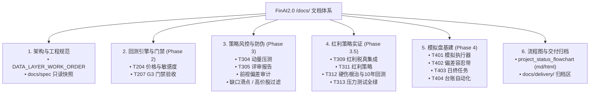

# FinAI2.0 · 文档全景导航索引（Documentation Index）

> 更新日期：2026-09-07  
> 对应项目版本：Phase 0~Phase 3.5 完成，基线 629 passed 全绿  
> 外部计划与理论权威：`D:\Projects\research-finai\`（00–17 号报告 + `specs\001-a-stock-longonly-daily-quant\`）

---

## 快速导航分类

---

## 一、 架构与工程规范（地基与红线）

| 文档 | 说明 | 对应阶段 / 编号 |
|---|---|---|
| [`engineering/DATA_LAYER_WORK_ORDER.md`](engineering/DATA_LAYER_WORK_ORDER.md) | **数据层最高工程红线与工单**：复权口径显式化、停牌过滤、凭据统一管理 | Phase 0–1 |
| [`spec/001-a-stock-longonly-daily-quant/`](spec/001-a-stock-longonly-daily-quant/) | 计划仓 spec/plan/tasks 的**只读镜像快照**（防挪走失锚，权威在 research-finai） | 全生命周期 |
| [`compliance/`](compliance/) | 个人程序化交易合规报备材料留痕目录 | 合规硬门禁 |

---

## 二、 回测引擎核心设计与门禁（Phase 2）

| 文档 | 说明 | 对应阶段 / 编号 |
|---|---|---|
| [`../backtest/T201_design.md`](../backtest/T201_design.md) | 事件驱动回测引擎核心架构设计：七态状态机、双账本、撮合 8 规则 | T201 |
| [`t204_price_model_sensitivity.md`](t204_price_model_sensitivity.md) | 价格模型显式声明与 3 口径 × 3 滑点档敏感度对比分析报告 | T204 |
| [`t204_sensitivity_curve.svg`](t204_sensitivity_curve.svg) | 敏感度九宫格净值对比曲线矢量图 | T204 |
| [`t207_g3_gate_acceptance.md`](t207_g3_gate_acceptance.md) | **G3 门禁验收报告**：5 必挂用例全绿 + 成本六科目逐项分厘核对 | T207 (G3) |

---

## 三、 策略研发、风控防伪与评审（Phase 3）

| 文档 | 说明 | 对应阶段 / 编号 |
|---|---|---|
| [`t304_stress_report.md`](t304_stress_report.md) | 2015 股灾与 2018 熊市极端跨区间压力测试报告（动量策略致命缺陷实证） | T304 |
| [`t305_technical_review.md`](t305_technical_review.md) | **G4 门禁技术评审报告**：动量候选策略淘汰与红利策略方向转型决策 | T305 (G4) |
| [`phase35_recommendation.md`](phase35_recommendation.md) | Phase 3.5 红利策略切换实施方案与 G4.5 门禁准入标准 | Phase 3.5 |
| [`bias_audit_report.md`](bias_audit_report.md) | **零前视偏差与幸存者偏差深度审计报告**（代码路径与时序逐项核查） | T306 |
| [`gap_slippage_model.md`](gap_slippage_model.md) | 隔夜 ±3%/±5% 跳空缺口非线性滑点模型与压测规范 | T307 / T310 |
| [`high_price_exclusion.md`](high_price_exclusion.md) | 高价股排除机制（max_price ≤ 300 元）集中度与整手风控设计 | T308 |
| [`momentum_backtest_summary.md`](momentum_backtest_summary.md) | 动量策略全周期回测总结与淘汰分析 | T302–T305 |

---

## 四、 红利策略实证、硬伤根治与回测（Phase 3.5）

| 文档 | 说明 | 对应阶段 / 编号 |
|---|---|---|
| [`t309_dividend_tax_summary.md`](t309_dividend_tax_summary.md) | 财税〔2015〕101号红利税模块 FIFO 持股期扣税实现总结 | T309 |
| [`T310_completion_summary.md`](T310_completion_summary.md) | 跳空缺口滑点压力测试 26 单测全绿完工总结 | T310 |
| [`T311_COMPLETION_SUMMARY.md`](T311_COMPLETION_SUMMARY.md) | 红利策略核心实现与 MA200 择时接入完工总结 | T311 |
| [`t311_dividend_strategy_acceptance.md`](t311_dividend_strategy_acceptance.md) | 红利策略单测与端到端模拟验收报告 | T311 |
| [`t312_dividend_strategy.md`](t312_dividend_strategy.md) | 红利策略回测执行规格与参数定义书 | T312 |
| [`t312_implementation_summary.md`](t312_implementation_summary.md) | 红利股数据采集管道与回测链路实施总结 | T312 |
| [`T312_FINAL_SUMMARY.md`](T312_FINAL_SUMMARY.md) | **T312 最终完工总结**：四大底层硬伤彻底根治 + 自动化防伪审计 5/5 PASS + 真实 10 年回测落盘 | T312 |
| [`t313_dividend_stress_report.md`](t313_dividend_stress_report.md) | **G4.5 门禁压力测试报告**：红利策略在股灾/熊市 MA200 100% 空仓保命避险实证 | T313 (G4.5) |

---

## 五、 模拟盘基建就绪（Phase 4）

| 文档 | 说明 | 对应阶段 / 编号 |
|---|---|---|
| [`t401_paper_trading_design.md`](t401_paper_trading_design.md) | 模拟盘执行器架构设计（回测与实盘同构桥） | T401 |
| [`t402_deviation_tolerance.md`](t402_deviation_tolerance.md) | **回测-模拟偏差容忍带量化体系**（NAV/收益/换手/成交价/滑点 5 指标） | T402 |
| [`t403_daily_tasks.md`](t403_daily_tasks.md) | 模拟盘日终自动化任务（对账、净值核算、报表渲染）设计 | T403 |
| [`T403_COMPLETION_REPORT.md`](T403_COMPLETION_REPORT.md) | T403 日终任务与报表生成器交付报告 | T403 |
| [`t404_ledger_automation.md`](t404_ledger_automation.md) | 14 号易变数据台账保鲜与到期提醒自动化调度器设计与验收 | T404 |

---

## 六、 状态流程图与交付归档

| 文档 / 路径 | 说明 |
|---|---|
| [`project_status_flowchart.md`](project_status_flowchart.md) | **系统全生命周期 Markdown 状态流程图**（Mermaid 渲染） |
| [`project_status_flowchart.html`](project_status_flowchart.html) | **系统交互式状态流程图**（纯前端原生，浏览器可直接打开查看） |
| [`delivery/`](delivery/) | 阶段完工总结文本、就绪执行清单与单测输出文本归档区 |
