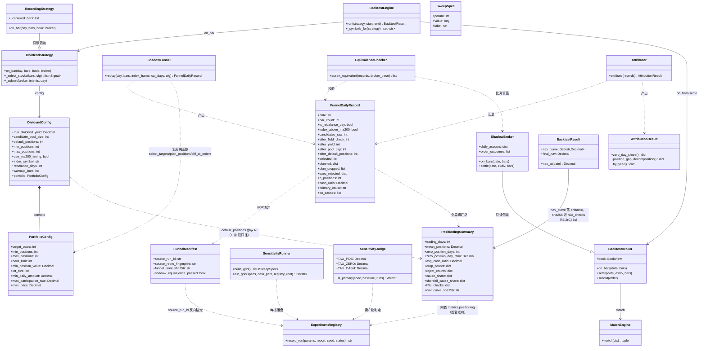
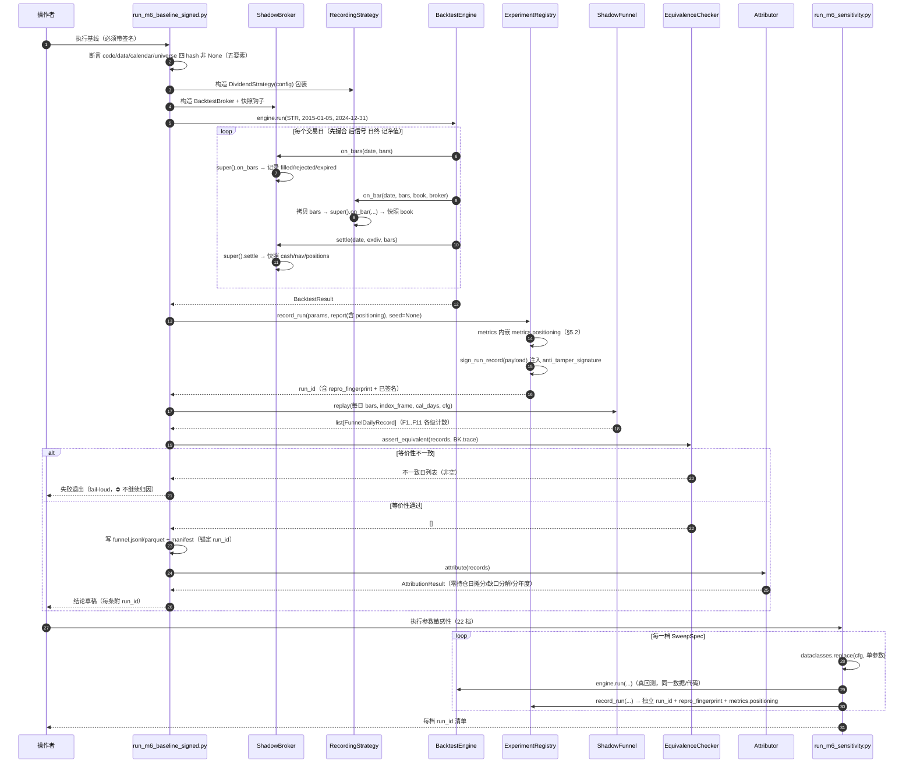
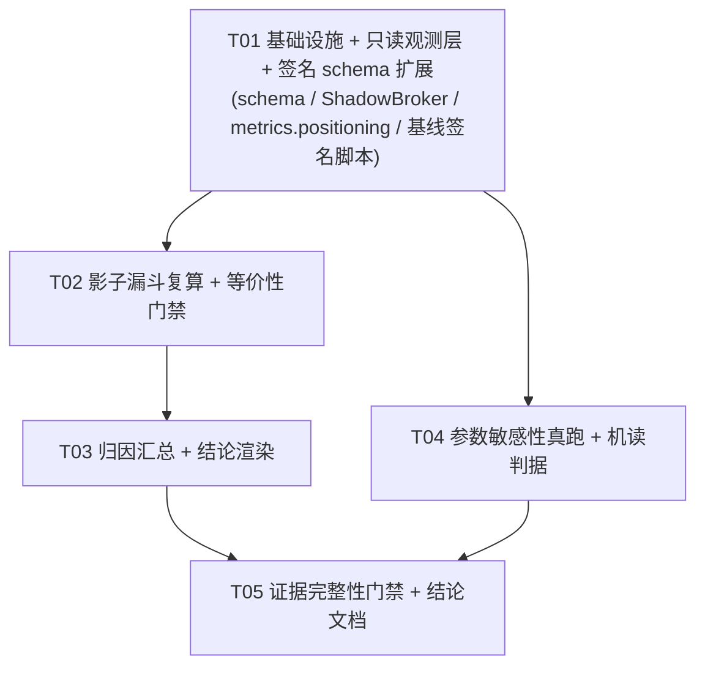

# M6 归因实验设计 —— 红利策略「建不满仓」的逐环节拆解

> 撰写人：高见远（架构师）　日期：2026-09-11　任务：M6（`roadmap_decision.md` §7）
> 性质：**只读设计文档**。⛔ 未修改任何代码 / 数据 / 测试，⛔ 未执行回测，⛔ 未 commit。
> 事实基座（仅此两处，且**只取非结论性原始读数**）：
> - `experiments/runs/20260907-150402-t312-dividend-v1-noseed.json`（权威产物，`anti_tamper_signature=055cb1d6…82d5`）
> - `docs/diagnosis/t312_full_period_diagnosis.md`（其 `metrics` 部分已核实与产物一致）
>
> 本文不含任何**推算收益**、不引用任何旧 md 的结论性数字。所有代码级结论均带 `文件:行号`。

---

## 0. 一句话目标与纪律

**目标**：把诊断报告的三个现象——「零持仓日 54.7%」「日均持仓 0.5–1.8 只（契约目标 5）」「平均现金占比 65.4%」——**精确摊分到"候选→持仓"漏斗的每一个环节**，并给出**可机读、可复现**的归因判据；**本阶段不改任何参数值**（`roadmap_decision.md` §3 第 3 条：没有归因就改参数 = 用新猜测替换旧猜测）。

**三条纪律**（贯穿全文）：
1. **无证据不下结论**：任何环节的贡献占比，只能来自 `experiments/runs/*.json`（带签名）+ 其派生的、带 `repro_fingerprint` 指纹链的漏斗轨迹文件；⛔ 不得用手工统计 / 估算值 / 旧文档数字。
2. **不碰 `finai/sources/`**（370 行 `FINDING-` 守卫），本设计不需要该目录任何改动。
3. **只读设计**：本文列出的所有代码改动**只列清单，不实现**。

### 0.1 ⚠️ 必须先登记的证据缺口（本设计的第一优先事项）

| 现象 | 权威产物里有吗？ | 现实来源 |
|---|---|---|
| 总收益 −27.72% / CAGR −3.20% / MDD 43.08% / 胜率 28.21% / 换手 201.14% / 往返 78 | ✅ 有（`metrics`） | 权威产物 |
| **零持仓日 54.7% / 平均现金占比 65.4% / 日均持仓 0.5–1.8 只** | ❌ **没有** | 仅来自 `scripts/diagnose_t312_full_period.py` 的 `RecordingBroker`（`diagnose_t312_full_period.py:53-66`），该脚本**只写 md、不落签名产物** |

**含义**：驱动整个 M6 的三个核心病象，**目前没有任何带 `anti_tamper_signature` 的机读产物背书**——它们只存在于一份人写的 md 里。这不是说数字错（`roadmap_decision.md` 已认其与产物"同源"），而是说：**在把它们当作归因起点之前，M6 的第一步必须先用一条真实回测路径把这三个数重新落成签名产物**，否则整个归因链的第一环就是"人眼背书"。→ 已写入 §5 的 C-01 改动项（**C-01 必须扩展产物 schema**，§5 已补）。

> ⚠️ **本条已由主理人实测复核**：`20260907-150402-*.json` 的 `metrics` 恰含 20 个键
> （`annual_turnover … win_rate`），**其中不含任何持仓/现金语义的键**。⇒ 结论成立：这三个数只在 md 里。

### 0.2 红线自违背的范围界定（⚠️ 四分类，⛔ 不混计）

`README.md:62`（核心红线 5）逐字为：

> **死代码与参数生效**：开启特性必须在账本产生有效流水，**组合打分必须真实决定资金权重**。

**⚠️ 关键区分（主理人指正后确立，直接影响归因优先级）**：「参数不生效」**不是一类**——按「补上/改掉之后**本次回测结果会不会变**」必须**分成四类**，⛔ 不得合并成一个「踩红线数量」：

| 类 | 定义 | 补上/改掉是否改变本次结果 | 对 M6 归因的地位 |
|---|---|---|---|
| **① `实际生效`** | 默认取值即改变输出（参数被引用且参与结果） | —（已生效） | 参与方 |
| **② `惰性（对结果无影响）`** | **任何合法取值下输出都不变** ⇒ 改/删皆不影响结果 | **不会改变** | ❌ **非主因**（噪声参数） |
| **③ `只校验不执行`** | 输出扫描不变，但语义要求「应被执行」而**全仓无该执行代码**（如「该补足仓位却没补」） | **会改变** | ⭐ **主因候选** |
| **④ `已接线但当前不可达`** | **存在某合法取值会改变输出，但当前取值不触发** | **不会改变**（改到触发点才会） | ❌ **非主因**（设计余量） |

**⚠️ ② 类须再细分（⛔ 性质不同 ⇒ 与红线 5 关系不同，不得合并计数）**：② 类内的 6 项**并非同一性质**——其中 3 项是**参数本身不产生效应**（违反「参数生效」），另 3 项是**代码分支恒假但属正确防御**（⛔ **不构成违反**）：

| 性质（分列，⛔ 不得合并） | 实际条目 | 数量 | 与 `README.md:62` 红线 5 的关系 | 应否修 |
|---|---|---|---|---|
| **参数不生效**（合法域内取值不影响输出） | `candidate_pool_size`、`max_positions`、`hard_limit` raise | **3** | ⚠️ **直接违反「参数生效」** | **删参数 或 接线** |
| **应有执行而无代码** | `min_positions` | **1** | ⚠️ **直接违反「参数生效」**（⭐ **主因候选**） | **补「补足到下限」逻辑** |
| **代码分支恒假，但属正确防御** | `F10a`、`F10b`、`F11`-停牌子分支 | **3** | ✅ **不构成违反**（**是正确设计**，非缺陷） | ⛔ **不该修** |
| **合法可达但当前不触发** | `target_count`、`max_participation_rate` | **2** | ✅ **非缺陷**（设计余量） | 预留，勿删 |

⇒ **违反红线 5「参数生效」= 前两类 = 3 + 1 = 4 项**（⛔ **不是 7**）；后两类共 5 项**仅登记、不算违反**。⚠️ 上一轮把 `3 + 1 + 3` 合并成「7 项违反」是**口径虚高**——第三类（F10a/F10b/F11-停牌子分支）是 portfolio 层的**纵深防御**（停牌不可建仓的真职责在引擎层撮合规则，`matching.py:179-180`），把它算进「违反」会让数字失真（§1.4-⑧）。

⇒ **红线 5「参数生效」的真实违反 = 「参数不生效」（3 项）+ 「应有执行而无代码」（1 项）= 4 项**（⛔ **不是 7**，见上表分列）；**「代码分支恒假但属正确防御」（3 项）与「合法可达但当前不触发」（2 项）合计 5 项均对红线合规或非缺陷**，⛔ 不得并入违反数。**可作主因候选的只有 `min_positions`（应有执行而无代码：补足逻辑缺失）**（§1.4-⑦）；「参数不生效」3 项虽亦违反红线，但**改/删均不改变本次结果 ⇒ 非主因**。

**⚠️ 主理人的关键指正（已采纳）**：`max_participation_rate`（`portfolio.py:156`）**原被本报告误归为「惰性」，实为 ④ 类**——`value = min(base, amount*rate)` 是**真接线**的拦截，只是 `min_daily_amount × rate = 5000万 × 5% = 250 万 ≫ 单笔 2~3 万` ⇒ 永不咬合。**区别的后果**：若误判为「死代码」，会把它列入「改掉就能提高仓位」的主因候选而**误导参数调整**；正确归类后它**明确不是主因**（改它不改变本次回测）。

**⚠️ 第二次更正（引入可操作判据后，§0.2.1）**：上一轮本报告曾把 ② 类**清空**（报「惰性 0」、全部挪进 ④），**这是过度修正**。按主理人给的可操作判据重算（**合法域取值扫描**）后——`candidate_pool_size`（扫 8/50/200 输出恒同，Σ₅₀ 被归一化约掉）应归 **②**、`hard_limit`（合法域 ≥8 下 `raise` 恒不触发）应归 **②**、F10a / F11-停牌子分支（条件恒假）应归 **②**；而 `target_count=3` 会截断（④）、`max_participation_rate ≤ 0.003` 会咬合（④）才属 **④**。⇒ 最终 **② = 6 项**（**再分 ②a `参数不生效` 3 / ②b `分支恒假·正确防御` 3**）、**③ = 1 项**、**④ = 2 项**（§1.1 汇总表），⛔ 既不清空 ②、也不与 ③ 混计（见 §0.2.1 判据）；且 **② 内 ②a 与 ②b 性质不同**（一为缺陷、一为正确防御），**须分列**（§0.2 上表）。

⚠️ **措辞纪律（防止过度断言）**：红线 5 的分句「组合打分必须真实决定资金权重」在**被选中的 5 只之内是成立的**（`portfolio.py:200-201` 确实按权重分配 `base`）。被违反的只是该红线的**总要求「参数生效」**，且**仅在 ②③ 类上**。故本报告**不写**「组合打分完全不决定资金权重」——该说法会被行情反驳（见 §1.1 开头对「两次用法 (a)(b)」的拆分）。

### 0.2.1 分类的可操作判据（可证伪，⛔ 不靠判断）

> 主理人要求：四分类**不得是另一种「人的判断」**。⇒ 下列判据**可机械执行、可被证伪**：对每个参数 / 分支，**在其合法域内**取至少 3 个值（**最小值 / 默认值 / 最大值**），观察**受影响的最终输出** = {持仓只数, 目标权重, 实际下单意图}。

| 判据（按序判定） | 归入 |
|---|---|
| 默认取值即改变输出 ⇒ 参数被引用且参与结果 | **① `实际生效`** |
| **任何合法取值下输出都不变** ⇒ 改/删皆不影响 | **② `惰性（对结果无影响）`** |
| **存在某合法取值会改变输出，但当前取值不触发** | **④ `已接线但当前不可达`** |
| 输出扫描不变，**但语义要求「应被执行」而全仓无该执行代码** | **③ `只校验不执行`** |

**② / ③ 的分界（防混淆）**：② 是「**本就不影响结果的参数**」（如权重分母，被下游归一化精确约掉）；③ 是「**应当影响结果却没有实现**」（契约声明的约束无任何执行代码）。
- 例：`candidate_pool_size` 扫 8/50/200 ⇒ 输出恒同 ⇒ **②**（Σ₅₀ 被 `portfolio.py:201` 二次归一化约掉，见 §1.1-★2）；
- 例：`min_positions` 扫 3/5 ⇒ 输出恒同，**但契约要求「持仓 ≥ 3」（`README.md:8`）而全仓无补足代码** ⇒ **③**。

**⛔ 计数纪律（四类分列，⛔ 不得合并）**：`README.md:62` 红线 5 的违反数 = **「参数不生效」（3）+「应有执行而无代码」（1）= 4 项**；
- **「代码分支恒假但属正确防御」（F10a/F10b/F11-停牌子分支，3 项）⛔ 不计入违反**（正确设计，真职责在引擎层撮合规则）；
- **「合法可达但当前不触发」（`target_count`/`max_participation_rate`，2 项）⛔ 不计入违反**（设计余量）；
- 四类中**只有「应有执行而无代码」是主因候选**（且仅 `min_positions` 一项）。⇒ 报告须**四类分别列数**，⛔ 不得合并成一个「踩红线数量」。

### 0.3 证据边界（反面案例：主理人的一次真实误判）

> **主理人（交付总监）此前曾把 `docs/diagnosis/t312_full_period_diagnosis.md` 判定为"仓位数字与产物一致，可用"。此判断错误。** 实际他只核对了该文档中的 **CAGR / MDD / 胜率 / 换手** 与产物一致，就**顺势把同文档中的持仓/现金数字也当成了"已被产物支持"**——而那些字段**根本不在产物里**，谈不上"一致"。

**这是 §0.1 那个坑的实况案例——踩坑的人正是主理人本人**。它比任何抽象告诫都更有说服力：

> **教训：机读证据必须按字段级对齐，不得由"部分字段已核对"外推为"整份文档已核对"。** 逐字段声明"该字段来自哪个 `run_id` 的哪个键"，缺一个字段就有一个"未验证"。

⇒ 本设计据此把证据判定从"文档级"下沉到**字段级**（§4.1）：结论中每个数字必须能定位到 `experiments/runs/<run_id>.json` 的**具体 JSON 路径**，否则记为"未验证"，⛔ 不得因同文档其它字段已验证而顺带采信。

---

## 1. 漏斗全还原：从「全市场候选」到「最终持仓」

下面按**执行顺序**列出每一个筛选 / 约束环节。基线参数以 `20260907-150402-*.json` 的 `params` 为准（与 `scripts/run_dividend_backtest.py:398-416` 逐项一致）：

```
DividendConfig: min_dividend_yield=0.03, candidate_pool_size=50, default_positions=5,
                min_positions=5, max_positions=8, use_ma200_timing=true,
                index_symbol="sh.000300", rebalance_days=20, warmup_bars=210
PortfolioConfig: target_count=5, min_positions=3, max_positions=8, hard_limit=10,
                min_position_value=20000, lot_size=100,
                min_daily_amount=50000000, max_participation_rate=0.05, max_price=300.0
```

> **本表新增「生效性」列**（取值仅限四类：`实际生效` / `惰性（对结果无影响）` / `只校验不执行` / `已接线但当前不可达`；判据见 §0.2.1；⛔ 后两类的**归因地位截然不同**，见 §0.2）。判定依据一律给 `文件:行号`；**逐环节**覆盖 F0–F13 及 F10a–g 七个子过滤（主理人要求；§1.1 是其横向提炼，§1.4 是逐条复核）。

| # | 环节 | 文件:行号 | 判据 / 行为 | 涉及参数（默认） | 是否"减少持仓数" | **生效性**（判定依据） |
|---|---|---|---|---|---|---|
| **F0** | 取数域（引擎侧） | `backtest/engine.py:145`、`:176-181`；`strategy/candidates.py:305-306`；`scripts/run_dividend_backtest.py:341-364`；`backtest/feed.py:236-241` | 每日取数范围 = 挂单 ∪ 持仓 ∪ `watchlist`；`watchlist` = `universe_provider(day)`（`alive_universe`，失败则退回扫描数据目录 `:357-364`）。当日无 parquet 行 = 停牌 = 键缺席 | — | 定义分母：实际可选标的 ≈ 数据目录 487 只中当日有行者 | **实际生效**（`engine.py:176-181` 定义当日可选集；无该集则无 bar） |
| **F0b** | 指数恒插入 watchlist | `strategy/candidates.py:310-311` | `use_ma200_timing` ⇒ `index_symbol` 追加进 watchlist（仅为喂 MA200 数据） | `index_symbol` | 否（策略层 `:376-377` 排除） | **实际生效·副作用**（`:310-311` 决定 feed 是否加载指数 bar ⇒ F3 的数据前提） |
| **F1** | 冷启动闸门 | `strategy/candidates.py:302`、`:314-320` | `_bar_count < warmup_bars` ⇒ 只收集指数 close、`return`（不交易） | `warmup_bars=210` | **是**（前 209 个交易日强制空仓，见 §1.4-②） | **实际生效**（`:314` `_bar_count < warmup_bars` ⇒ return） |
| **F2** | 调仓频率闸门 | `strategy/candidates.py:330-331`、`:334` | 距上次调仓 < `rebalance_days` ⇒ `return`（维持现持仓） | `rebalance_days=20` | 间接（降低反应速度，不直接减持仓数） | **实际生效**（`:330-331` 门控 + `:334` 置位；作用点见 §1.4-①） |
| **F3** | **MA200 择时闸门（全局清仓开关）** | `strategy/candidates.py:322-327`、`:338-350` | 指数 close < MA200 ⇒ `signals=[]` ⇒ 空目标 ⇒ 组合层全清仓；`:339` buffer<200 ⇒ `return`；`:350` 冷启动延长期 | `use_ma200_timing=true`、`index_symbol` | **是（全局，最强）** | **实际生效·全局最强**（`:343-344`；判定输入 = **指数**，见 §1.4-⑤） |
| **F4** | 指数自身排除 | `strategy/candidates.py:376-377` | `symbol == index_symbol` ⇒ `continue` | `index_symbol` | 否（应然） | **实际生效**（`:376-377`） |
| **F5** | 字段完整性（fail-closed） | `strategy/candidates.py:380-381`；`backtest/feed.py:438-439` | `dividend_yield is None or market_cap is None` ⇒ `continue`（数据不全的标的直接出局） | — | **是** | **实际生效·fail-closed**（`:380-381`） |
| **F6** | **股息率阈值** | `strategy/candidates.py:383-384` | `bar.dividend_yield >= min_dividend_yield` | `min_dividend_yield=0.03` | **是** | **实际生效**（`:383-384`） |
| **F7** | 排序 + 候选池截断 | `strategy/candidates.py:387-388` | 按股息率降序，取前 `candidate_pool_size` | `candidate_pool_size=50` | 否（见下方 ⚠️） | **②a 参数不生效（⚠️违反红线 5）**（扫 8/50/200 输出**恒同**：`:391` 分母 Σ₅₀ 被 `portfolio.py:201` 二次归一化**精确约掉**；合法域 `:236-239` 强制 pool ≥ max_positions=8 ⇒ top-5 恒不变。退化数据例外见 §1.1-★2） |
| **F8** | **`default_positions` 截断（top-5）⭐** | `strategy/candidates.py:396` | `top_candidates[:default_positions]` ⇒ ①signals 至多 5 条 ②权重分子只用前 5 的市值 | `default_positions=5` | **是（结构性，且不可回补）** | **实际生效·结构性**（`:396` `[:default_positions]`） |
| **F9** | `select_targets`（取前 `target_count`） | `strategy/candidates.py:357` → `strategy/portfolio.py:124-137` | 校验 Decimal、降序取前 `target_count` | `target_count=5` | 否（F8 后已 ≤5） | **④ 已接线但当前不可达**（扫 3/5/8：**`target_count=3` 时截断为 3 只 ⇒ 输出改变**；当前 5 == len(signals) ⇒ 不触发。次级顺序路径见 §1.4-⑥） |
| **F10** | `plan_positions` / `_plan_one` 逐票过滤 | `strategy/candidates.py:359-360` → `strategy/portfolio.py:165-209`、`:140-162` | 见 F10a–F10g | 见下 | **是（逐票、且被丢者无替补）** | **混合**（见 F10a–F10h 子项） |
| F10a | 停牌不可建仓 | `portfolio.py:144` | `bar is None` ⇒ drop | — | 是 | **②b 代码分支恒假·正确防御**（无参数可扫；可达输入下 targets⊆bars.keys()（`candidates.py:356/375`）⇒ `bar` 恒非 None ⇒ 条件恒假、输出恒同。⛔ **不构成红线违反**：停牌真职责在引擎层撮合规则 `matching.py:179-180`，本层是纵深防御，见 §1.4-⑧） |
| F10b | 字段类型校验 | `portfolio.py:148-149` | `amount`/`close` 非 Decimal ⇒ raise | — | 否（raise，不是静默） | **②b 代码分支恒假·正确防御（✅非违反）**（`:148-149` raise；`feed._row_to_bar` 恒产 Decimal（`feed.py:424-430`）⇒ 恒不触发 ⇒ 输出恒同） |
| **F10c** | 高价股过滤 | `portfolio.py:151-152` | `close > max_price` ⇒ "超过价格上限" | `max_price=300.0` | **是** | **实际生效·命中率待实测**（`:151-152`） |
| **F10d** | 流动性门槛 | `portfolio.py:153-154` | `amount < min_daily_amount` ⇒ "流动性不足" | `min_daily_amount=5e7` | **是** | **实际生效·命中率待实测**（`:153-154`） |
| F10e | 参与率封顶 | `portfolio.py:156` | `value = min(base, amount*max_participation_rate)` | `max_participation_rate=0.05` | 否（F10d 通过时基本不咬合，见 §1.2） | **④ 已接线但当前不可达**（扫 0.05/0.003/1：**`rate ≤ 0.003` 时 `min` 取 `amount×rate` ⇒ 输出改变**；当前 0.05 不触发（250万 ≫ 单笔 2~3万）。见 §1.1-★1 与 §1.4-③） |
| F10f | 整手化 | `portfolio.py:158` | `shares = int(value/close)//lot_size*lot_size` | `lot_size=100` | 间接（放大 F10g） | **实际生效·截断**（`:158` 恒执行向下取整） |
| **F10g** | 单票建仓下限 | `portfolio.py:160-161` | `close*shares < min_position_value` ⇒ "低于单票下限" | `min_position_value=20000` | **是（且与 F8 交互，见 §1.2）** | **实际生效·待实测**（`:160-161`） |
| F10h | 权重归一 | `portfolio.py:200-203` | 有 `weights` 时 `base = total_nav*w/sum_w`；否则等权 `total_nav/len(targets)` | — | 否 | **实际生效**（`:200-203`） |
| **F11** | `diff_to_orders` | `strategy/candidates.py:363-365` → `portfolio.py:212-252` | plan 外现持仓 ⇒ SELL 全清（`:231-233`）；plan 内做差额；停牌 ⇒ "停牌无法调仓"（`:240`）；目标股数 `:245` | `lot_size` | 否（产出意图，不保证成交） | **① 实际生效**（`:212-252`）；其"停牌无法调仓"子分支 **②b 代码分支恒假·正确防御**（`:238-241`；plan⊆bars.keys() ⇒ 条件恒假、输出恒同。⛔ 不构成红线违反，见 §1.4-⑧） |
| **F12** | **撮合层拒绝（隐藏漏斗）** | `backtest/broker.py:203-223`、`:260-264` → `backtest/matching.py:162-243` | 规则1 停牌 `:179-180`；规则2 涨停买 `:185-186`；规则4 T+1 可卖不足 `:193-194`；规则5 整手 `:197-198`；**规则7 资金不足 `:228-229`** ⇒ REJECTED（落 `order.reject_reason`） | — | **是（意图 ≠ 成交）** | **实际生效·条件触发**（`matching.py:179-229`；各理由命中次数须实测） |
| **F13** | 时序 / DAY 单过期 | `backtest/engine.py:144-155`；`backtest/broker.py:375-398`、`:400-413` | 先撮合后信号 ⇒ 当日意图次日成交；未成交/无次日 ⇒ EXPIRED | — | **是（尾部残余）** | **实际生效**（`engine.py:144-155`；`broker.py:400-413` EXPIRED） |

### 1.1 「生效性」四分类全表（读码结论，非推测）

**红线依据**：`README.md:62`（核心红线 5）——「**死代码与参数生效**：开启特性必须在账本产生有效流水，**组合打分必须真实决定资金权重**」（详见 §0.2）。

**红线 5 的适用范围须先界定（防过度断言）**：组合层对分数有**两次**用法——
- **(a) 选目标**：`select_targets`（`portfolio.py:135`）按 score 降序取前 `target_count` 名。⇒ 因 signals 已 ≤ `default_positions`=5，**当前 `target_count=5 == len(signals)` ⇒ 集合恒等**；但 `target_count=3` 会截断（**④ 已接线但当前不可达**，§1.4-⑥）——F9 属 ④，**不是** ②a。其顺序由 score（市值权重）重排决定（`portfolio.py:135`）；
- **(b) 定权重**：`plan_positions`（`portfolio.py:200-201`）按 `weights` 分配 `base`。⇒ **实际生效**（在 5 只之内按自由流通市值相对分配资金）。

故"组合打分决定资金权重"**在 5 只之内字面成立**；被违反的是红线 5 的**总要求「参数生效」**，且**仅限 ②③ 类**（下表以四分类逐行标注）。⛔ 本报告不写"组合打分完全不决定权重"。

**判据**：§0.2.1（**合法域取值扫描**）——② = 任何合法取值下输出不变；④ = 存在合法取值会变但当前不触发；③ = 输出扫描不变但语义应有执行而全仓无代码。

| 环节 / 参数 | 代码位置 | 生效性（四分类，见 §0.2） | 取值扫描证据（判据 §0.2.1） |
|---|---|---|---|
| **F7** `candidate_pool_size=50` | `candidates.py:388`→`:396`；`portfolio.py:194-201` | **②a 参数不生效（⚠️违反红线 5）** | 扫 **8/50/200** ⇒ 输出**恒同**：`:391` 分母 Σ₅₀ 被 `portfolio.py:201` 二次归一化**精确约掉**（代数见 ★2）；合法域 `:236-239` 强制 pool ≥ max_positions=8 ⇒ top-5 恒不变。⇒ 改/删均不改变结果（退化例外见 ★2） |
| **F9** `target_count=5` | `portfolio.py:124-137` | **④ 已接线但当前不可达** | 扫 **3/5/8** ⇒ **3 时输出改变**（`ranking[:3]` ⇒ 只 3 只目标，权重/下单随之变）；当前 5 == len(signals) ⇒ 不截断 ⇒ 不触发。详见 §1.4-⑥ |
| `DividendConfig.min_positions=5` / `PortfolioConfig.min_positions=3` | `candidates.py:203,223,230-233`；`portfolio.py:58,68,86` | **③ 只校验不执行 ⭐主因候选** | 扫 **3/5** ⇒ 输出不变，**但契约明写「持仓 3–8 只」（`README.md:8`）要求下限应被强制执行，全仓无「补足到下限」代码** ⇒ 「应有影响却无实现」。详见 §1.4-⑦ |
| `DividendConfig.max_positions=8` / `PortfolioConfig.max_positions=8` | `candidates.py:204,229-239`；`portfolio.py:60,86,90` | **②a 参数不生效（⚠️违反红线 5）** | 扫 **8/20** ⇒ 输出不变；仅构造期域校验（`candidates.py:230-233`/`portfolio.py:86-92`），**上限恒满足**（signals ≤ 5 < 8）⇒ **无「缺失执行」语义**（与 `min_positions` 的**不对称**：下限被实际违反、上限恒成立） |
| **`hard_limit` raise 分支** | `portfolio.py:184-186` | **②a 参数不生效（⚠️违反红线 5）** | 扫 **8/10/20** ⇒ 输出不变；合法域 `portfolio.py:90-92` 强制 `hard_limit ≥ max_positions=8` ⇒ `len(targets) ≤ 5 < 8` ⇒ `raise` 对**任何合法取值**都不触发 |
| **F10e** `max_participation_rate=0.05` | `portfolio.py:156` | **④ 已接线但当前不可达** | 扫 **0.05/0.003/1** ⇒ **存在合法值改变输出**（`rate ≤ base/amount ≤ 1.5e5/5e7 = 0.003` 时 `min` 取 `amount×rate` ⇒ 买得更少）；当前 0.05 不触发（250万 ≫ 单笔 2~3万）。见 ★1 |
| **F10a** 停牌不可建仓 | `portfolio.py:144` | **②b 分支恒假·正确防御（✅非违反）** | 无参数可扫；可达输入下 `targets ⊆ bars.keys()`（`candidates.py:356/375`）⇒ `bar` 恒非 None ⇒ **任何输入下条件恒假、输出恒同**。见 §1.4-⑧ |
| **F10b** amount/close 类型校验 | `portfolio.py:148-149` | **②b 代码分支恒假·正确防御（✅非违反）** | 无参数可扫；`feed._row_to_bar` 恒产 Decimal（`feed.py:424-430`）⇒ `raise` 恒不触发 ⇒ 输出恒同（纯纵深防御） |
| **F10c** 高价股过滤 `max_price=300` | `portfolio.py:151-152` | **① 实际生效·命中率待实测** | 扫 **300/500/None** ⇒ 输出改变（丢票数变）⇒ 接线生效；实际命中数待 C-01 落产物核实。⚠️ **覆盖缺口（§1.3-H5b / §1.4-⑩）**：其意图为"防集中度/冲击成本"（`portfolio.py:54`），但真正的整手失真带 `[151,199]` **全部 < 300** ⇒ 阈值设在失真带上方、对之不覆盖 |
| **F10d** 流动性 `min_daily_amount=5e7` | `portfolio.py:153-154` | **① 实际生效·命中率待实测** | 扫 **5e7/1e7/0** ⇒ 输出改变 ⇒ 生效 |
| **F10f** 整手化 `lot_size=100` | `portfolio.py:158` | **① 实际生效（截断）·⭐ H5 环节之一 ·⭐ H5b 唯一判别位** | 扫 **100/1** ⇒ 输出改变（股数取整粒度变）⇒ 恒执行；**H5**：整手取整会把 `base_i` 略高于 2 万的票再压到线下（`base_value ≥ 20000` 但 `planned < 20000`）⇒ 记为 `lot_rounding`（§1.4-⑨ 三值）；**⭐ H5b（与权重无关）**：等权 `base=30000` 下 `close ∈ [151,199]` ⇒ 整手后 `planned = 100×close ∈ [15100,19900] < 20000` ⇒ **权重再均匀也建不成**（49/281 = 17.4% 价位，§1.4-⑩） |
| **F10g** 单票下限 `min_position_value=20000` | `portfolio.py:160-161` | **① 实际生效·⭐ H5 主锚点·待实测** | 扫 **20000/5000/1000** ⇒ 输出改变 ⇒ 生效；**H5**：`base_i < 20000` ⇒ 丢弃且**不重新分配**（`portfolio.py:205-208`）⇒ `weight_floor`（§1.4-⑨ 实测：`10:1:1:1:1` 选 5 建 1）；**H5b** 为同一阈值的**价位侧**表现（`base_i = 30000 ≥ 20000` 却仍丢）⇒ 二者共用该阈值但**成因维度不同**（§1.4-⑩） |
| **F11** 主体 `diff_to_orders` | `portfolio.py:212-252` | **① 实际生效** | 意图列表随 `current`/`plan`/`lot_size` 改变 |
| **F11** "停牌无法调仓" 子分支 | `portfolio.py:238-241` | **②b 分支恒假·正确防御（✅非违反）** | 无参数可扫；`plan ⊆ bars.keys()`（plan 仅在 `_plan_one` 返回非 None 时写入）⇒ `bar` 恒非 None ⇒ 条件恒假、输出恒同。见 §1.4-⑧ |
| **F12** 撮合规则 1–7 | `matching.py:179-229` | **① 实际生效（条件触发）** | 各拒绝理由命中次数待实测（§2.2 `exec.rejected`） |
| `plan_positions` 分配 100% NAV | `portfolio.py:200-203` | **① 实际生效（对现金无知）** | `base` 之和 = `total_nav`；现金≈0 时可触发 F12 规则7（`matching.py:228-229`）；基线现金 65.4% 大概率未触发，须埋点排除 |

★1 **F10e 判为 ④ 的取值证据**：`value = min(base, amount × rate)`（`portfolio.py:156`）。`amount ≥ min_daily_amount = 5e7`（F10d 已过）；令 `rate ≤ base/amount ≤ total_nav/5e7 = 1.5e5/5e7 = 0.003` 即咬合 ⇒ **0.003 是合法值（∈(0,1]，`portfolio.py:93-95`）且会改变输出** ⇒ 属 **④**（有取值会变、当前不触发），**不是** ②。当前 `rate=0.05` ⇒ `amount×rate ≥ 250万 ≫ base` ⇒ `min` 恒取 `base`。
★2 **F7 判为 ②a 的代数证据 + 退化例外**：`weight_i = mc_i/Σ₅₀`（`candidates.py:391,397`）⇒ `base_i = NAV·(mc_i/Σ₅₀) / Σ₅(mc_j/Σ₅₀) = NAV·mc_i/Σ₅ mc_j` ⇒ **Σ₅₀ 精确约掉**，pool ∈ [8,∞) 输出恒同 ⇒ **②a 参数不生效**。
  - ⚠️ **退化数据例外（如实标注）**：若前 5 名 `market_cap` 全为 0、而第 6…pool 名中有人 >0，则 `candidates.py:392 total_market_cap == 0` 分支对不同 pool 取值行为不同（pool=8 可能早返回 `[]`、pool=50 不早返回 ⇒ 走 weights 全 0 的等权兜底 `portfolio.py:202`）。该路径要求 `market_cap == 0`（而 `candidates.py:380-381` 已把 None 剔除）⇒ **退化数据路径，不构成主因候选**；C-01 落产物时应加一条断言排除（`total_market_cap > 0` 恒成立）。

**小结（F10a–g 七子过滤，按判据归类）**：
- **① 实际生效：F10c / F10d / F10f / F10g（4 个，命中率待实测）**；
- **②b 分支恒假·正确防御：F10a / F10b（2 个）** —— ⛔ **不构成红线违反**（正确设计）；
- **④ 已接线但当前不可达：F10e（1 个）** —— ⛔ 非主因。

**另揪出的非 F10 项（按判据归类，⛔ ② 内须再分 ②a/②b）**：`candidate_pool_size`（**②a**）、`max_positions`（**②a**）、`hard_limit` raise（**②a**）、`target_count`(F9)（**④**）、`min_positions`（**③ ⭐**）、F11-停牌子分支（**②b**）。⇒ 主理人的怀疑成立（不止两处），**但四类（及 ②a/②b）归因地位不同**（见下表），⛔ 不可混计。

**逐环节「生效性」四类分列汇总**（§1 主表逐行标注的横向提炼；判据见 §0.2.1；⛔ **② 须再分 ②a/②b**）：

| 性质（四类分列，⛔ 不得合并） | 环节 / 参数 | 数量 | 与红线 5 的关系 |
|---|---|---|---|
| **① `实际生效`** | F0、F0b、F1、F2、F3、F4、F5、F6、F8、F10c、F10d、F10f、F10g、F10h、F11（主体）、F12、F13 | **17** | — （参与方） |
| **②a `参数不生效`** | `candidate_pool_size`(F7)、`max_positions`、`hard_limit` raise | **3** | ⚠️ **直接违反「参数生效」** |
| **③ `应有执行而无代码`** | `min_positions` | **1** | ⚠️ **直接违反「参数生效」**（⭐唯一主因候选） |
| **②b `代码分支恒假·正确防御`** | F10a、F10b、F11-停牌子分支 | **3** | ✅ **不构成违反**（正确设计，⛔ 不该修） |
| **④ `合法可达但当前不触发`** | `target_count`(F9)、`max_participation_rate`(F10e) | **2** | ✅ **非缺陷**（设计余量） |

> ⛔ **分列纪律（主理人指定，⛔ 不得合并）**：红线 5「参数生效」的真实违反 = **②a（3）+ ③（1）= 4 项**；
> - **②b（3 项，F10a/F10b/F11-停牌子分支）⛔ 不算违反**——它们是 portfolio 层的**纵深防御**（停牌真职责在引擎层撮合规则 `matching.py:179-180`），属**正确设计**；
> - **④（2 项）⛔ 不算违反**——设计余量（存在会改结果的合法取值，但当前不触发）；
> - ⇒ **可作「建不满仓」直接成因候选的仅 `min_positions`（1 项）**；②a/②b/④ 共 8 项**改/删均不改变本次回测 ⇒ ⛔ 不得作为参数调整依据**（⚠️ ②b 更**不该修**）。
> - ⛔ **上一轮「7 项违反」为口径虚高**（把 ②a 3 + ③ 1 + ②b 3 合并），已按主理人要求拆为 3 / 1 / 3 / 2。逐条取值证据：②a/②b/④ 见上表与 ★1/★2，③ 见 §1.4-⑦。

### 1.2 两个必须量化的参数交互（候选主因所在）

- **`min_position_value=20000` × 本金 15 万 ⇒ 最多 7 只，且小权重票被挤出。**
  `base` 按市值权重分配（`portfolio.py:200-201`）。当某票权重 `w` 使 `base = 150000*w/sum_w < ~20000` 时，F10g 直接丢弃它（`:160-161`），**而后面的第 6、7…只（被 F8 丢掉）不会补上来**。⇒ 权益上限被 `150000/20000 ≈ 7` 只封顶，且**权重最小的那 1–2 只实际建不起来**，净持仓数进一步下降。
  - ⭐ **本条的完整机制已单列为 H5 假设**（§1.3-H5 / §1.4-⑨）：数值上**不是「7 只封顶」这么温和**——权重离散会把持仓压到 **1–3 只**（见 §1.4-⑨ 的函数级实测矩阵）。
- **`rebalance_days=20` × MA200 滞后**：`_last_rebalance_bar` 在 F3 判断**之前**置位（`:334`），故 MA200 的"由空转多/由多转空"最多要等 20 个交易日才被响应——这是零持仓日"粘滞"的结构来源，必须与 F3 分开计量。

### 1.3 待验证假设（**不是结论**）

> ⚠️ 以下为**假设**，须由 §2/§3 的实验证实或证伪。列出它们只为给实验设"待否决项"，⛔ 不得在任何对外材料中转述为结论。

- **H1（零持仓日主因）**：F3 MA200 择时是最大单一来源。依据：`roadmap_decision.md`/诊断显示防御年（2016/2018/2022）空仓有效，与"指数在 MA200 下方 ⇒ 强制空仓"一致（`candidates.py:343`）。**待验证**：`use_ma200_timing` 反事实（§3）给出的零持仓日差。
- **H2（牛市持仓不足主因）**：**F6 股息率阈值与 F3 MA200 存在时序矛盾**——MA200 只在指数上行（`index>=MA200`）时才允许建仓（`:343-347`），而上行市里股价抬升会压缩股息率，使 `dividend_yield>=0.03` 的候选急剧减少。依据：2019/2020/2024 是牛市（MA200 应多为 ON），但日均持仓仅 1.75/1.34/0.75 只（诊断 §1）。**待验证**：对每个调仓日同时记录 `index_above_ma200` 与 `after_yield`，度量二者的条件分布（§2.3-c）。
- **H3（放大器，非主因；其主分支已细化并升级为 H5）**：F8 的 top-5 截断 + F10c/F10d/F10g 的逐票丢弃**无替补机制**，会把"可建 5 只"缩成"实建 2–3 只"。**待验证**：`plan_dropped` 逐日计数（§2.3-输出 5）。
- **H4（结构缺口，③ 类·主因候选）**：`min_positions` 只有校验、**无任何补足执行**（§1.4-⑦）⇒ 契约下限 3 在运行时零约束。**依据**：全仓 grep 无补足逻辑。**推理链（非凭空）**：契约下限 **3** / F8 目标 **5**，而诊断日均持仓 **0.5–1.8 只已跌破下限**；⇒ 即便把所有「少仓」归给过滤环节（H2/H3），「下限无强制」也意味着**没有任何机制把持仓拉回 3** ⇒ H4 与 H1/H2/H3 **并列**（而非仅放大器）。**待验证**：调仓日「`after_default_positions ≥ min_positions` 但实际 `planned` 只数 < min_positions」的天数占比（§2 影子复算）。
- **H5（权重断崖 · ⭐ 最直接的结构成因候选）**：**市值加权 × 单票 `min_position_value=20000` 下限 × 丢弃后不重新分配** ⇒ 权重低于阈值的候选被逐个丢弃，且其额度**不再分配给其余标的**（`portfolio.py:205-208` 只 `dropped.append`，⛔ 无再分配）。
  - **机制链（全部有代码依据）**：`candidates.py:396-397` `weight = market_cap / total_market_cap`（红利策略以市值权重作 score）→ `candidates.py:356-360` `weights=scores` → `portfolio.py:194-195` 归一 → `portfolio.py:201` `base = total_nav * w_i / sum_w` → `portfolio.py:158` 整手化 → **`portfolio.py:160-161` `planned < 20000` ⇒ 丢弃** → **`portfolio.py:205-208` 不重新分配**。
  - **代数（精确）**：`base_i = NAV · mc_i / Σ₅ mc_j`（Σ₅₀ 被约掉，见 §1.1-★2）；丢弃条件 = `close × (int(base_i/close)//100×100) < 20000`。⇒ 在 NAV=15 万 / 收盘 10 元 / 整手 100 股下，**大致等价于 `w_i / mean(w) ≲ 0.667`**（即权重低于均值的约 2/3 即被丢）。
  - **⭐ 函数级实测（本报告独立复算，见 §1.4-⑨ 矩阵）**：等权 `1:1:1:1:1` ⇒ **建 5 只**；`3:2:2:1:1` ⇒ **建 3 只**；`10:1:1:1:1` ⇒ **建 1 只**；`50:1:1:1:1` / `200:1:1:1:1` ⇒ **建 1 只**（丢弃原因全为「低于单票下限」）。**⇒ 选 5 只、只建 1–3 只，纯由权重离散造成，与「选不到票」无关。**
  - **为何对红利策略特别致命**：本策略选股目标是**高股息**股，而加权用**自由流通市值** ⇒ 池内小市值票权重最低、最容易被 `base_i < 2 万` 丢掉 ⇒ 结果是**持仓向少数大市值票集中（甚至只建 1 只）**，与「分散持有 5 只高股息」的**策略意图恰好相反**。
  - **⚠️ 精确化（本条的可证伪形态，⛔ 勿过度断言）**：触发条件是 **top-5 候选的市值离散度**（**不是**「小市值」本身）——若 5 只市值相近（等权），**零丢弃**（已实测）；离散度越大丢弃越多。⇒ **H5 强度 ∝ 调仓日 top-5 的自由流通市值离散度**；该量可由本设计直接落产物（§2.2 `selected_weights` / `market_cap`）并与丢弃数做相关，故 H5 是**可证伪**的。
  - **能解释已观测现象**：① 日均持仓 0.5–1.8 只（目标 5）——「选到了但被丢且不补」；② 平均现金 65.4%——被丢弃额度**没有投出去**（机读恒等式：`留存现金 ≈ Σ_{dropped} base_i`，见 §2.3-输出 5）；③ 与 H1–H4 **不同维度、可叠加**：H1 解释「整体空仓日」，H2 解释「牛市候选枯竭」，H4 解释「少了无人纠偏」，**H5 解释「有票时为何只建 1–3 只」**。
  - **待验证（⛔ 仍为假设）**：由 §2 影子复算逐调仓日统计 `len(targets) − len(planned)` 中「`base_value < min_position_value`」的占比与 `Σ base_i(dropped)`，并检验恒等式 `留存现金 ≈ Σ_{dropped} base_i`。⚠️ 该复算**不需要改任何代码**（纯 `plan_positions` 函数级复算）⇒ **已列为 §2 影子复算的第 0 优先项**。

- **H5b（H5 的「子假设」· ⭐ 价位真空带：与 H5 不同维，⛔ 不得与 H5 合并计数）**：**即使权重完全均匀（等权 `1:1:1:1:1`），也有一整段价位无论怎么分都建不成仓**——`[151,199]`。
  - **与 H5 的区别（关键，⛔ 勿混）**：**H5 = 权重不均匀 ⇒ 低权重票被丢**（**离散度驱动**：等权即零丢弃，§1.4-⑨ 矩阵第 1 行）；**H5b = 权重完全均匀仍有票建不成**（**价位驱动**，与离散度**无关**，§1.4-⑨ 矩阵第 1 行 `close=151` 即反例）。⇒ H5b **更强、更隐蔽**：H5 的处方是"换加权"，而 H5b **换加权也无效**（等权同样建不成）。
  - **机制（`文件:行号`，全链）**：`portfolio.py:158` `shares = int(value / close) // cfg.lot_size * cfg.lot_size`（整手**向下**取整）→ `portfolio.py:159` `planned = close * Decimal(shares)` → `portfolio.py:160-161` `if planned < cfg.min_position_value: return None, "低于单票下限"`（**丢弃**）→ `portfolio.py:205-208` 只 `dropped.append`，⛔ **无再分配**。等权基线 `base = 150000 / 5 = 30000`（`portfolio.py:202-203`）下，`close ∈ [151,199]` ⇒ `shares = 100` ⇒ `planned = 100 × close ∈ [15100, 19900] < 20000`（`min_position_value`，`portfolio.py:61`）⇒ **恒被丢**。
  - **量化（主理人实测 + 本报告独立复算吻合）**：死价位带 `[151,199]` = **49 个价位**；基准区间 `[20,300]` = **281 个价位** ⇒ **17.4% 的价位是「永远建不成的价位」**（49/281 = 17.44%）。⛔ 须与 `[301,301+]` 的「超过价格上限」**分开计**（原因不同，`portfolio.py:151-152`：前者是整手化跌破下限 F10f/F10g、后者是高价股过滤 F10c），不得并成一个"建不成率"。
  - **⭐ 锐利之处（参数意图与作用范围错位）**：`max_price=300.0`（`portfolio.py:65`；其意图见 `portfolio.py:54` 文档串——**"防集中度风险与冲击成本放大"**）与 `min_position_value` + 整手化（要防的是**整手非线性失真**）本是**同一族"价位相关护栏"**；但**真正的整手失真区间恰是 `[151,199]`，全部落在 300 之下** ⇒ **`max_price=300` 对它想防的那类问题（价位相关的非线性/失真）零覆盖**：阈值设在失真带**上方**，越界才拦、带内不拦。这是「参数意图与实际作用错位」的又一实例（与 §0.2 的 `max_participation_rate` **同族**——都是"该防的没防到"）。⚠️ **措辞边界**：⛔ **不得**说"`max_price` 造成了死价位带"——造成者是 **F10f/F10g**；`max_price` 的问题是**覆盖缺口**（guard 设在了错误的高度），不是成因。
  - **对"建不满仓"的贡献路径**：真实候选若 `close ∈ [151,199]`，则**无论权重如何**都建不成（H5 的"改等权"在此失效）⇒ 直接**压低实际持仓只数**、并把该票 `base` 额**原封不动变成现金**（恒等式 `留存现金 ≈ Σ dropped base`，§2.3-输出 5）⇒ **推高现金占比**；且因**无再分配**，其余标的**不会补上**该额度。
  - **⚠️ 死带依赖 `base`，⛔ 不是单一固定区间（本报告独立复算补充）**：死带由 `(base, close)` **共同**决定——`base=30000`（等权 5 只 / NAV 15 万）⇒ `[151,199]`（49 个）；`base=35000` ⇒ `[176,199]`（24 个）；`base=25000` ⇒ 144 个（另含 `63-66` / `84-99` / `251-300` 等碎段）；`base ≥ 40000` ⇒ `[20,300]` 内**无**死带；`base = 20000`（恰等于下限）⇒ 275/281 个价位全死。⇒ **正确的计量单位是"逐日 `(base_i, close_i)` 配对"**，⛔ 不是"固定 `[151,199]`"；基线等权 `base=30000` 只是**起点**（NAV 随净值漂移 ⇒ `base` 漂移 ⇒ 死带**扫过**不同价位）。⚠️ 若把 `base ∈ [20000,30000]` 采样（步长 100）取**并集**，死价位达 275/281（97.9%）。**该并集定理（本报告独立复算 + 证明，§1.4-⑪-(b)）**：`dead(base)` **随 `base` 下降单调不减**（`dead ⊆` 意义）⇒ 区间并集 **恰等于** 端点最小值 `base=20000` 的死集 ⇒ 97.9% **不是"包络近似"，而是 `min(base)` 处的精确值**；但它仍**不是任何单日的占比**（单日只有 1 个 `base`），⛔ 只能作敏感性上界、不得当实际丢弃率引用。⭐ **正是这条"随 `base` 下降单调变宽"的性质，直接推出 H5c（下方）**。
  - **可证伪形态（⛔ 仍为假设）**：由 §2 影子复算统计**真实候选的 `close` 分布**（§2.2 新增 `selected_close`）与**逐日 `base_i`**：① 若落入**当日死带**的候选占比 `dead_band_candidate_share` **显著 > 0**，**且**② 这些标的的丢弃记录中 `kind == lot_rounding` **占主导** ⇒ **H5b 成立**；反之若真实候选几乎不落在死带内（如红利池 `close` 集中在中低价位）⇒ **H5b 降级为"理论存在、实践未命中"**。该测试**零成本**（只需 `close`；纯 `plan_positions` 函数级，⛔ 无需改代码 / 回测 / C-01）⇒ **已列为 §3.1.1 路径 A 第二项**。

- **H5c（H5b 的「时间维」推广 · ⭐ 死带随 NAV 退化的正反馈螺旋：比 H5 / H5b 更强，⛔ 不得与二者合并计数）**：**死带宽度不是常量，而是 `base` 的单调减函数；而 `base = NAV / N` 随净值下跌而变小 ⇒ 越亏 ⇒ 死带越宽 ⇒ 能建的票越少 ⇒ 现金越多 ⇒ 越难回本**——一个**自我强化**的螺旋。
  - **H5 / H5b / H5c 的分工（请按此定位，⛔ 勿混）**：

    | 假设 | 维度 | 解释什么 |
    |---|---|---|
    | **H5** | **某一时点** | 权重离散 ⇒ 低权重标的被丢（`weight_floor`） |
    | **H5b** | **某一时点** | 价位落入死带 ⇒ 建不成（`lot_rounding`，与权重无关） |
    | **H5c** | **时间序列** | **NAV 退化 ⇒ 死带单调变宽 ⇒ 持仓持续下滑** ⇒ 统一解释「**为何越到后期持仓越少**」 |

  - **机制（`文件:行号`）**：`base` 由**当日** NAV 决定（`candidates.py:358` `total_nav = book.total_nav` → `:360` → `portfolio.py:201-203`），而丢弃阈值 `min_position_value` 是**常量**（`portfolio.py:61`）⇒ 二者**量纲失配**：`base` 是可变的、`m` 是固定的。⇒ `dead(base)` 随 `base` 单调变宽（§1.4-⑪-(b) 单调性定理）⇒ **NAV 下跌自动放大丢弃率**，且因 `portfolio.py:205-208` **无再分配**，缺口**不会**被补上。
  - **量化（本报告独立复算，逐点与主理人实测吻合）**——等权 `N=5`、`base = NAV/5`、死带按 `[20,300]`（281 价位）计：

    | NAV | `base` | 死价位数 | **死带占比** | 状态 |
    |---|---|---|---|---|
    | 150 000 | 30 000 | 49 | **17.4%** | 起始（基线） |
    | 130 000 | 26 000 | 123 | **43.8%** | 恶化 |
    | 110 000 | 22 000 | 217 | **77.2%** | 接近半失效 |
    | 100 000 | 20 000 | 275 | **97.9%** | **临界（= `min_position_value`×N）** |
    | 90 000 | 18 000 | 281 | **100.0%** | ⛔ **完全无法建仓** |

    （主理人给的 17.4% / 43.8% / 77.2% / 97.9% / 100% **五档本报告独立复算逐点吻合，无出入**；其"`[66,300]` / `[28,300]` / `[21,300]`"是**连续区间式的概略写法**——实际死集是**碎段**（如 `base=26000` 实为 `(66,66)(87,99)(131,199)(261,300)`），⛔ 不得据此认为死带在 `[a,300]` 上连续。）

  - **⭐ 临界点（本报告代数给出，并与上式一致）**：
    ```
    完全无法建仓 ⟺ base < min_position_value
                    ⇒ planned = 100·p·floor(base/(100p)) ≤ base < 20000 = m ⇒ 全价位丢弃
    等权 N 只时 base = NAV/N ⇒ 完全无法建仓 ⟺ NAV < N · min_position_value
    ⇒ 15 万本金 / N=5：等效触发线 = NAV < 100,000 元（= 5 × 20,000）
    ⇒ 15 万本金 / N=8：base = 150000/8 = 18,750 < 20,000 ⇒ 恒失效（任何价位）
    ```
    ⚠️ **务必精确（本报告复核代码后修正）**：`len(targets) = min(target_count, len(signals))`，而 `len(signals) ≤ default_positions`（`candidates.py:396` `top_candidates[:cfg.default_positions]`）⇒ **单把 `target_count` 调成 8 并不会得到 N=8**（`len(signals)` 仍被 `default_positions=5` 截到 5 ⇒ `base=30000` ⇒ 仍只有 17.4% 死带，**非恒失效**——本报告已用 `select_targets(8 signals)` 实测确认）。⇒ **恒失效的真实充分条件是 `len(targets) > NAV / min_position_value`**，对 15 万本金需 **N ≥ 8**，即须**同时**抬高 `target_count ≥ 8` **与** `default_positions ≥ 8`（⛔ 单独改一个不够）。
  - **⭐ ㊶ `default_positions` 与 `target_count` 构成隐性双口径（H5c 的触发条件说明，⛔ 必读）**：两个参数**都表达"持仓数"**，但住在**两个不同的配置类**里、语义不同、且**一个是另一个的隐性上限**：
    ```python
    DividendConfig.default_positions = 5      # 选股环节产出几只信号（candidates.py:205）
    PortfolioConfig.target_count     = 5      # 组合层取前几只（portfolio.py:57）
    实际 N = min(len(signals), target_count)，其中 len(signals) ≤ default_positions
    ⇒ N 的隐性上界由 DividendConfig 决定，而 base = NAV/N 的分母正是这个 N
    ```
    - **⇒ H5c 临界线的算法（主理人指定，⛔ 不得只用 `target_count`）**：`N := min(default_positions, target_count)`（严格说 `min(len(top_candidates), default_positions, target_count)`），**临界线 = `NAV / N < min_position_value`**。⚠️ **任何只看 `portfolio.py` 的人会算错临界点**——因为 `default_positions` **不在 `PortfolioConfig` 里**（`portfolio.py:48-65` 无该字段），它住在 `candidates.py:205`。
    - **本报告实测（`N = min(dp, tc)`，NAV=15 万）**：`(dp=5,tc=8) → N=5 → base=30000`（**不失效**）；`(dp=8,tc=5) → N=5 → base=30000`（**不失效**）；**只有 `(dp=8,tc=8) → N=8 → base=18750 < 20000` ⇒ 恒失效**；`(dp=3,tc=5) → N=3 → base=50000`（死带 0%）。⇒ **"同时抬两个"是恒失效的必要条件，实测四个组合已逐点确认**。
    - **⚠️ 无任何一致性校验（本报告复核，⛔ 这是本条单列的理由）**：`DividendConfig.__post_init__`（`candidates.py:212-245`）只校验 `min_positions ≤ default_positions ≤ max_positions` **自家字段**；`PortfolioConfig.__post_init__`（`portfolio.py:86-92`）只校验 `min_positions ≤ target_count ≤ max_positions` **自家字段**。**全仓无任何跨配置断言**（既无 `default_positions == target_count` 的等式，也无从属关系声明）。
    - **⚠️ 更强的证据：两个"最小持仓数"实测就不一致**（本报告实测构造 `DividendConfig(portfolio=PortfolioConfig())`）：`DividendConfig.min_positions = 5` **vs** `PortfolioConfig.min_positions = 3` ⇒ 同一个概念在两个配置类里**取值不同** ⇒ **这正是"无单一事实源"的实证**（该不一致已在 §1.1 表的 `min_positions` 行登记为 ③ 类主因候选，此处是**同一个根因的另一面**）。
    - **⚠️ 为何对本任务致命**：两个参数当前**恰好都是 5**，所以看起来"正常"；但一个**"增持仓"的改动**（有人把 `default_positions` 抬到 8 以求"多持几只"）会**同时**把 `base` 压到 18750 < 20000 ⇒ **从"只建 5 只"直接跳成"完全无法建仓"**——**意图与后果相反**，且**无任何门禁会拦下这个改动**（可构造、可运行、静默返回空 plan）。
    - **⇒ 路径 A 第 1/3 项的落数要求**：`N` 必须按 `min(default_positions, target_count)` 记，并在 §2.2 记录里**同时落 `default_positions` 与 `target_count` 两个原始参数**（⛔ 只落 `N` 会让该双口径在产物里不可见）。
    - **候选修法（⛔ 本轮不实施；见 §6-9 第 5 条）**：建立**跨配置一致性校验**或**合并为单一事实源**。
  - **⚠️ 口径边界（⛔ 勿外推）**：上表 `base = NAV/N` 是**等权**口径（§3.1.1 路径 A 第 1 项的场景）；**基线是市值加权**（`candidates.py:360` `weights=scores` ⇒ `base_i = NAV·w_i/Σw`）⇒ 小权重票的 `base_i < NAV/N` ⇒ **基线的实际死带比上表更宽**（**H5 与 H5c 叠加**，⛔ 二者相加而非二选一）。故上表是 H5c 的**保守下界**。
  - **与已观测现象的对应（由产物**签名字段**推导，⛔ 不引用诊断 md）**：产物 `20260907-150402` 的 `metrics.initial_nav='150000'`、`final_nav='108421.14'`、`max_drawdown='0.4307653…'`、`max_dd_peak='2018-01-29'`、`max_dd_trough='2024-10-11'`、`max_dd_recovery=None`（**已实测核实**）⇒ ① **终值** `base = 108421.14/5 = 21684.23` ⇒ 死带 **81.1%**（本报告复算，与主理人"约 77–98% 区间"一致：77.2% 对应 NAV≈110k、97.9% 对应 NAV=100k，81.1% 是**终值点**的精确值）；② **谷值** `NAV_trough = (1 − 0.4307653) × NAV_peak ≤ 108421.14` 且 `NAV_peak ≥ 150000` ⇒ `NAV_trough ∈ [85 385.25, 108 421.14]`，对应 `base ∈ [17 077, 21 684]` ⇒ **谷值处死带占比 ∈ [81.1%, 100.0%]**，其中 **`base < 20 000`（⇒ 100% 全失效）不可排除**；⛔ **能否确认曾触及全失效，须靠 NAV 路径**（现产物**没有** NAV 路径，见 §3.1.1 路径 A 第三项）。③ `max_drawdown=43.08%` 即螺旋的**下行段**；④ 日均持仓 0.5–1.8 只 + 现金 65.4% 是 H5c 的**稳态表现**（⚠️ 该二数仍不在产物里，§0.1）。
  - **为何比 H5 / H5b 更强**：H5 / H5b 都是**静态横截面**判据（给定某日的权重或价位，判定丢不丢）；**H5c 是**动态**判据**——它把 `base` 当**状态变量**，因此能解释二者都解释不了的现象：**"为何越到后期持仓越少"**（净值下行 ⇒ 死带扩张 ⇒ 丢弃率上升的**正反馈**）。⇒ 只测 H5 / H5b 会**系统性低估**该机制（因为测的是期初的宽死带、而实际死带随 NAV 扩张）。
  - **可证伪形态（⛔ 仍为假设）**：由 §2.3-输出 7 给出**逐年死带占比序列** `dead_band_share_by_nav`；若该序列**在 NAV 下行期单调上升**（`nav_degradation_spiral == true`）⇒ H5c 成立；若死带占比与 NAV 无相关（例如真实候选 `close` 始终远低于死带下界 `base/200`）⇒ **H5c 降级为"潜在螺旋、实际未启动"**。⚠️ 与 H5b 一样**便宜**（只需 NAV 序列 + 候选 `close`），但 ⚠️ **注意：NAV 逐日序列当前不在产物里**（§3.1.1 路径 A 第三项已说明三条取数路径）。
  - **⛔ 计数纪律（防止污染 §0.2 四分类）**：H5c **不是**「参数不生效」类（`min_position_value` **确实生效**，且 `base` 也确实参与结果）⇒ **它不改变 §0.2 / §1.1 的四分类计数**（仍为 `2②a=3` / `③=1` / `②b=3` / `④=2`，红线 5 违反数仍 **4**）。H5c 是**参数交互在设计上不可行**（量纲失配：常量阈值 vs 浮动 `base`）的独立缺陷类别，⛔ **不得并入红线 5 违反数**。
  - **候选修法（⛔ 本轮不实施，供 M7 评估；见 §6-9）**：① 让下限与 `base` 联动（如 `min(min_position_value, base/3)`）；② 改"手数下限"口径（至少 1 手，且不超过 `base` 的 K 倍）；③ **不变量前置校验**：`len(targets) > NAV / min_position_value` 时**显式 fail-loud / WARN**（现状是**静默**返回 0 持仓 —— 这才是真正的"沉默失效"，与 §0.2 ④ 类的"设计余量"性质不同）。


### 1.4 主理人指定候选的逐条复核（读码结论，均带 `文件:行号`）

> 主理人对五处「生效性」存疑，并要求按 **§0.2.1 可操作判据**（**合法域取值扫描**）逐条归类——区别「**该有执行而无执行 / 该影响结果却无影响**」（②③，主因候选）与「**已接线但当前取值不触发**」（④，非主因）。下列结论均为**读码核实**（非推断），每条给**取值扫描证据**。

**① `rebalance_days` 的实际作用点 —— 实际生效（门控交易频率）**
- 门控：`candidates.py:330-331` `if self._bar_count - self._last_rebalance_bar < cfg.rebalance_days: return`（非调仓日直接返回，**维持现持仓**）。
- 置位：`candidates.py:334` `self._last_rebalance_bar = self._bar_count`（**在 F3 MA200 判断 `:338` 之前**置位）。
- ⇒ 该参数**真实门控**了"多久才能重新决策"，故为 `实际生效`；其副作用是 MA200 转向后最多滞后 `rebalance_days` 个交易日才被响应（§1.2 已登记）。**扫描 20/60/120 ⇒ 输出改变 ⇒ ①「实际生效」**（⛔ 非 ②：有合法取值会改结果，且默认值即生效）。

**② `warmup_bars` 的边界 —— 实际生效；冷启动强制空仓天数 = `warmup_bars − 1` = 209**
- **计数起点**：`_bar_count` 初值 **0**（`candidates.py:283`），每次 `on_bar` **先 +1**（`:302`）⇒ 第 1 个交易日 `_bar_count == 1`。
- **判据**：`candidates.py:314` `if self._bar_count < cfg.warmup_bars: … return`；`warmup_bars = 210`（`:209`）⇒ 早返回日 = `_bar_count ∈ {1, …, 209}` = **209 个交易日**（不产生任何交易意图）。
- **首个可交易日**：`_bar_count == 210`（第 210 个交易日）；因 `210 − (−1) = 211 ≥ rebalance_days=20`（`:330`，`_last_rebalance_bar` 初值 −1，`:284`），**该日即为调仓日**（故并非「前 210 天全空仓」）。
- **与 `_ma200_buffer = deque(maxlen=200)`（`:285`）的关系**：warmup 期每交易日 append 一次指数 close（`:319`），209 次 append 后 deque 因 `maxlen=200` 只保留最近 200 ⇒ 到第 210 日 `:339` 的 `len(...) >= 200` 恰为 True，**无需「冷启动延长期」**（`:348-350` 的延长仅在指数数据缺失致 append 不足时触发）。
  - **一般式**：首个可交易日 buffer 长度 = `min(warmup_bars, 200)` ⇒ 要保证 `≥ 200` 必须 `warmup_bars ≥ 200`，**这正是 `:244-245` 硬校验 `warmup_bars ≥ 200` 的由来**（二者配套设计，⛔ 不是随手取的数）。
- ⇒ **`cause_share.warmup` 的天数应按 209 计**（非 210），并由 C-01 的 `metrics.positioning.warmup_days` 落产物核实（⛔ 不靠手数）；`warmup_bars < 200` 的档位**不存在**（§4.3）。

**③ `max_participation_rate=0.05` 是否真的拦住建仓 —— ④「已接线但当前不可达」（⚠️ 原标「惰性」，按主理人指正改正）**
- **代码**：`portfolio.py:156` `value = min(base, amount * cfg.max_participation_rate)`；`amount` = **当日该股成交额**。⇒ **拦截是真接线的**（不是未写/未被调用）。
- **不可达的算术**：**通过 F10d** 的标的必有 `amount ≥ min_daily_amount = 5e7` ⇒ 单笔买入上限 `amount × 0.05 ≥ 250 万`；而散户单笔仅 **2~3 万**（总资金 10~15 万，`README.md:8`）⇒ `250 万 ≫ 3 万` ⇒ `min` **恒取 `base`** ⇒ 该拦截**当前永不触发**。
- ⇒ **归因地位**：`max_participation_rate` 对「建不满仓」**零贡献**，且**改它不改变本次回测结果** ⇒ **非主因候选**（§0.2 ④ 类）。⛔ 若误标为「死代码」，会被当作「改掉即可提高仓位」的候选而**误导参数调整**——这正是主理人要求分开标注的原因。
- ⛔ **不得**由此推出「参与率保护无意义」：它是**真实生效的容量上限**，只是当前资金规模下不构成约束（与「流动性门槛 `min_daily_amount` 未触发」是两件不同的事）。
- **触发条件可做机读断言**：当 `total_nav > 2.5e6`（等价于 `rate=0.05`）时该拦截才会第一次咬合（见 §1.1-★1）。

**④ `hard_limit=10` 是否可能被触及 —— ②a 参数不生效（⚠️违反红线 5）**
- 代码：`portfolio.py:184-186` `if len(targets) > cfg.hard_limit: raise PortfolioError(...)`。
- 入参 `targets` 来自 `select_targets`（`portfolio.py:137` 取前 `target_count=5`），而 `signals ≤ default_positions=5`（`candidates.py:396`）⇒ **`len(targets) ≤ 5 < hard_limit=10` 恒成立** ⇒ `raise` 分支**永不触发**。
- **双重约束链条（⛔ 关键：不是漏了，而是被更早的约束覆盖）**：`len(targets)` 被**两条独立的构造期校验**共同压死——
  1. `portfolio.py:86` 强制 `target_count ∈ [min_positions, max_positions]` ⇒ `target_count ≤ max_positions = 8`；而 `targets = ranking[:target_count]`（`:137`）⇒ `len(targets) ≤ target_count ≤ max_positions`；
  2. `portfolio.py:90-92` 强制 `hard_limit ≥ max_positions` ⇒ `max_positions ≤ hard_limit`。
  ⇒ 两条链条合起来：`len(targets) ≤ target_count ≤ max_positions ≤ hard_limit` ⇒ **`len(targets) > hard_limit` 被代数排除**，与 `hard_limit` 取值无关（扫 8/10/20 输出恒同）。
  - ⭐ **这一点比「不可达」更有说服力**：`raise` 不是「漏接」，而是**被更早的 `:86` 约束 + `:90` 不变量覆盖**了——即使单独放宽 `:90`，`:86` 仍会挡住；⇒ 该分支是**冗余保险**，删 `hard_limit` 也**不改变**任何结果。
- ⇒ 判为 **②a 参数不生效**（⛔ 非 ④：**不存在**会改变结果的合法取值）。
- ⚠️ 连带结论：**运行时唯一真正的持仓数硬顶其实是 F8 的 `default_positions=5`**，而**下限无任何约束**（见 ⑦ 与 §1.1）。

**⑤ `use_ma200_timing` 的判定输入 —— 是【指数】（`sh.000300`），不是个股**
- 取数：`candidates.py:317` / `:324` `index_bar = bars.get(cfg.index_symbol)`；`cfg.index_symbol = "sh.000300"`（`candidates.py:207`）。
- 判据：`candidates.py:340` `ma200 = sum(self._ma200_buffer)/len(...)`，`:343` `if index_bar.close < ma200: signals = []`。
- 缓存来源：`_ma200_buffer` 只 append **指数** close（`:319` / `:327`），**从不 append 个股**。
- ⇒ **判定输入 100% 是指数**（沪深 300 收盘价 vs 其 200 日简单均线），个股价格不参与择时判定。这一点对 H1/H2 的因果解释至关重要：F3 是**市场级**开关，与个股股息率（F6）在时间上可能反向耦合（§1.3-H2）。
- 数据前提：`:325-326` 交易期若指数 bar 缺失 ⇒ **raise**（fail-closed），故 F3 不会因缺数被静默跳过。

**⑥ `target_count`(F9) —— ④ 已接线但当前不可达（取值扫描 + 次级顺序路径）**
- **取值扫描（判据 §0.2.1）**：合法域 `portfolio.py:86` = `[min_positions, max_positions]` = `[3, 8]`。扫 **3/5/8**：
  - `target_count=3` ⇒ `ranking[:3]`（`portfolio.py:137`）**只留 3 只目标** ⇒ 目标权重/下单意图**改变** ⇒ **存在合法取值会改变输出**；
  - `target_count=5`（当前，`run_dividend_backtest.py:399`）== `len(signals)`（≤ `default_positions=5`）⇒ **不截断** ⇒ **当前取值不触发**。
  ⇒ 判为 **④**（非 ②：有合法取值会改结果；非 ③：执行代码存在）。
- **次级路径（顺序，非集合）**：`select_targets` 按 **score（= 市值权重）降序**重排（`portfolio.py:135-137`），而 `signals` 在策略层按**股息率降序**生成（`candidates.py:387`）⇒ **集合恒等但意图顺序可能不同**；`broker.on_bars` 同日按 `_pending` **插入顺序**逐笔消耗现金（`broker.py:215-223`、`:207-208` docstring）⇒ 顺序经 **F12 规则7（资金不足）** 可影响「同日多单中哪一笔被拒」。
- ⇒ 该路径在基线（现金 65.4%）大概率不触发，但**必须在 C-01 埋点确认**（`exec.rejected` 是否含「资金不足」）；⛔ 不得因「看起来现金充裕」跳过。

**⑦ `min_positions` —— ③「应有执行而无代码」；⚠️ 违反红线 5，且是「建不满仓」的 ⭐ 唯一主因候选**
- **全部出现点**：`candidates.py:203`（声明默认 5）、`:223-227`（int 类型校验）、`:230-233`（`min_positions ≤ default_positions ≤ max_positions` 域校验）；`portfolio.py:58`（默认 3）、`:68`（int 校验）、`:86`（`target_count ∈ [min, max]` 域校验）。**全仓 grep 无任何「持仓不足 min_positions 时补足/建仓」的执行代码**。
- ⇒ 性质 = **③ 类（有校验、无执行）**：契约写「持仓 3–8 只」（`README.md:8`），但**下限 3 在运行时无任何约束** ⇒ 「长期 0.5–1.8 只」在代码上**完全合法**（不触发任何断言/过滤）。
- ⇒ **归因地位**：这是**唯一**「补上执行逻辑就会改变结果」的项 ⇒ **主因候选**，与 §1.3 的 H1/H2/H3 并列（记为 **H4**）。
- ⇒ **与观测现象的定量关联（H4 的推理链，非凭空）**：契约「持仓 3–8 只」（`README.md:8`）要求下限 **3**、F8 目标 `default_positions=5`；而诊断的日均持仓 **0.5–1.8 只**（§0.1）**已跌破下限 3**。⇒ **即使把「建不满仓」的全部缺口都归给 F6/F10c/F10d/F10g 等过滤环节（H2/H3），系统也「没有任何机制」把持仓从 1 只拉回 3 只**——「下限未被强制执行」这一点**独立于**「过滤丢了多少票」而成立。这正是 H4 作为**并列主因假设**（而非仅放大器）的依据：过滤环节解释「为何少」，`min_positions` 无补足解释「**为何少了却无人纠偏**」。
- **待验证（⛔ 仍为假设）**：由 §2 影子复算给出「调仓日 `after_default_positions ≥ min_positions` 且 `planned` 只数 < min_positions」的**天数占比**来量化其单独贡献；⚠️ 该项**不在 §3.1 参数扫描网格内**——**补足逻辑是「新增代码」而非「改参数」**，超出 M6 只读范围，本设计只标注不改。
- ⚠️ **本项不是「参数被浪费」，而是契约/实现缺口**：红线 5「开启特性必须在账本产生有效流水」在此表现为——*声明的持仓下限从未转化为任何交易意图*。修法超出 M6 只读范围，本设计**只标注不改**。

**⑧ `F10a` / `F10b` / `F11`-停牌子分支 —— ②b 代码分支恒假·正确防御（⛔ 不构成红线违反）**
- 三者均**无参数可扫**（`F10a` / `F11`-停牌子分支条件为 `bar is None`，`portfolio.py:144` / `:238-241`；`F10b` 为「`amount`/`close` 非 Decimal ⇒ raise」，`:148-149`）。
- **输出恒定证据（路径包含关系）**：`plan_positions` 的 `targets` 来自 `select_targets`（`portfolio.py:137`），而 `signals` 的 symbol 取自 `_select_stocks` 对 `bars.items()` 的遍历（`candidates.py:375`）⇒ `targets ⊆ bars.keys()`；`diff_to_orders` 的 `plan` 键由 `plan_positions` 仅在 `_plan_one` 返回非 None（即 `bars.get(symbol) is not None`）时写入（`portfolio.py:204-208`）⇒ `plan ⊆ bars.keys()`。
- ⇒ **三条分支在其可达输入集上条件恒假、输出恒同** ⇒ 任何参数取值都不改变输出 ⇒ **②b**（停牌实际由 F12 规则1 在撮合层拦下，`matching.py:179-180`）。
- ⭐ **性质判定（⛔ 不计入红线违反）**：这三条**不是缺陷，而是正确设计**——停牌不可建仓/调仓的**真职责在引擎层**（撮合规则1 已拦，`matching.py:179-180`），portfolio 层再查一次是**纵深防御**（defense-in-depth）；⛔ **不该「修复」**（删掉反而降低防御层级）。⇒ 与 ②a（参数不生效，**是缺陷**）性质相反，**必须分列计数**（§0.2 分列表）。⛔ 三者亦**不是「设计余量」**（**不存在**「会改变结果的合法取值」），故**不得**归入 ④。

**⑨ H5 证据 —— 市值加权 × 2 万下限 × 无再分配（纯 `plan_positions` 函数级复算；⛔ 未改任何代码）**
- **复算前提**：`NAV=150000`、5 只候选、`close=10`、`lot_size=100`、**bar 的 `amount=8e7`**（> 默认 `min_daily_amount=5e7` ⇒ 确保 F10d 通过、不干扰；`min_daily_amount` 本身未改）、默认 `min_position_value=20000`；直接调用生产纯函数 `portfolio.plan_positions(targets, NAV, bars, cfg, weights=…)`。
- **实测矩阵（本报告独立复算结果，读码之外的运行验证）**：

| 权重分布 | 选中 | **实建** | 计划额 | **留存现金** | 丢弃原因 | 代表 base |
|---|---|---|---|---|---|---|
| `1:1:1:1:1` | 5 | **5** | 150000 | **0** | — | 30000 各 |
| `3:2:2:1:1` | 5 | **3** | 116000 | **34000** | 低于单票下限 ×2 | 50000/33333/33333/**16666**/**16666** |
| `10:1:1:1:1` | 5 | **1** | 107000 | **43000** | 低于单票下限 ×4 | 107142/**10714**×4 |
| `50:1:1:1:1` | 5 | **1** | 138000 | **12000** | 低于单票下限 ×4 | 138888/**2777**×4 |
| `200:1:1:1:1` | 5 | **1** | 147000 | **3000** | 低于单票下限 ×4 | 147058/**735**×4 |

- ⇒ **两条硬结论**：
  1. **等权无丢弃、离散即丢弃** ⇒ H5 的触发量是**市值离散度**，不是「小市值」（§1.3-H5 精确化）；
  2. **恒等式成立**：`留存现金 ≈ Σ_{dropped} base_i`（如 `3:2:2:1:1`：34000 ≈ 16666.67×2 = 33333 + 整手余数 ≈ 34000 ✅；`10:1:1:1:1`：43000 ≈ 10714.29×4 = 42857 ✅）⇒ **被丢弃额度原封不动变成现金**，这正是「平均现金 65.4%」的机制来源。
- **⚠️ 边界声明**：本矩阵是**构造权重**下的函数级复算，**不是**基线真实权重下的结果（真实 top-5 权重须由 §2 影子复算落产物，⛔ 不得把本矩阵当基线结论引用）；但其方向与恒等式是**代码级确定**的。
- ⛔ **`kind` 判别式必须记录「中间量」——不能用末端值反推**（⚠️ 原写 `base_value < min_position_value` **不成立**，主理人实测指出，本报告已复算确认）：
  `portfolio.py:156-161` 的链条是 `base → after_participation = min(base, amount×rate) → after_lot = close × (int(after_participation/close)//100×100) → planned`，**每一步都可能跌到 `min_position_value` 之下**，而**三者最终都报同一句「低于单票下限」**（`:160-161`）⇒ 仅看 `planned`/`base` 无法溯源。
  ⇒ **`kind` 由「哪一步首次跌破下限」决定（三值）**：

| `kind` | 判别（首次跌破的那一步） | 性质 |
|---|---|---|
| `weight_floor` | `base < min_position_value`（**第 0 步**即跌破） | ⭐ **H5**（市值权重过小） |
| `participation_cap` | `base ≥ m` 且 `after_participation < m`（被 `amount×rate` 压破） | F10e（参与率封顶） |
| `lot_rounding` | `base ≥ m` 且 `after_participation ≥ m` 且 `planned < m`（被整手向下取整压破） | F10f（整手化） |

  （`m` = `min_position_value`）
  - **实测证据（本报告只读复算）**：
    - `weight_floor`：`base=10714 < 20000` ⇒ 丢（§1.4-⑨ 矩阵 `10:1:1:1:1`）；
    - `participation_cap`：`amount=5e7`、`rate=0.00035` ⇒ `after_participation = min(30000, 17500) = 17500 < 20000` ⇒ **`base=30000 ≥ 20000` 却仍被丢** ⇒ **末端值判别会误判**；⚠️ **该步仅在非默认 `rate` 下可达**——默认 `rate=0.05`（`portfolio.py:64`）时 `cap = 5e7 × 0.05 = 250 万 ≫ base` ⇒ `after_participation ≡ base` ⇒ **默认配置下 `participation_cap` 恒为 0**（⛔ 防御性字段，不得当作成因；§5.2-C 已显式标注）；
    - `lot_rounding`：`close=199`、`base=30000` ⇒ `after_participation=30000` 但 `shares=int(30000/199)//100×100=100` ⇒ `planned=19900 < 20000` ⇒ 丢（另 `close=2500` ⇒ `shares=0` ⇒ `planned=0`，退化）。
  ⇒ **C-01 必须落 `base` / `after_participation` / `after_lot` / `planned` 四个中间量**（§5.2-C），而非只落 `base_value`。

**⑩ H5b 证据 —— 死价位带 `[151,199]`（纯 `plan_positions` 函数级复算；⛔ 未改任何代码、未跑回测、未碰数据）**
- **复算口径**：`PortfolioConfig()` **默认**（`portfolio.py:48-65`：`min_position_value=20000`、`lot_size=100`、`min_daily_amount=5e7`、`max_participation_rate=0.05`、`max_price=300.0`）；`NAV=Decimal("150000")`、**5 只**候选、`weights=None`（⇒**等权** `base = 150000/5 = 30000`，`portfolio.py:202-203`）；构造 bar 的 `amount=8e7`（> `min_daily_amount` ⇒ F10d 通过、不干扰结论）。逐价位调用生产纯函数 `plan_positions(targets, NAV, bars, cfg)`。
- **⚠️ fixture 自查（主理人踩过的坑，本报告已核对）**：`syms = [f"s{k}" for k in range(5)]` 且 `bars = {s: Bar(symbol=s, …) for s in syms}` ⇒ **键与 targets 完全一致**；全扫输出中**从未出现**「停牌不可建仓」（只有「低于单票下限」与「超过价格上限」两种）⇒ **证明没有 `bars.get()` 返回 `None` 的假象**（⛔ 若键错位成 `ss0` 会被误判为"停牌不可建仓"）。
- **实测矩阵（本报告独立复算 ⇒ 与主理人实测「逐点吻合」，无出入）**：

| `close` | 建仓只数 | 丢弃原因 | 整手后 `planned` | 判定 |
|---|---|---|---|---|
| 150 | **5** | — | 30000 | ✓（`shares=200`，恰满额） |
| **151** | **0** | 「低于单票下限」×5 | **15100** | ⛔ 死带起点 |
| 160 | **0** | 「低于单票下限」×5 | 16000 | ⛔ |
| 175 | **0** | 「低于单票下限」×5 | 17500 | ⛔ |
| **199** | **0** | 「低于单票下限」×5 | **19900** | ⛔ 死带终点 |
| **200** | **5** | — | **20000** | ✓（**恰好触界**，`planned == min_position_value` ⇒ 不小于 ⇒ 通过） |
| 250 | **5** | — | 25000 | ✓ |
| 300 | **5** | — | 30000 | ✓ |
| **301** | **0** | 「**超过价格上限**」×5 | — | ⛔ **原因不同**（F10c，`portfolio.py:151-152`）⇒ ⛔ 勿与上混 |

- **全区间扫描（[20,305] 共 286 个价位，本报告独立复算）**：建 0 只的价位共 **54** 个 —— 其中 **49 个在 `[151,199]`（原因恒为「低于单票下限」）**、**5 个在 `[301,305]`（原因恒为「超过价格上限」）** ⇒ **两种"建不成"的原因彻底分离**，⛔ 不得混计为一个"建不成率"。死带在 `[20,300]` 内的占比 = **49 / 281 = 17.44%**（主理人给的 17.4% **独立复算吻合**）。
- **代数（精确，取代"扫一遍看看"）**：令 `n := floor(base / (100·close))`（手数），则 `planned = 100·close·n`；丢弃条件 `planned < 20000` ⇔ `n < 200/close`。在 `base = 30000` 下 `n = floor(300/close)`：`close ∈ [151,199]` ⇒ `300/close ∈ (1.5, 1.99]` ⇒ **`n = 1`**，而 `200/close ∈ (1.005, 1.32)` ⇒ **`1 < 200/close` 成立 ⇒ 恒丢**；`close = 200` ⇒ `n = 1` 但 `1 < 1` 为假 ⇒ **恰好通过**（`planned = 20000`）；`close ≤ 150` ⇒ `n ≥ 2` 且 `100·close·n ≥ 20000` ⇒ 通过（与全扫"151 以下无死价位"一致）。⚠️ 该代数**只对 `base = 30000` 成立**——`base` 一变死带即平移（§1.3-H5b 补充表）。
- **⛔ 边界声明**：本矩阵是**等权构造**下的函数级复算（`close` 与 `base` 均为构造值），**不是**基线真实候选价位分布下的结果（真实分布须由 §2 影子复算落产物，§3.1.1 路径 A 第二项）；但其**方向与死带边界是代码级确定**的（`portfolio.py:158-161` 纯算术）。

**⑪ H5c 证据 —— 死带随 NAV 退化的正反馈螺旋（纯 `plan_positions` 函数级复算 + 代数证明；⛔ 未改任何代码、未跑回测、未碰数据）**
- **复算口径**：`PortfolioConfig()` 默认（`m = min_position_value = 20000`，`portfolio.py:61`）；**单标的**调用 `plan_positions([s], base, {s:bar}, cfg, weights={s:Decimal("1")})` ⇒ `base` 精确等于传入值（`portfolio.py:200-201`），从而**把 `base` 当自变量扫描**；`p` 扫 `[20,300]`；判别 = 是否返回空 plan（即报「低于单票下限」）。⛔ **fixture 键已对齐**（`s='s0'` 与 targets 一致），全扫**从未**出现「停牌不可建仓」⇒ 无 `bars.get()→None` 的假象。
- ⚠️ **取样窗口约定（⛔ 引用占比时必须带上窗口，否则数字无意义）**：**上界 300 = `max_price`**（`portfolio.py:65`）——`p > 300` 的标的被 F10c 以**另一原因**「超过价格上限」在**整手化之前**丢掉（`portfolio.py:151-152` 早于 `:158`），**永不进入**整手化/下限判定 ⇒ 故分母取 `[20,300]` 的 **281** 是**有语义的窗口**（它正是 `min_position_value` 这个判据**实际能生效的价位区间**）⇒ **H5b/H5c 的占比都应表述为"在 `[20,300]` 有效窗口内"**。**下界 20 是取样约定**（红利池真实价位远高于此；⛔ 换下界会改变计数与占比，故必须与占比同时声明）。
  - ⚠️ 由此**一处必要的措辞收紧**：`dead(base)` 在 `p > base/100` 时**恒为死**（`floor(base/(100p)) = 0` ⇒ `planned = 0 < m`，如 `base=40000` 时 `p ≥ 401`）——但这些价位**已在 `max_price` 之外**、不构成"有效窗口内的死带"。⇒ 下文"死带消失"一律指 **`[20,300]` 有效窗口内为零**，⛔ 不得读作"任何价位都能建仓"。

- **(a) 三组关键数（全扫 + 精确式，与主理人实测逐点吻合）**

| `base` | 死价位 | **占比** | 死集（`[20,300]` 内） | 与主理人实测 |
|---|---|---|---|---|
| 30 000 | 49 | **17.4%** | `[151,199]`（**单一连续带**） | ✅ 吻合 |
| 26 000 | 123 | **43.8%** | `(66,66)(87,99)(131,199)(261,300)`（**碎段**） | ✅ 占比吻合；区间为概略 |
| 25 000 | 144 | 51.2% | `(63,66)(84,99)(126,199)(251,300)` | （本报告补充） |
| 22 000 | 217 | **77.2%** | 8 段（含 `(111,199)` `(221,300)`） | ✅ 吻合 |
| 20 000 | 275 | **97.9%** | 全 `[21,300]` 减 6 个洞（`25/40/50/100/200` 等，见 (c)） | ✅ 吻合 |
| 18 000 | 281 | **100.0%** | 全价位 | ✅ 吻合 |
| 35 000 | 24 | 8.5% | `[176,199]` | （本报告补充） |
| 40 000 | **0** | 0.0% | 空 ⇒ **正是 `2·m`** | （本报告补充） |

  ⚠️ **精确丢弃条件（取代任何闭式近似）**：`planned = 100·p·floor(base/(100p))`（`portfolio.py:158-159`）⇒
  ```
  丢弃 ⟺ 100 · p · floor(base / (100p)) < m          # m = min_position_value = 20000
  存活 ⟺ p · floor(base / (100p)) ≥ m/100 = 200
  ```
  ⛔ 主理人已自行否掉闭式 `(base/200, base/100]`——**本报告确认该闭式确实不成立**（`base=30000` 时它给出 `(150,300]`，而实际死集仅 `(150,200)`；`[200,300]` 的 `base/100=300` 段**全部存活**）。⇒ **一律用上式逐点判定，⛔ 不得用固定区间或该闭式**。

- **(b) 单调性定理（本报告证明 + 实测五组全 True）**：**`dead(base)` 随 `base` 下降单调不减**（集合包含意义）。
  *证明*：设 `dead(b)`，即 `100p·floor(b/(100p)) < m`。取 `b' < b` ⇒ `floor(b'/(100p)) ≤ floor(b/(100p))` ⇒ `100p·floor(b'/(100p)) ≤ 100p·floor(b/(100p)) < m` ⇒ `dead(b')`。∎
  *实测*：`30000 ⊆ 40000`（49 ⊆ …）／`26000 ⊆ 30000`／`22000 ⊆ 26000`／`20000 ⊆ 22000`／`18000 ⊆ 20000`，**五组全 True**。
  ⇒ **两个直接推论**：① §1.3-H5b 的"并集 97.9%"**恰等于 `min(base)=20000` 处的精确值**（并集 ⊆ 且 ⊇ 该点死集）；② **H5c 成立**：`base` 下移 ⇒ 死带只增不减 ⇒ **NAV 退化必然单调放大丢弃率**。

- **(c) 主死带闭式（本报告给出，实测为真子集/精确相等）**：`k=1` 段（`floor(base/(100p))=1` ⟺ `base/200 < p ≤ base/100`）内**存活 ⟺ `p ≥ 200`** ⇒ **主死带 = `(base/200, min(200, base/100))`**；**非空 ⟺ `base < 2·m = 40 000`**。
  *实测核对*：`base=30000` ⇒ `(150,200)` = `[151,199]` **与全扫精确相等**（49=49）；`base=35000` ⇒ `(175,200)` = `[176,199]`（24=24，精确相等）；`base=25000` ⇒ `(125,200)` = `[126,199]`（74 ⊂ 实际 144）；`base=20000` ⇒ `(100,200)` = `[101,199]`（99 ⊂ 275）；`base=40000` ⇒ 空（0=0）。
  ⇒ **结论**：`base ≥ 30000` 时**主死带 = 全死集**（无碎段，这也是 `base=30000` 时 `[151,199]` 恰为单一连续带的原因）；`base < 30000` 后 `k ≥ 2` 段开始贡献**碎段**，全死集**严格大于**主死带。
  ⇒ **`base = 2·m = 40 000` 是"死带消失"的临界点**（`base ≥ 40000` ⇒ **`[20,300]` 有效窗口内**零死价位）；**等权 5 只时对应 `NAV = 5 × 40 000 = 200 000`**（⚠️ 与 §3.1 `initial_capital=200000` 档互为印证，见 §6-8）。

- **(d) 临界点与等效触发线（`base = NAV/N`，等权口径）**
  ```
  base < m  ⇒ planned ≤ base < m ⇒ 全价位丢弃（完全无法建仓）   # 充分条件（§1.4-⑪-(a) 已实测 base=18000 → 100%）
  ⇒ NAV < N · m ；N=5, m=20000 ⇒ NAV < 100 000 元              # 15 万本金的等效触发线
  ⇒ N ≥ 8 时 base = 150000/8 = 18 750 < 20 000 ⇒ 恒失效（任何价位）
  ⇒ 一般式 base = 2m = 40000 ⇒ NAV = 200 000 时死带消失（(c)）
  ```
  ⚠️ **`N ≥ 8` 的精确条件（本报告复核代码后修正主理人表述）**：`len(targets) = min(target_count, len(signals))` 且 `len(signals) ≤ default_positions`（`candidates.py:396`）⇒ **只把 `target_count` 设为 8 时 `N` 仍为 5**（本报告用 `select_targets(8 signals)` 实测：8 信号 ⇒ 返回 8，但**上游 `default_positions=5` 已把 signals 截到 5** ⇒ 实际 `N=5` ⇒ `base=30000` ⇒ 仍 17.4% 死带，**并非恒失效**）⇒ **恒失效须同时满足 `target_count ≥ 8` 与 `default_positions ≥ 8`**，判定式统一写成 `len(targets) > NAV / m`。⛔ 原表述"若 `target_count` 配置为 8 则该策略在任何价位都无法建仓"**不成立**（缺 `default_positions` 这一半）。
  - **⚠️ 临界线的正确算法（本报告复核后补充，见 §1.3-H5c 的 ㊶）**：**`N := min(default_positions, target_count)`**（严格说是 `min(len(top_candidates), default_positions, target_count)`）——⚠️ **`default_positions` 住在 `DividendConfig`（`candidates.py:205`）、不在 `PortfolioConfig` 里** ⇒ 只用 `target_count` 会**算错临界点**。本报告实测四个组合：`(5,8)→N=5` 不失效、`(8,5)→N=5` 不失效、**`(8,8)→N=8 ⇒ base=18750 < 20000` 恒失效**、`(3,5)→N=3 ⇒ base=50000` 死带 0%。
  - **等价表述（更易机读）**：**配置可行性不变量** `len(targets) ≤ NAV / min_position_value`；一旦违反，`plan_positions` 会**静默**返回空 plan（`:205-208` 只 `dropped.append`，**无任一 raise / WARN**）⇒ **"沉默失效"**。

- **(e) 产物括号（用**签名字段**推导，⛔ 无任何假设路径）**
  - `metrics.initial_nav='150000'`、`final_nav='108421.14'`、`max_drawdown='0.4307653722557783501291325324'`、`max_dd_peak='2018-01-29'`、`max_dd_trough='2024-10-11'`、`max_dd_recovery=None`（**本报告实测读取**，`experiments/runs/20260907-150402-*.json`）。
  - **终值点**：`base = 108421.14/5 = 21684.228` ⇒ 死带 **228/281 = 81.1%**（主理人"约 77–98%"是该区间内的**跨度**描述；77.2% 对应 NAV≈110k、97.9% 对应 100k，**81.1% 是终值点精确值**）。
  - **谷值点（可严格界定，⛔ 但无法定值）**：⚠️ **`max_dd_peak` / `max_dd_trough` 是**日期**字符串、不是 NAV 数值**；产物**没有** NAV 路径、也**没有**谷值 NAV ⇒ 只能用 `MDD = (peak − trough)/peak` 反推：`trough = (1 − 0.4307653)·peak`，且 `peak ≥ initial_nav = 150 000` ⇒ **`trough ∈ [85 385.25, 108 421.14]`**（下界取 `peak=150000`，上界因 `trough = 全局最低 NAV ≤ final_nav`）⇒ **`base ∈ [17 077.05, 21 684.23]`** ⇒ **谷值处死带占比 ∈ [81.1%, 100.0%]**，其中 **`base < 20 000`（全失效）不可排除**。⇒ ⛔ **结论纪律**：只能写"**十年末期已进入 81%–100% 的死带区间、完全失效不可排除**"，⛔ **不得**断言"曾完全无法建仓"（需 NAV 路径，见 §3.1.1 路径 A 第三项）。
  - **与"日均 0.5–1.8 只 / 现金 65.4%"的关系**：⚠️ 该二数**仍不在产物内**（§0.1）⇒ 此处只能称"与 H5c 的稳态预测**方向一致**"，⛔ 不得称"已被 H5c 解释"（须等 C-01 落产物）。

- **⛔ 边界声明**：(a) 表为**等权口径**（`base = NAV/N`）；基线是**市值加权**（`candidates.py:360`）⇒ `base_i = NAV·w_i/Σw`，小权重票的 `base_i < NAV/N` ⇒ **基线实际死带 ≥ 本表**（H5 与 H5c 叠加，本表是**保守下界**）。(e) 的括号是**真实签名字段**推导，但**不含 NAV 路径**，故只给区间、不给序列。

**小结（回答主理人「我怀疑不止 3 处」与「分列计数」要求）**：逐环节按 **§0.2.1 判据**标注后（§1 主表 + §1.1 表），**四类分列（⛔ 不得合并）**——`参数不生效` **3** 项（`candidate_pool_size`、`max_positions`、`hard_limit` raise）、`应有执行而无代码` **1** 项（`min_positions`）、`代码分支恒假·正确防御` **3** 项（F10a、F10b、F11-停牌子分支）、`合法可达但当前不触发` **2** 项（`target_count`、`max_participation_rate`）。⇒ **红线 5 真实违反 = 前两类 = 3 + 1 = 4 项**（⛔ 非 7）；**其中主因候选仅 `min_positions`（1 项，见 ⑦）**；后两类 5 项**均不构成违反**（②b 是正确防御、④ 是设计余量），⛔ 不与违反数混计。

---

## 2. 实验一：逐环节漏斗量化（"把 54.7% 摊分到环节上"）

### 2.1 核心方法论：影子复算 + 等价性断言（零侵入）

> ⭐ **优先级 0（H5，必须先做）——纯函数复算，无需改代码、无需跑回测**：
> `plan_positions` 是**纯函数**，可直接以「构造权重 + 构造 bar」调用，验证「市值加权 × 2 万下限 × 无再分配」的断崖效应（§1.4-⑨ 已给出本报告的复算矩阵：等权建 5 只、`10:1:1:1:1` 只建 1 只）。
> ⇒ **成本极低、结论极硬**（不依赖任何数据/产物），故列为 M6 影子复算的**第一项**；其**真实权重版**（用基线 top-5 的实际 `market_cap`）随后在同一 §2 框架内落产物。
> ⭐ **H5b（价位真空带）与 H5 同批落数**：同一纯函数调用的产物（只需候选 `close` 与逐日 `base_i`，§1.4-⑩ / §3.1.1 路径 A 第二项）⇒ ⛔ 无需为 H5b 单开任何新机制或回测。
> ⭐ **H5c（死带随 NAV 退化的螺旋）**：`dead(base)` 的**横截面**部分（`dead_band_share_by_nav`）**同批零成本可算**（§1.4-⑪-(a)）；其**时间序列**部分（逐年死带占比）需**逐日 NAV** ⇒ ✅ **主理人裁定走 3c**：`BacktestResult.nav_curve`（`engine.py:74` 内存已有）由 **C-01 落盘**，再由本 §2 的 `funnel.jsonl` 逐日 `nav` 交叉校验（⛔ **3b「另建临时影子轨迹」已取消，勿重复实现**，§3.1.1 路径 A 第三项）。
> ⚠️ **H5c 的 `N` 必须按 ㊶ 双口径算**：`N = min(default_positions, target_count)`（`default_positions` 在 `candidates.py:205`、**不在** `PortfolioConfig` 里）⇒ 本 §2 记录须**同时落 `cfg_default_positions` 与 `cfg_target_count` 两个原始值**（§2.2 schema / §1.3-H5c ㊶）。

因为 F1–F11 全部是 `(bars, cfg, 账户状态)` 的**确定纯函数**，所以可以**不改任何生产代码**地重建漏斗：

- **观测通道**（只读、通过继承注入，不在策略里写分支）：
  - `ShadowBroker(BacktestBroker)`：覆写 `on_bars`（先 `super()` 再快照撮合结果：`orders`/`trades`/`reject_reason`）与 `settle`（`super()` 后快照 `book.cash / total_market_value() / positions / nav`）——形态与既有 `diagnose_t312_full_period.py:53-66` 完全同源，**已被项目验证可行**。
  - ⭐ 采用**委托包装**而非修改：`RecordingStrategy` 只需在 `on_bar` 里"记录入参 `bars` 的符号与字段 → 调 `super().on_bar(...)` → 记录 `book`"，**不重排、不增分支、不碰算术**。
- **影子复算器**（`attribution/shadow_funnel.py`）：从记录的 `bars` + `index_frame` + `cal_days` **离线重放** F1–F11 的每一级计数：
  - F1/F2 用 `bar_count`（= 交易日序号）与 `rebalance_days` 重放调仓日程；
  - F3 用 `index_frame` 重放 MA200（窗口 200，`apply_ma200` 与 `candidates.py:340` 同式）；
  - F4–F8 用同一份 `min_dividend_yield`/`candidate_pool_size`/`default_positions`；
  - F9–F11 直接**调用生产纯函数** `select_targets` / `plan_positions` / `diff_to_orders`（`portfolio.py:124/165/212`）——它们是纯函数，直接复用即"与被观测对象同源"，无重实现风险。
- **等价性断言（关键）**：对每一个调仓日，断言
  `shadow.selected_codes == [intent for 实际 BUY 意图的 symbol]`（允许 T+1 一日滞后）**且** `shadow.plan` 与记录到的实际目标一致；任一天不等 ⇒ **实验失败退出（fail-loud）**，⛔ 不允许"部分匹配也继续归因"。
  → 这把"影子是否忠实"从假设变成**被机器强制的门禁**。等价性通过率必须是 100%（或明确列出不可比对日 + 原因）。

> **为什么不用"在策略里打日志"**：在 `DividendStrategy.on_bar` / `_plan_one` 内插日志或计数，会改变热路径的时序/状态（哪怕只加一次属性写入，也可能因异常路径差异改变 `_ma200_buffer`/`_pending_ids` 推进），构成**观测者效应**。本设计把观测**全部放在继承层的只读包装**里，生产四个模块（`strategy/`、`portfolio.py`、`engine.py`、`broker.py`、`matching.py`）**零改动**，因此观测者效应 = 0（唯一代价是包装层调用了 `super()`，等价性断言保证其输出与基线逐日一致）。

### 2.2 每个交易日的记录结构（JSON Schema）

落盘为 **JSONL**（一日一行），并另存 Parquet 便于聚合。字段（`Decimal` 一律 `str`，符合仓库"金额全 Decimal、⛔ 无 float"纪律）：

```jsonc
{
  "date": "2019-03-15",                 // ISO 日期
  "bar_count": 1031,                    // 引擎第 N 个交易日（F1/F2 用）
  "is_rebalance_day": true,             // 是否调仓日（F2 判定结果）
  "phase": "trading",                   // "warmup" | "trading"
  "index_symbol": "sh.000300",
  "index_close": "3800.12",
  "ma200": "3650.44",
  "ma200_buffer_len": 200,
  "index_above_ma200": true,            // F3 判据
  "index_bar_present": true,

  // —— F4..F8：纯策略层（由 shadow_funnel 复算）——
  "cfg_default_positions": 5,           // ⭐ ㊶ 隐性双口径：DividendConfig.default_positions（candidates.py:205）——⚠️ 必须落原始值
  "cfg_target_count": 5,                // ⭐ ㊶ PortfolioConfig.target_count（portfolio.py:57）——⚠️ 与上一个并列落，⛔ 只落 N 会让双口径不可见
  "n_targets": 5,                       // N = min(cfg_default_positions, cfg_target_count)（§1.3-H5c ㊶）
  "candidates_raw": 487,
  "candidate_codes_raw": ["sh.600000", "sz.000002", "..."],   // 便于审计抽样
  "after_field_check": 470,             // F5
  "after_yield": 63,                    // F6
  "after_pool_cap": 50,                 // F7
  "after_default_positions": 5,         // F8
  "selected": ["sh.600000", "..."],     // F8→F9 的 signals 码表
  "selected_weights": {"sh.600000": "0.312", "...": "..."},
  "selected_close": {"sh.600000": "10.00", "...": "..."},   // ⭐ H5b：候选 close —— 价位带敏感性（§3.1.1 路径A第二项）；⚠️ 键必须与 targets 对齐（键错位会被误判为停牌）
  "day_base": {"sh.600000": "30000.00", "...": "..."},      // ⭐ H5b：当日各目标分配额 base_i（等权 = total_nav/len(targets)；加权 = :201）

  // —— F9..F11：组合层 ——
  "targets": ["sh.600000", "..."],
  "planned": {"sh.600000": "29412.00", "...": "..."},
  "planned_base": {"sh.600000": "30000.00", "...": "..."},   // ⭐ H5：权重分配额（整手化/下限过滤之前）
  "min_position_value_drops": [                                // ⭐ H5 判别明细（⛔ 仅计数不够，见 §5.2-C）
    {"symbol": "sh.600002", "weight": "0.1111", "market_cap": "1.2e9", "close": "10.00",
     "base_value": "16666.67",            // 第 0 步：权重分配额
     "after_participation": "16666.67",   // 第 1 步：min(base, amount×rate)
     "after_lot": "16600.00",             // 第 2 步：整手取整后市值
     "planned": "16600.00",               // 末端
     "planned_shares": 1660,
     "kind": "weight_floor"}              // 由「哪一步首次跌破下限」决定（三值，见 §1.4-⑨）
  ],
  "plan_dropped": [["sh.600001", "流动性不足"], ["sh.600002", "低于单票下限"]],
  "drop_reason_counts": {               // 逐票丢弃原因计数（固定键，缺省 0）
    "停牌不可建仓": 0, "超过价格上限": 0, "流动性不足": 0,
    "低于单票下限": 0, "停牌无法调仓": 0
  },
  "intents": [{"symbol": "sh.600000", "side": "BUY", "volume": 800}],

  // —— F12/F13：撮合层（ShadowBroker 实测）——
  "exec": {
    "submitted": 6, "filled": 5, "expired": 0,
    "rejected": { "资金不足": 1 }        // 固定键：停牌/涨停/跌停/T+1/整手/资金不足
  },

  // —— 账户真值（ShadowBroker 实测，用作 ground truth）——
  "positions_after": ["sh.600000", "..."],
  "n_positions": 4,
  "cash": "61230.55",
  "nav": "149112.03",
  "cash_ratio": "0.4106",

  // —— 归因标签（由 aggregator 离线计算，见 §2.3）——
  "primary_cause": "ok",                // 见 §2.3-a 的互斥优先级
  "co_causes": ["min_position_value"]   // 非互斥的共因
}
```

**固定键枚举**（机读要求，⛔ 不许自由文本）：
- `drop_reason_counts` 的键 = `portfolio.py` 的 4 个字面量（`:144/:152/:154/:161/:240`）∪ 兜底 `"其他"`；
- `exec.rejected` 的键 = `matching.py:88-95` 的 **8 个字面量**（含规则 0 `委托数量须为正`，`:95`）∪ `"其他"`；
- `primary_cause` ∈ `{warmup, ma200, yield_threshold, signal_empty, plan_filters, execution, cash_carryover, ok}`（**零持仓日**用）；
- **持仓不足日（`0 < n_positions < default_positions`）另有独立枚举**（§2.3-输出 5）：`weight_floor` / `participation_cap` / `lot_rounding` / `partial_plan` / `execution_loss`；
- `min_position_value_drops[].kind` ∈ **`{weight_floor, participation_cap, lot_rounding}`**（判别 = **哪一步首次跌破** `min_position_value`：`base` / `after_participation` / `planned`；⛔ 不是 `base_value < m` 这种末端反推，§1.4-⑨）。⚠️ **默认配置下 `participation_cap` 恒为 0（防御性字段，见 §5.2-C）**；⭐ **`lot_rounding` 的价位侧证据 = H5b 死价位带 `[151,199]`（§1.3-H5b / §1.4-⑩）**。⚠️ 记录 `close` 时**键必须与 `targets` 完全对齐**（键错位 ⇒ `bars.get()` 返回 `None` ⇒ 会被误判为"停牌不可建仓"，§1.4-⑩ fixture 自查）。

### 2.3 汇总为可读结论（互斥归因 + 共因直方图）

**(a) 零持仓日的互斥主因归属**（每个零持仓日**恰得一个** main cause，按下述**固定优先级**，先命中先归属，避免重复计数）：

| 优先级 | 条件 | `primary_cause` |
|---|---|---|
| 1 | `phase == "warmup"`（`candidates.py:314`） | `warmup` |
| 2 | 非调仓日，且上一次调仓决策的 cause 为 ma200 | `ma200`（**状态继承**，见下） |
| 3 | 调仓日 且 `index_above_ma200 == false` | `ma200` |
| 4 | 调仓日 且 `after_yield == 0` | `yield_threshold` |
| 5 | 调仓日 且 `after_default_positions == 0` | `signal_empty` |
| 6 | 调仓日 且 `planned == {}` | `plan_filters`（再按 `drop_reason_counts` 细分；其中「低于单票下限」**再分** `weight_floor` / `participation_cap` / `lot_rounding`，§1.4-⑨） |
| 7 | 调仓日 且 `planned != {}` 但 `n_positions == 0` | `execution`（再按 `exec.rejected` 细分） |
| 8 | 其余（如 plan 非空但当日尚未成交的 T+1 空窗） | `cash_carryover` |

> **状态继承规则（优先级 2）**：零持仓常"跨日粘滞"（MA200 一旦转空，下一个调仓日到来前一直是 0，`candidates.py:330-331`）。为避免把"MA200 触发的空仓"错记为"非调仓日无信号"，非调仓日的零持仓一律**归给最近一次调仓决策的 cause**，并打 `inherited: true` 标记。该规则**机读、可复算**，且与"MA200 空仓天数 vs 过滤器空仓天数"的路线要求（`roadmap_decision.md` §2-A）语义一致。

**输出结论 1（零持仓日摊分表，直接回答"X% 由 MA200、Y% 由流动性门槛"）**：

```
零持仓日总数 = 1330（须由本实验重新落产物核实，⛔ 不引用诊断 md 的 1330）
  ├─ ma200          : n1 (n1/1330 = __%)   ← 直接回答"MA200 造成多少"
  ├─ yield_threshold: n2 (__%)             ← 直接回答"股息率阈值造成多少"
  ├─ plan_filters   : n3 (__%)  其中 流动性不足 m1 / 超过价格上限 m2 / 低于单票下限 m3
  ├─ signal_empty   : n4 (__%)
  ├─ execution      : n5 (__%)  其中 资金不足 k1 / T+1 k2 / 涨停 k3 …
  ├─ warmup         : n6 (__%)
  └─ cash_carryover : n7 (__%)
```

**输出结论 2（持仓缺口的摊分）**：契约目标 `default_positions=5` vs 实测日均 `mean(n_positions)`。把缺口 `5 − mean` 拆成三段的可加分解：
- `Δ_ma200 = 5 × P(有效状态为 ma200)`（择时把整仓归零的天数占比 × 5）；
- `Δ_candidate = E[min(5, after_yield) | 非 ma200 日]` 与 5 的差（候选不足，含 F6 与 F8）；
- `Δ_filter = E[5 − n_positions | 非 ma200 日 且 after_default_positions==5]`（逐票过滤 + 执行损耗）。

**输出结论 3（共因直方图）**：`co_causes` 的非互斥频次（回答"不是唯一原因、而是叠加"），例如"`流动性不足` 与 `低于单票下限` 同日同时出现的天数"。

**输出结论 4（分年度稳定性）**：对 2015–2024 每年重复结论 1/2（与诊断 §1 的分年度表对齐），用于检查"某年是特例"。

**输出结论 5（⭐ H5 专属：持仓不足日 `0 < n_positions < default_positions` 的主因摊分）**

> ⚠️ 输出 1–2 只管「零持仓日」与「平均缺口」，**H5 的指纹是「有票却只建 1–3 只」**（`n_positions ∈ [1,4]`）⇒ 必须单列，否则会混在 `plan_filters` 里看不见（主理人指定，§5.2-C）。

对每个调仓日，令 `miss = len(targets) − len(planned)`：

| `primary_cause` | 判别条件（机读） | 归属 |
|---|---|---|
| `weight_floor` | 被丢项 `base < min_position_value`（**第 0 步**跌破） | ⭐ **H5**（权重断崖） |
| `participation_cap` | `base ≥ m` 但 `after_participation = min(base, amount×rate) < m` | F10e（参与率封顶）—— ⚠️ **防御性字段；默认配置下恒为 0**（`5e7 × 0.05 = 250 万 ≫ base 3 万` ⇒ `min` 恒取 `base`，`portfolio.py:153-156`）⛔ **不得误读为成因贡献** |
| `lot_rounding` | `base ≥ m` 且 `after_participation ≥ m` 但 `planned < m` | F10f（整手化）—— ⭐ **H5b**：死价位带 `[151,199]`（49/281 = **17.4%** 价位建不成，§1.4-⑩） |
| `partial_plan` | `miss > 0` 但原因非「低于单票下限」（如 F10c/F10d） | F10c/F10d |
| `execution_loss` | `planned` 完整但实际成交少于 plan | F12/F13 |

> （`m` = `min_position_value`；**逐项按「哪一步首次跌破」归类**，§1.4-⑨ — ⛔ 不得用 `planned` 末端值反推。）

**机读恒等式（把 H5 从假设升级为机制确认）**：
```
留存现金(日终) ≈ Σ_{dropped} base_value - 未成交BUY额 - 费用
```
若该式在容差内恒成立，即证明「被丢弃额度**确实**原封不动变成现金、且**从未**被再分配」⇒ H5 的机制链**闭合**（§1.4-⑨ 已在构造权重下验证该式）。⛔ 若该式**不成立**，须先解释差额（可能来自 F12 资金不足/T+1）**再**下结论。

**输出结论 6（H5 强度 ∝ 市值离散度）**：逐调仓日记录 top-5 的 `market_cap` 离散度（如 `max/min`、变异系数），与 `weight_floor` 计数做相关 ⇒ **证伪测试**：若二者不相关，H5 降级。

**输出结论 7（⭐ H5c 专属：死带占比的**时间演化****）

> ⚠️ H5 / H5b 的输出（输出 5 / 6）都是**横截面**的；H5c 的指纹是**时间序列**上的单调关系（§1.3-H5c）⇒ 必须单列，否则会被"平均下来看不见"。

对每个**调仓日**，用**当日** NAV 与**当日**目标数算出当日的死带，并统计：
```
逐日：N_t = len(targets)（= min(target_count, len(signals))）
      base_t = NAV_t / N_t                       # 等权口径；加权口径用 base_{i,t} 逐票算
      dead_band_share_t = |{ p ∈ [20,300] : 100·p·floor(base_t/(100p)) < m }| / 281   # 价位口径（§1.4-⑪ 精确式）
      dead_band_candidate_share_t = |{ i : 候选 i 的 close 落入当日死带 }| / N_t        # 候选口径（H5b 同一量，此处逐日）
```
- **主判据（`nav_degradation_spiral`，机读标志）**：把 `dead_band_share_t`（或 `dead_band_candidate_share_t`）按年聚合 ⇒ 逐年序列；若**在 NAV 下行期单调上升**（与 `NAV_t` 呈**负**相关、且至少 3 个年度同号）⇒ 标志置 `true`。
- **逐年表（须落产物）**：`year | NAV_年初 | NAV_年末 | mean(base_t) | dead_band_share(年) | n_positions(年) | cash_ratio(年)`。
- **同时给出端点括号**（不依赖逐年序列，立即可得，§1.4-⑪-(e)）：`dead_band_share`（终值 108 421.14/5 = 21 684.23） = **81.1%**；谷值括号 ⇒ **[81.1%, 100.0%]**。
- **证伪**：若 `dead_band_share_t` 与 `NAV_t` **无相关**（真实候选 `close` 恒在死带之外）⇒ **H5c 降级**（§1.3-H5c 可证伪形态）。
- ⛔ **口径纪律**：该量只回答"**计划层**的切断比例随时间是否上升"，⛔ **不**回答"收益是否因此变差"（那需要路径 B 的真实回测对照，§3.1.1）。


### 2.4 输出落盘路径与格式（⛔ 不污染 `experiments/runs/`）

```
artifacts/m6_attribution/<run_id>/funnel.jsonl        # 逐日记录（§2.2 schema），一行一日
artifacts/m6_attribution/<run_id>/funnel.parquet      # 同内容列式版，供聚合
artifacts/m6_attribution/<run_id>/manifest.json       # 指纹链（见下）
```

`manifest.json`（把漏斗轨迹**钉到**其来源的签名产物上，形成可校验的证据链）：

```jsonc
{
  "source_run_id": "2026xxxx-xxxxxx-t312-dividend-v1-noseed",
  "source_repro_fingerprint": "…",          // 必非 null；否则本轨迹不可作为证据
  "source_anti_tamper_signature": "…",
  "funnel_jsonl_sha256": "…",
  "funnel_parquet_sha256": "…",
  "n_trading_days": 2431,
  "shadow_equivalence_passed": true,        // §2.1 断言全过
  "shadow_mismatch_days": [],
  "generated_at": "2026-…+08:00"
}
```

**为什么放 `artifacts/` 而非 `experiments/runs/`**：`experiments/runs/` 是**带签名、一次一文件、由 `ExperimentRegistry` 原子写**的正式产物目录（`reporting/registry.py:194-251`），其 `run_id` 是幂等键，不允许塞入非回测汇总物。`artifacts/` 是项目既有的中间产物区（`.gitignore` 只忽略 `artifacts/**/*.tmp|*.partial|interface_matrix/*.lock`，其余可入库），适合放"派生轨迹"。⇒ 轨迹本身**不冒充**正式产物，而是通过 `manifest.json` 的 `source_repro_fingerprint` 反向锚定（属于 §4 定义的"派生证据"）。

---

## 3. 实验二：参数敏感性反事实（单参数扫描）

> ⛔ **前置口径纪律（主理人指定，须原样保留）**：在 §5.2 的 C-01 验收（`metrics.positioning` 齐备 + `anti_tamper_signature` 验签通过 + `repro_fingerprint` 非 None）通过之前，**「P0 = 仓位长期不足（日均 0.5–1.8 只 / 零持仓日 54.7%）」只能称作「未经机读证据支持的现象描述」，不得作为任何改参数的依据**。本章的全部档位扫描，其**基线与比较基准必须是 C-01 重跑出的签名产物**，⛔ 不得以 `docs/diagnosis/*.md` 的读数作为基线。

### 3.1 扫描网格（OFAT：围绕基线，一次只动一个参数）

| 参数（出处 `20260907-150402-*.json#params`） | 基线 | 放宽/收紧档位 | 目的（回答什么） |
|---|---|---|---|
| `portfolio.min_daily_amount` | 5e7 | 3e7 / 1e7 / 5e6 / **0（仅作上界，见 §6 风险1）** | 流动性门槛贡献多少空仓/少仓 |
| `portfolio.min_position_value` | 20000 | 10000 / 5000 / 1000 | 2 万门槛 + 整手挤出多少仓位 |
| `portfolio.max_price` | 300.0 | `None`（禁用）/ 500 / 200 | 高价股过滤贡献多少 |
| `min_dividend_yield` | 0.03 | 0.025 / 0.02 / 0.04（收紧） | 股息率阈值贡献多少（含"牛市候选枯竭"检验） |
| `candidate_pool_size` | 50 | 100 / 200 | **证伪**"候选池不够"（§1.1 表第 1 行：`candidate_pool_size` 为 ④ 类·已接线但当前不带效应，预期全场逐指标无变化） |
| `default_positions` | 5 | 8 / 10（须同步抬 `max_positions`/`hard_limit`，`candidates.py:229-239`） | 量化 F8 top-5 截断的真实代价 —— ⛔ **⚠️ 见 §6-8**：15 万本金下 `N=8` ⇒ `base=18750 < 20000` ⇒ **进入 H5c 恒失效区**（全票被丢），该档**不能**用来度量 F8 的代价 |
| `use_ma200_timing` | true | false | **直接反事实**：关掉择时可减少多少零持仓日 |
| `rebalance_days` | 20 | 60 / 120 | 降频对持仓/换手/MA200 滞后的影响 |
| `warmup_bars` | 210 | 60（下限受 `candidates.py:244-245` 约束 ≥200，故 60 不可行 ⇒ 记"不可扫"，见 §4） | 冷启动期空仓占比 |
| `initial_capital` | 150000 | 200000 / 100000 | 验证 §1.2 的 `capital/min_position_value` 上限 —— ⛔ **⚠️ 见 §6-8**：三者同时混入 **H5c 死带开关**（100k ⇒ `base=m` ⇒ 死带 97.9%；200k ⇒ `base=2m` ⇒ 死带 0%），⛔ 不可把差异全归给"本金效应" |
| ⭐ **加权方式（H5 验证）** `weights` | `scores`（市值加权，`candidates.py:360`） | `None`（等权，同一批候选） | **H5 直接反事实**：「若等权，5 只候选能建几只」——⚠️ **必须分两条路径**，见下方 §3.1.1 |
| **组合（**可选，标记为 P2**）** | — | `use_ma200_timing=false` × `min_dividend_yield=0.02` | H1×H2 的交互项（**仅在单因素结论出来后**再做，避免过度搜索） |

**总档数**：约 4+3+3+3+2+2+1+2+0+2 = **22 条真回测**（+ 基线 1 条，+ 可选交互若干）；**另加 H5 加权方式 1 档**（见 §3.1.1，其**路径 A 不算回测**）。

#### 3.1.1 ⭐ H5 / H5b / H5c 的零成本探测——路径 A **三项**（等权 vs 市值加权 → H5；价位带敏感性 → H5b；死带时间演化 → H5c）；路径 B 必须分两条路径（主理人裁定）

> ⚠️ **上一轮本报告的判断有误**：曾写「改加权 = 改代码 ⇒ 超出只读范围 ⇒ 不加入 §3.1」。**该判断只在「真实回测」层面成立，在「影子复算」层面不成立**——而后者**零成本**。
> **实测依据（本报告只读复算确认）**：`plan_positions(..., weights=None)` 与 `plan_positions(..., weights={s: Decimal("1") for s in targets})` **结果完全相同**（均为等权 `total_nav/len(targets)`，`portfolio.py:202-203`）⇒ **`weights` 参数已存在，等权 vs 市值加权只是「传不传该参数」的差异**。

| 路径 | 做法 | 成本 | 是否改代码 | 结论强度 |
|---|---|---|---|---|
| **A · 影子复算（优先级 0，⭐立即可做）** | 用 `plan_positions` 对**同一批候选**分别传 `weights=scores` / `weights=None`，对比【实建仓只数 / 留存现金 / 丢弃计数】 | **零**（纯函数，无需回测/C-01/改代码） | ⛔ **不改** | **弱**：证的是「若等权则**计划层**不切断」 |
| **B · 真实回测对照** | 改 `candidates.py:360` 的一行（`weights=scores` → `weights=None`）跑对照回测，落签名产物 | 1 行 + 1 次回测 | ✅ 改 1 行（**仅路径 B 需要**） | **强**：证的是「若等权则**十年期指标**如何」 |

**⭐ 路径 A 第二项：价位带敏感性（H5b 的零成本探测；⛔ 同样不改代码 / 不回测 / 不依赖 C-01）**

> 主理人裁定追加。第一项（等权 vs 加权）证的是 **H5**（离散度）；本项证的是 **H5b**（价位真空带，§1.3-H5b / §1.4-⑩）——**二者维度不同，须分开落数**。

- **做法（纯函数级 + 真实数据，零改码）**：取 §2 影子复算记录的真实候选 `close` 分布（§2.2 `selected_close`）与**逐日各目标分配额 `base_i`**（§2.2 `day_base`；等权 = `total_nav / len(targets)`（`portfolio.py:202-203`），加权 = `portfolio.py:201`），对每个候选判定是否落在**当日**死带内：
  判别式 `100 × close × floor(base_i / (100 × close)) < min_position_value`（等价于 `portfolio.py:158-161` 的整手化 + 下限丢弃，纯算术）。
- **产出两个数**：(a) **落入当日死带的候选占比** `dead_band_candidate_share`（§5.2-C `h5_checks`）；(b) 该占比 **vs 实际丢弃率** —— 即 `len(targets) − len(planned)` 中 `kind == lot_rounding`（`portfolio.py:160-161`）的占比。⇒ **二者之差**即"不能由价位带解释的其余丢票"（`weight_floor` 等）⇒ 由此**量化 H5b 对「建不满仓」的独占贡献**。
- **成本**：**零**（只需候选的 `close`，`backtest/types.py:56`，以及 `base_i`；纯函数级）⇒ ⛔ **无需改代码、无需回测、无需 C-01**；且比第一项**更贴近真实**（用真实 `close` 分布而非构造权重）。
- ⛔ **结论强度（与第一项同等，主理人指定）**：路径 A 只证「若换价位 / 若换加权，**计划层**不会切断」 ⇒ 只能给出 H5b 的**影响上界**（"落到死带里的这些候选本可建成"）；⛔ **不得**据此宣称"收益会改善"或"改 `min_position_value`/`lot_size` 就能解决问题"——那需要路径 B 的真实回测签名产物（验收见 §5.2(D)）。
- ⚠️ **必须逐日配对**：死带随 `base` 漂移（§1.3-H5b 补充表：`base=30000 ⇒ [151,199]`（49 个）；`35000 ⇒ [176,199]`（24 个）；`25000 ⇒ [126,199]`（144 个）；`≥40000 ⇒ [20,300]` 内无死带）⇒ **同一价位在不同交易日可能是死票或活票**，⛔ 不得用固定 `[151,199]` 一刀切（否则会把"该日本可建成"的票误记为死票，虚高 H5b）。
- **证伪纪律（§1.3-H5b 第 5 点）**：若 `dead_band_candidate_share` 接近 0（真实红利候选 `close` 集中在中低价位）⇒ **H5b 降级为"理论存在、实践未命中"**，⛔ 不得因"代码里存在死后带"就断言它是本次回测的成因。

**⭐ 路径 A 第三项：死带占比的「时间演化」（H5c 探测）—— ✅ 主理人已裁定：采用 3a + 3c，⛔ 跳过 3b（已由 3c 取代）**

> 主理人裁定追加。其目标是 H5c（§1.3-H5c / §1.4-⑪）：算出**十年间每年的死带占比** ⇒ 直接给出 H5c 的时间演化曲线。

- ⚠️ **前置更正（本报告实测核实，⛔ 影响可执行性）**：主理人**原**表述"用产物 `nav_curve`、零成本"**在当前产物上不可执行**——本报告实测 `experiments/runs/*.json`（含权威产物 `20260907-150402`）的 `metrics` **共 20 键且不含任何 NAV 序列**（**无 `nav_curve`、无 `equity_curve`、无逐日字段**）；且 `max_dd_peak`/`max_dd_trough` 是**日期字符串**、`max_dd_recovery = None` ⇒ **连"谷值 NAV 的数值"都不在产物里**（只有 MDD 比率）。
- ⭐ **但 `nav_curve` 本身**确实存在——**在引擎内存里**：`backtest/engine.py:74` `BacktestResult.nav_curve: dict[str, Decimal]`（**本报告实测核实**，且 `:88-93` 有 `nav_at()` 取值器）⇒ 结论是 **"内存里有、落盘时没写"**，而不是"没有此数据" ⇒ **落盘成本 ≈ 零**（只是 `registry` 多写一个键，**不是重新计算**）。这直接把 3c 的成本从"中"降到"低"，也使 3b 成为重复劳动。
- **三条取数路径与裁定**：

  | # | 数据来源 | 能算什么 | 成本 | 结论强度 | **裁定** |
  |---|---|---|---|---|---|
  | **3a** | **现有签名产物字段**：`initial_nav` / `final_nav` / `max_drawdown`（+ `peak ≥ initial_nav`、`trough ≤ final_nav`） | **两点括号**：终值点死带 **81.1%**；谷值点死带 **∈ [81.1%, 100%]**（§1.4-⑪-(e) 已算） | **零**（只读产物，已在本报告完成） | **弱**：只给端点与区间，⛔ 给不出**逐年**曲线 | ✅ **采用**（保留） |
  | **3b** | ~~§2 影子轨迹的逐日 `nav`~~ + `data/dividend_stocks/` 的候选 `close` | ~~逐年死带占比~~ | ~~低~~ | ~~中~~ | ⛔ **跳过 —— 已被 3c 取代**（⚠️ **勿重复实现**：既然 3c 已把 `nav_curve` 纳入 C-01，再建临时影子轨迹只取 NAV 是重复劳动；§2 影子轨迹的**其余**用途不受影响） |
  | **3c** | **C-01 把 `BacktestResult.nav_curve` 落盘**（`engine.py:74` 已有）⇒ 供 `metrics.positioning.h5c_checks.dead_band_share_by_year` 计算 | **逐年**死带占比 + `nav_degradation_spiral` 标志（§2.3-输出 7） | **低**（⚠️ **仅落盘，非重算**；但须解决签名覆盖与体积，见下） | **强**：进入签名域，可被门禁机读比对 | ✅ **采用**（纳入 C-01，见 §5.2-C 注与 §5.1 C-01 行） |

- ⚠️ **3c 的两个实现约束（主理人指定，⛔ 必须传给 C-01 实现方）**：
  1. **体积**：`nav_curve` ≈ **2431 条 × Decimal 字符串** ≈ **70–80 KB** ⇒ 落盘后须确认产物体积可接受（⛔ 不得因此把 `metrics` 之外的东西塞进来，见 §5.2(A) 签名域纪律）。
  2. **签名覆盖方式**：⛔ **不得**把整串 `nav_curve` 直接塞进签名域（会让 `anti_tamper_signature` 膨胀、且逐日序列进 `metrics` 会破坏"浅层汇总"的分层）。**建议**：`nav_curve` 落为**派生轨迹**（`artifacts/m6_attribution/<run_id>/nav_curve.parquet`，与 §2.4 同构），同时把**其 `sha256` 与"逐年死带占比"汇总**落进 `metrics.positioning`（⇒ 摘要进签名域、明细按 §4.1「派生证据」锚定）——**这样签名只需覆盖 hash 与汇总值，不需覆盖 2431 行序列**。⚠️ **该放置方式是架构建议，须由主理人裁定后再进 T01**（涉及 `metrics` 分层口径）。
- **判别式（三项共用，⛔ 必须用精确式）**：当日 `base_t = NAV_t / N_t`，其中 **`N_t = min(default_positions, target_count)`**（§1.3-H5c ㊶，⛔ 不得只用 `target_count`）；等权口径直接用 `base_t`，加权口径逐票用 `base_{i,t}` ⇒ `100·p·floor(base_t/(100p)) < m` ⇒ 该价位当日为死价位（§1.4-⑪ 精确式；⛔ 闭式 `(base/200, base/100]` 与固定 `[151,199]` **均已被证否**）。
- **产出（§5.2-C `h5c_checks`）**：`dead_band_share_by_year`（逐年）、`nav_degradation_spiral`（标志）、`nav_vs_dead_band_corr`（相关系数）、`fully_dead_days`（完全失效日数）。
- ⛔ **结论强度（主理人指定，三项一致）**：路径 A 只证「**计划层**切断比例随时间上升」；⛔ **不得**据此宣称"收益会改善"或"NAV 下跌的元凶是 H5c"——后者需要路径 B 的真实回测对照签名产物（§5.2(D)）。
- ⚠️ **反因果纪律**：NAV 下跌与死带扩张**互为因果**（亏 ⇒ `base` 小 ⇒ 死带宽 ⇒ 空仓/现金多；反之现金多也可能压低收益）⇒ `nav_degradation_spiral == true` **只证明"存在正反馈结构"**，⛔ **不证明"该螺旋是收益亏损的主因"**（那需要路径 B 的对照）。这一点必须与 §2.3-输出 7 并列陈述。

- **顺序纪律**：**先做路径 A**；**仅当路径 A 显示显著改善**，才做路径 B（避免为一个已被函数级证伪的方向付出回测成本）。
- ⛔ **强度纪律（主理人指定）**：**路径 A 的结论强度低于路径 B**——路径 A 给的是 **H5 影响的上界**（「计划层若不切断，最多能建几只」），**不是**「若等权则收益改善」。⛔ **不得**用路径 A 的结论宣称「改成等权就能解决问题」——那需要路径 B 的签名产物。
- ⇒ **路径 A 的价值**：把「日均 0.5–1.8 只」**直接归因到计划层**，**不必等整套 C-01 schema 落地**；作为 M6 优先级排序的第一块依据。

### 3.2 ⛔ 铁律：每一档都是一次真回测，落 `experiments/runs/`

- 复用 `scripts/run_dividend_backtest.py::run_dividend_backtest_2015_2024`（`registry_root` / `start_date` / `end_date` 均已参数化，`:371-381`），仅以 `dataclasses.replace` 改写单参数（`candidates.py:189`/`portfolio.py:48` 均为 frozen dataclass，天然不可变）。
- 每档必须走 §5-C01 的**新注册路径**（等同 `run_dividend_backtest.py:532-540`：传 `code_hash`/`data_hash`/`calendar_hash`/`universe_hash`），使产物满足 `schema_version=2` **且 `repro_fingerprint is not None`**（`registry.py:203-213`），并携带 `metrics.positioning`（§5.2）。
- ⛔ **禁止**：用估算值、用 `roadmap_decision.md` 的"预期改善"、用旧 md 数字、用无签名的 dry-run。
- ⚠️ **基线必须重跑**：`20260907-150402-*.json` 是 **legacy 产物**（无 `schema_version`/`repro_fingerprint`，`registry.py:52-54`），**不能作为 `repro_fingerprint` 基准**。所有档位（含基线）必须在同一代码/数据哈希下**重跑一遍**，否则 `G-REPRO-1` 无法把新档与基线归入同一比较组。→ 写入 §5-C01。

### 3.3 机读判据：什么算"该参数是主因"

先声明常量（`attribution/sensitivity.py` 顶部，⛔ 不许改写成"看起来明显"）：

```python
TAU_POS   = Decimal("0.5")    # 日均持仓数必须至少改善 0.5 只（= 目标 5 的 10%）
TAU_ZERO  = Decimal("-0.05")  # 零持仓日占比必须至少下降 5 个百分点
TAU_CASH  = Decimal("-0.10")  # 平均现金占比必须至少下降 10 个百分点
MIN_MONOTONE_LEVELS = 3       # 放宽方向上至少 3 档同号（单调性）
MIN_ROBUST_PERIODS  = 2       # 3 个子区间中至少 2 个区间达标
```

对参数 `P`，取放宽档位序列 `G = [g1, g2, g3]`，定义（`B` = 重跑的基线）：

```
Δmean_positions(g) = mean_positions(g) - mean_positions(B)
Δzero_ratio(g)     = zero_day_ratio(g) - zero_day_ratio(B)
Δcash_ratio(g)     = avg_cash_ratio(g) - avg_cash_ratio(B)

monotone(P)  := 所有 Δ 在 G 上同号（口径：放宽 ⇒ Δmean_positions > 0 且其余 < 0）
material(P)  := Δmean_positions(g_max) ≥ TAU_POS
              ∧ Δzero_ratio(g_max)   ≤ TAU_ZERO
              ∧ Δcash_ratio(g_max)   ≤ TAU_CASH
robust(P)    := material 在 3 个子区间 {2015–2017, 2018–2020, 2021–2024} 中至少 MIN_ROBUST_PERIODS 个成立
is_primary(P):= monotone(P) ∧ material(P) ∧ robust(P)
```

对 `use_ma200_timing`（布尔，无"档位"）单列判据：
```
ma200_zero_share := zero_day_ratio(timing=true) - zero_day_ratio(timing=false)
is_primary(MA200) := ma200_zero_share ≥ TAU_ZERO_STRICT   # TAU_ZERO_STRICT = 0.10
```

**输出**：一张 `is_primary` 矩阵（参数 × 判据三元组，每格 true/false + 支撑它的 `run_id`）。⛔ 任一结论**必须**附 `run_id` 才能出现在报告里。

### 3.4 稳健性检查（防"单年特例"当主因）

1. **子弹区间**：把 3 个 `⊆` 起止日期（`run_dividend_backtest.py:390-391` 支持 `start_date/end_date`）各跑一遍基线 + 关键档；单年结论降级为"仅在该年成立"。
2. **单调性**：主因必须在放宽方向单调（非"某个孤立档跳变"），否则判 `non_monotone`（噪声嫌疑）。
3. **样本量提示**：每个子区间交易日数、调仓次数、非零持仓日数**一并落产物**，低于阈值（建议调仓次数 < 24，即 <2 年）的区间结论标注"样本不足，仅参考"。

---

## 4. 什么算证据 / 什么不算

### 4.1 合格证据（必须同时满足）

| 类别 | 形态 | 校验点 |
|---|---|---|
| **一级证据（回测产物）** | `experiments/runs/<run_id>.json` | ① `schema_version == 2`；② `anti_tamper_signature` 可验（且**签名字段含 `metrics`**，见 §5.2）；③ **`repro_fingerprint is not None`**；④ `code_hash`/`data_hash`/`calendar_hash`/`universe_hash` **四者非 None**（`registry.py:203-213`）；⑤ 由真实代码路径产出（非手工编辑 JSON）；⑥ **归因关键字段（逐日均持仓/零持仓日占比/平均现金占比/各环节剔除计数）存在于 `metrics` 内且非空**（§5.2） |
| **派生证据（漏斗轨迹）** | `artifacts/m6_attribution/<run_id>/funnel.*`、`artifacts/m6_attribution/<run_id>/nav_curve.parquet` | ① `manifest.json.source_repro_fingerprint` **非 None 且指向一级证据**；② `funnel_*.sha256` / **`nav_curve_sha256`** 与文件内容一致；③ `shadow_equivalence_passed == true`；④ `source_run_id` 真实存在于 `experiments/runs/`。⚠️ **`nav_curve` 属此列**（主理人裁定 3c：逐日 NAV 序列落 `artifacts/`，其 `sha256` + 逐年死带占比汇总落进 `metrics.positioning.h5c_checks`，见 §5.2(C)） |
| **结论** | `docs/audit/m6_attribution_findings.md` | 每条结论逐条标注 `→ run_id` **+ 字段路径**（§4.4 字段级对齐），无出处不落笔 |

### 4.2 不合格证据（出现即结论作废）

- ❌ 手工统计（Excel / 脑算 / 控制台截图）出的任何比例或均值；
- ❌ **单次运行但无落盘产物**（例如"我跑了一下看到持仓 3 只"）；
- ❌ 引用任何历史 md 的**结论性数字**（`docs/diagnosis/t312_full_period_diagnosis.md` §1~§3 的百分比/均值、`roadmap_decision.md` 的预期改善、`docs/t313_*`、`T312_FINAL_SUMMARY.md` 等）；
- ❌ **`G-DOC-1` 涵盖范围的文档数字**（`docs/**/*.md` + 计划仓 `tasks.md` 镜像）：它们尚未通过"文档↔产物一致性门禁"，一律不得作为输入；
- ❌ 估算值 / 外推值 / 从旧 `metrics` 反推的中间量；
- ❌ 用 legacy 产物（无 `repro_fingerprint`，如 `20260907-150402`）直接当作"复现基准"；
- ❌ 只给"方向性判断"（"应该会改善"）而无 `run_id` 支撑。

### 4.3 当前不可归因（须显式标注，⛔ 不得推测填补）

| 环节 / 问题 | 为何离线不可归因 | 需要什么才能归因 |
|---|---|---|
| `warmup_bars` 压缩到 <200 的**收益** | `candidates.py:244-245` 硬性要求 `warmup_bars >= 200`（MA200 最小需求），<200 会被 fail-closed 拒绝 → 该"档位"**不存在**，只能测 200/210/250 | 若确需测 <200，须先改契约 + 提供替代择时口径（超出 M6 只读范围） |
| **真实冲击成本**（放宽 `min_daily_amount` 后的实际滑点） | 当前 `SLIPPAGE=0`（`metrics.fees_total.SLIPPAGE == "0"`），`matching.py` 全有或全无、无部分成交/排队模型；放宽门槛的经济代价**在离线模型里无法表达** | 冲击成本模型（部分成交 + 冲击函数）落地后方可量化；M6 只能给出"建满仓的**名义**改善"，并**必须**并列声明其现实代价与模型不可测性 |
| **5 元佣金地板**对"小仓位被挤出"的**经济**权重 | 费率在 `backtest/fees.py:139-140`（`min_commission=5`）可算，但"哪些票因地板摩擦本就该不出手"属**决策层面**判断，非回测可归因 | 需引入"最小经济仓位"口径定义（产品决策），M6 只报告"被 F10g 挤出的仓位规模分布" |
| 数据侧幸存者偏差对 `candidates_raw` 的影响 | `_make_universe_provider` 失败时退回扫描数据目录（`run_dividend_backtest.py:357-364`，注释已登记"⚠ 幸存者偏差"）；该分支是否被走到、影响多少，需比对产物 `universe_hash` 与 `data_hash` | 对比 `universe_hash` 与实际 `data_hash` 的候选快照（`experiments/universe/`），若无法判定则标"不可归因" |
| 实时/盘中可交易性（如当日是否真能挂到单） | 离线仅有日线 bar（`backtest/feed.py` 停牌=缺席） | 需要实时/逐笔数据 → 超出 M6 |

### 4.4 证据边界：字段级对齐（反面案例见 §0.3）

**规则（本次因主理人踩坑而新增）**：结论中的**每一个数字**必须能定位到 `experiments/runs/<run_id>.json` 的**具体 JSON 路径**（例如 `metrics.positioning.zero_position_day_ratio`），否则记为 **"未验证"**。

- ⛔ **禁止**因"同一文档/同一产物的其它字段已验证"而**顺带采信**同源的相邻字段。
- 反面案例（§0.3）：主理人曾把"`diagnosis` 的 CAGR/MDD/胜率/换手已核对"外推为"整份文档的持仓/现金数字也已核对"——而后者**根本不在产物里**。
- 机读落地：`attribution/report.py`（C-08）渲染结论时必须携带**字段路径 token**；`attribution/schema.py`（C-02）提供"字段→JSON 路径"映射表，未被映射的字段一律拒绝渲染。
- ⇒ 这条规则把 §4.1 的"结论"一行从"附 `run_id`"**收紧为"附 `run_id` + 字段路径"**。

---

## 5. 所需代码改动清单（**只列，不实现**）

### 5.1 改动清单总表

> 除 C-01 的两处最小扩展外，全部为**新增**新文件；对其它生产模块（`strategy/`、`backtest/` 除 `metrics.py` 外、`data/`）**零修改**。
> ⚠️ **例外说明**：C-01 要求把归因关键量写进带签名的 `metrics`（§5.2），这**需要对 `reporting/registry.py` 的 `_metrics_summary` 与 `backtest/metrics.py` 的 `PerformanceReport` 做最小扩展**（两个模块各加字段，不改判定逻辑）——这是唯一需要对生产模块动手的地方，理由见 §5.2「为什么不能走旁路」。

| ID | 类型 | 路径 | 函数 / 类签名（建议） | 职责 | 验收判据 |
|---|---|---|---|---|---|
| **C-01** | 新增脚本 + **最小扩展 2 处生产文件** | `scripts/run_m6_baseline_signed.py`；`reporting/registry.py`（`_metrics_summary` 键表）；`backtest/metrics.py`（`PerformanceReport` 增字段） | `main() -> int`；`_metrics_summary(report)` 增加 `positioning` 子块；`PerformanceReport` 增 `positioning: PositioningSummary` | 用**当前代码**重跑 2015–2024 基线，**必须**走内容寻址注册路径（等同 `run_dividend_backtest.py:532-540`），产出 `schema_version=2` 且 `repro_fingerprint != None` 的权威产物；**并把归因关键量写进 `metrics`（§5.2）**；同时给落盘产物注入 `anti_tamper_signature`（见 §5.2 发现）；由 `ShadowBroker` 顺带落 §2.2 漏斗轨迹；⭐ **并落 `BacktestResult.nav_curve`（`engine.py:74` 内存已有）** ⇒ `artifacts/…/nav_curve.parquet` + `h5c_checks.nav_curve_sha256`（§5.2(C) 新增项，主理人裁定 3c） | **见 §5.2 的 C-01 验收判据（4 条，全部机读）**；⭐ 追加：`h5c_checks.dead_band_share_by_year` 可由落盘的 `nav_curve` 复算，且 `nav_curve_sha256` 与 `artifacts/…/nav_curve.parquet` 内容一致 |
| **C-02** | 新增包 | `attribution/__init__.py`、`attribution/schema.py` | `FunnelDailyRecord`（frozen dataclass）、`to_jsonl(rec) -> str`、`write_funnel(records, out_dir, manifest) -> Path`、`FunnelManifest`、`FIELD_PATH_MAP: dict[str, str]` | 定义 §2.2 schema、固定键枚举、JSONL/Parquet 落盘与 manifest 指纹；维护"归因字段→产物 JSON 路径"映射（§4.4） | 单测：schema 往返序列化幂等；缺失固定键 ⇒ raise（fail-closed）；Decimal 全走 str；`FIELD_PATH_MAP` 覆盖 C-05 全部输出字段 |
| **C-03** | 新增模块 | `attribution/recording.py` | `ShadowBroker(BacktestBroker)`（覆写 `on_bars`/`settle`）、`RecordingStrategy(DividendStrategy)`（覆写 `on_bar`，仅 `super()` + 只读快照） | 零侵入观测层；产出逐日账户真值与撮合拒绝计数 | 单测：与未包装基线回测**逐日 `nav_curve` 完全相等**（观测者效应=0 的机器证明） |
| **C-04** | 新增模块 | `attribution/shadow_funnel.py`、`attribution/equivalence.py` | `replay(day, bars, index_frame, cal_days, cfg) -> FunnelDailyRecord`（内部复用 `select_targets`/`plan_positions`/`diff_to_orders`）、`assert_equivalent(records, broker_trace) -> list[str]`（返回不一致日列表） | 离线复算 F1–F11 各级计数 + 逐日等价性断言 | 等价性不一致日 = `[]`（100% 通过）；构造一个被篡改的 `bars` ⇒ 断言**必失败**（反向测试） |
| **C-05** | 新增模块 | `attribution/attribution.py` | `attribute(records) -> AttributionResult`、`AttributionResult.zero_day_share() -> dict[str, Decimal]`、`.position_gap_decomposition() -> dict[str, Decimal]` | 实现 §2.3 互斥优先级归属 + 缺口可加分解 + 分年度 | 单测：给定构造记录集，`zero_day_share` 之和 = 1；优先级顺序被显式断言；空集 ⇒ 空结果（不 raise 不臆造）；输出字段全部在 `FIELD_PATH_MAP` 内 |
| **C-06** | 新增脚本（复用现有 run 函数） | `scripts/run_m6_sensitivity.py` | `build_grid() -> list[SweepSpec]`、`run_grid(specs, data_path, registry_root) -> list[str]` | 实现 §3.1 网格：`dataclasses.replace` 单参数 + 真跑 + 落 `experiments/runs/`；输出 `run_id` 清单 | 每档一条 `repro_fingerprint != None` 产物；重复跑同档 ⇒ 指纹一致（幂等可复现）；`candidate_pool_size` 档位结果与基线**逐指标一致**（证伪 H 的负对照） |
| **C-07** | 新增模块 | `attribution/sensitivity.py` | `is_primary(spec, baseline, runs) -> Verdict`、常量 `TAU_POS/TAU_ZERO/TAU_CASH/…` | 实现 §3.3 机读判据 + §3.4 稳健性 | 单测：构造"明显主因"与"噪声"两组假产物，判据分别判 `True`/`False`；判据不含"人工目测"分支 |
| **C-08** | 新增模块 | `attribution/report.py` | `render_findings(attribution, verdicts) -> str` | 生成 `docs/audit/m6_attribution_findings.md`（每条结论附 `run_id` **+ 字段路径**） | 单测：输出中**每条数字**都紧跟一个 `run_id` + 字段路径 token；无出处或未映射字段的数字被拒绝渲染（§4.4） |
| **C-09** | 新增测试 | `tests/test_m6_shadow_equivalence.py`、`tests/test_m6_attribution_aggregation.py`、`tests/test_m6_sensitivity_criteria.py`、`tests/test_m6_evidence_integrity.py` | pytest 用例 | 覆盖 C-02..C-08 的验收判据 | 全绿；`test_m6_evidence_integrity` 断言"无 `repro_fingerprint` 的产物不得进入归因入口" + "无 `metrics.positioning` 的产物不得进入归因入口" |

### 5.2 C-01 补充要求：归因关键量必须落进**带签名的 `metrics`**（⛔ 不得走旁路）

> **主理人下达的关键补充**：光"重跑基线"不够。若不扩展产物 schema，重跑后的 `metrics` **依然没有**持仓数/现金占比/零持仓日字段——归因结论仍只能写在 md 里，**证据链第一环照旧是人眼背书**。

**(A) 签名作用域的决定性发现（读码核实）**

`scripts/gates/tamper_guard.py:54-61` 的 `compute_run_signature` **只签名 6 个字段**：

```python
fields_to_sign = {"run_id", "code_version", "data_version",
                  "params_hash", "status", "metrics"}
```

⇒ **只有 `metrics` 块内的内容受密码学防篡改保护**；写在 `metrics` 之外的顶层键（如另加 `attribution`）**不受签名覆盖**——那正是主理人禁止的"旁路绕签名"。
⇒ **强制结论：归因关键量必须放进 `metrics`。** 故 C-01 采用 **`metrics.positioning` 嵌套子块**方案（落在签名域内）。

**(B) 附带发现（否则 C-01 验收必挂）**

`reporting/registry.py:234-248` 的 `record_run` 写盘 payload **不含 `anti_tamper_signature`**（该文件全文无 `sign_run_record` 调用；grep 确认只有 `run_paper_trading_daily.py`、`run_dividend_backtest.py` 的门禁 ctx、与 `tamper_guard` CLI 会签名）。
⇒ 现有权威产物 `20260907-150402` 的签名是**事后经 CLI 注入**的；⇒ **C-01 必须显式对落盘 payload 调用 `sign_run_record(...)` 后再原子写**，否则新产物将"未签名"，`gate_g_governance.py:208-214`（G-1）会判 FAIL。

**(C) `metrics.positioning` 建议结构（字段命名由架构师定，须稳定、可机读）**

```jsonc
"metrics": {
  // … 现有 20 键保持不变（向后兼容） …
  "positioning": {
    "trading_days": 2431,
    "mean_positions": "1.42",                  // 逐日均持仓数（非零持仓数算术平均）
    "median_positions": "1",
    "max_positions_held": 6,
    "zero_position_days": 1330,
    "zero_position_day_ratio": "0.5471",       // = zero_position_days / trading_days
    "avg_cash_ratio": "0.6540",                // 逐日 cash/nav 的算术平均
    "avg_cash_ratio_ge95_days": 1330,
    "warmup_days": 210,
    "rebalance_count": 111,                    // 实际发生的调仓次数
    "drop_counts": {                           // 各环节剔除累计（全周期求和）
      "liquidity": 0, "max_price": 0, "min_position_value": 0, "suspended": 0
    },
    "min_position_value_drops": [               // ⭐ H5：⛔ 仅计数不够，必须记录 4 个「中间量」
      {"symbol": "sh.600002", "date": "2019-03-15", "weight": "0.1111",
       "market_cap": "1.2e9", "close": "10.00",
       "base_value": "16666.67", "after_participation": "16666.67",
       "after_lot": "16600.00", "planned": "16600.00",
       "kind": "weight_floor"}                 // kind ∈ {weight_floor, participation_cap, lot_rounding}
    ],                                          // kind = 哪一步首次跌破 min_position_value（§1.4-⑨）
                                                // ⛔ 不得由 base_value 末端反推（participation_cap 会误判）
    "reject_counts": {                         // 撮合层拒绝累计（F12）
      "资金不足": 0, "T+1可卖不足": 0, "涨停买入不可成交": 0,
      "跌停卖出不可成交": 0, "停牌不可下单": 0, "买入须整手100股": 0, "零股卖出须清仓": 0,
      "委托数量须为正": 0                    // 规则 0（matching.py:95，纵深防御）
    },
    "cause_share": {                           // §2.3-a 互斥归因占比（零持仓日摊分）
      "warmup": "…", "ma200": "…", "yield_threshold": "…",
      "signal_empty": "…", "plan_filters": "…", "execution": "…", "cash_carryover": "…"
    },
    "shortfall_cause_share": {                 // ⭐ H5 专属：§2.3-输出5 持仓不足日（0<n<目标）摊分
      "weight_floor": "…",                     // ⛔ 与 plan_filters 分开，否则 H5 看不见
      "participation_cap": "…",                // ⚠️ 防御性字段；默认配置下恒为 0（见下方 ⚠️ 注）⛔ 不得误读为成因贡献
      "lot_rounding": "…", "partial_plan": "…", "execution_loss": "…"
      //   ⭐ lot_rounding = H5b 唯一判别位：死价位带 [151,199]（49/281 = 17.4%，§1.3-H5b / §1.4-⑩）
    },
    "h5_checks": {                             // ⭐ H5 机读断言（§2.3-输出5）
      "cash_equals_dropped_base_max_abs_diff": "…",   // |留存现金 − Σ dropped base| 的最大偏差
      "cap_dispersion_vs_drop_corr": "…",            // 市值离散度 ↔ weight_floor 相关系数
      "dead_band_candidate_share": "…"                // ⭐ H5b：逐日 (base_i, close_i) 配对下落入「当日死带」的候选占比
    },
    "h5c_checks": {                            // ⭐ H5c：(§1.3-H5c / §1.4-⑪ / §2.3-输出7)
      "dead_band_share_by_nav": [              // ⭐ 按 NAV 分档的死带占比（横截面，给定 base 即可算）
        {"nav": "150000", "n_targets": 5, "base": "30000.00", "dead_band_share": "0.1744"},
        {"nav": "130000", "n_targets": 5, "base": "26000.00", "dead_band_share": "0.4377"},
        {"nav": "110000", "n_targets": 5, "base": "22000.00", "dead_band_share": "0.7722"},
        {"nav": "100000", "n_targets": 5, "base": "20000.00", "dead_band_share": "0.9786"},
        {"nav": "90000", "n_targets": 5, "base": "18000.00", "dead_band_share": "1.0000"}   // ⛔ 全失效
      ],                                       // 口径：p ∈ [20,300] 共 281 价位，判别式见 §1.4-⑪ 精确式（⛔ 非闭式/固定区间）
      "n_targets_basis": "min(cfg_default_positions, cfg_target_count)",  // ⭐ ㊶ 隐性双口径：⛔ 不得只用 target_count（§1.3-H5c ㊶）
      "dead_band_share_by_year": [             // ⭐ 时间演化（§2.3-输出7 / §3.1.1 路径A 3c）：逐年死带占比
        {"year": 2015, "nav_start": "…", "nav_end": "…", "mean_base": "…",
         "dead_band_share": "…", "dead_band_candidate_share": "…", "fully_dead_days": 0}
      ],
      "nav_degradation_spiral": false,          // 标志：NAV 下行期死带占比是否单调上升（§2.3-输出7 主判据）
      "nav_vs_dead_band_corr": "…",             // NAV ↔ dead_band_share 相关系数（负相关 ⇒ 螺旋成立）
      "nav_curve_sha256": "…"                   // ⚠️ 逐日 NAV 序列（来自 BacktestResult.nav_curve，engine.py:74）落 artifacts/，此处只落摘要 hash（见下注）
      "fully_dead_days": 0,                     // 完全无法建仓日数（当日 base < min_position_value ⇒ 全票被丢）
      "min_feasible_n_targets": "…"             // 不变量 len(targets) ≤ NAV/min_position_value 的逐日裕度最小值
    }
  }
}
```

- **放置理由**：`positioning` 是 `metrics` 的子键 ⇒ 被 `tamper_guard` 签名覆盖（(A)）；且是 Decimal→str（`_canonicalize` 兼容，`registry.py:98-108`）。
- ⭐ **新增（主理人裁定 3c）：把 `BacktestResult.nav_curve` 纳入 C-01 的落盘范围**（`engine.py:74` **内存中已存在**，`engine.py:88-93` 有 `nav_at()`）——**这不是重算，只是 `registry` 落盘时多写一个键**（⇒ 3c 成本由"中"降为"低"）。⚠️ **两个实现约束（⛔ 必须传给 C-01 实现方）**：
  1. **体积**：≈ **2431 条 × Decimal** ≈ **70–80 KB** ⇒ 须确认产物体积可接受（⛔ 不得为容纳它而在 `metrics` 之外另开顶层键，§5.2(A)）。
  2. **签名覆盖方式（建议）**：⛔ **不得**把 2431 行序列直接塞进签名域（会膨胀 `anti_tamper_signature`、破坏"`metrics` 只放浅层汇总"的分层）。**建议**：`nav_curve` 落为**派生轨迹** `artifacts/m6_attribution/<run_id>/nav_curve.parquet`（与 §2.4 同构），`metrics.positioning.h5c_checks` 只落 **`nav_curve_sha256`** 与**逐年死带占比汇总** ⇒ **摘要与 hash 进签名域、明细按 §4.1「派生证据」锚定**（即"可校验、不膨胀"）。⚠️ **该放置方式是架构建议，须主理人裁定后再进 T01**。
- `cause_share` 与 `drop_counts`/`reject_counts` 的**全周期汇总**可放签名产物（浅层计数）；**逐日明细**（§2.2 schema）仍放 `artifacts/` 派生轨迹——两者通过 `manifest.source_repro_fingerprint` 锚定（§4.1）。这样既满足"关键量进签名"又不把 2431 行明细塞进 `metrics`。
- **`G-DOC-1` 兼容**：`gate_consistency` 抽取 md 数字与产物比对；新键使"零持仓日 54.7%"这类数字**可被文档门禁机读比对**（此前因产物无此键而无法比对）。
- ⭐ **H5 专用要求（主理人指定，本报告已复算修正）**：`drop_counts.min_position_value` **只有计数不够**——必须落 **`min_position_value_drops: [{symbol, date, weight, market_cap, base_value, after_participation, after_lot, planned, kind}]`**（**四个中间量**）。
  - ⛔ **原因（三处都报同一句）**：`weight_floor` / `participation_cap` / `lot_rounding` 三者在 `_plan_one` 里**全部报「低于单票下限」（`portfolio.py:160-161`）**；
  - ⚠️ **实测反例（证明末端反推会错）**：`amount=5e7`、`rate=0.00035` ⇒ `after_participation = min(30000, 17500) = 17500 < 20000`，而 **`base=30000 ≥ 20000`** ⇒ 若用 `base_value < min_position_value` 判别，会**误判为非 H5**（实为 `participation_cap`）；
  - ⇒ **`kind` 必须由「首次跌破的那一步」判定**（§1.4-⑨ 三值表），故必须记录 `base` / `after_participation` / `after_lot` / `planned`。
- ⭐ **`cause_share` 必须新增 `shortfall_cause_share` 子块**（`weight_floor` / `participation_cap` / `lot_rounding` 等五键）：⛔ 若只留 `plan_filters` 一个键，H5 会被**稀释到看不见**——而 H5 恰恰是「有票时只建 1–3 只」的**最直接候选成因**（§1.3-H5）。
- ⚠️ **`shortfall_cause_share.participation_cap` 必须标注为"防御性字段；默认配置下恒为 0"（⛔ 不得误读为成因贡献）**：`portfolio.py:156` `value = min(base, amount * cfg.max_participation_rate)`；而进入 `_plan_one` 的**前置**是 F10d 已通过 ⇒ `amount ≥ min_daily_amount = 5e7`（`portfolio.py:153-154`）⇒ `cap = 5e7 × 0.05 = 250 万 ≫ base = 30000` ⇒ **`min(base, cap) = base` ⇒ 参与率永不封顶**。⇒ 默认配置下 `after_participation ≡ base`，故 §1.4-⑨ 的"首次跌破"只可能发生在 `base` 步（`weight_floor`）或 `planned` 步（`lot_rounding`），**永不发生在 `after_participation` 步** ⇒ **该键恒为 0**（保留键位是为 schema 稳定与"防御性字段"可审计，⛔ 不是为贡献度）。触发条件：`total_nav > 2.5e6` 时才首次咬合（§1.1-★1 / §1.4-③）。
- ⭐ **`shortfall_cause_share.lot_rounding` 必须并列 H5b 的死价位带证据**：`[151,199]` = **49 个价位 / `[20,300]` 的 281 个 = 17.4%**（等权 `base = 30000`；**主理人实测 + 本报告独立复算吻合**，§1.4-⑩）⇒ 该键是 H5b 的**唯一判别位**（其占比占主导 ⇔ H5b 成立）。⚠️ 因死带随 `base` 漂移（§1.3-H5b 补充表），`h5_checks.dead_band_candidate_share` 必须**逐日 `(base_i, close_i)` 配对**计算，⛔ 不得用固定 `[151,199]` 一刀切。
- ⭐ **H5c 专用要求（主理人指定，本报告已复算并补证明）**：**新增 `h5c_checks` 子块**（与 `h5_checks` **并列**，⛔ 不并入——H5 是**横截面**判据、H5c 是**时间序列**判据，混放会让"随时间上升"这一唯一指纹消失），含 **`dead_band_share_by_nav`**（按 NAV 分档的死带占比，横截面：给 `base` 即可算，⛔ 与 NAV 路径无关）与 **`nav_degradation_spiral`** 标志（检测"NAV 下行期死带占比单调上升"，§2.3-输出 7）。
  - **`dead_band_share_by_nav` 的五档由 §1.4-⑪-(a) 复算直接填入**（150k→17.4% / 130k→43.8% / 110k→77.2% / 100k→97.9% / 90k→**100%**），⛔ 判别式必须是 §1.4-⑪ 的**精确式** `100·p·floor(base/(100p)) < m`（闭式与固定区间**已被证否**，§1.4-⑪-(a)/(c)）。
  - **`fully_dead_days`** 必须落：当日 `base = NAV_t/N_t < min_position_value` ⇒ **全票被丢、静默返回空 plan**（`portfolio.py:205-208` 只 `dropped.append`，**无 raise/WARN**）⇒ 该计数是"沉默失效"的**唯一机读证据**（§1.4-⑪-(d)）。
  - **`dead_band_share_by_year`** 需要**逐日 NAV** ⇒ ⛔ **不能用现有产物**（实测：`experiments/runs/*.json` 的 `metrics` **无 `nav_curve`/`equity_curve`**，且 `max_dd_trough` 是**日期**不是 NAV 值，§1.4-⑪-(e)）⇒ ✅ **主理人已裁定：由 C-01 落盘 `BacktestResult.nav_curve` 解决**（`engine.py:74` 内存已有 ⇒ 仅落盘成本；§3.1.1 路径 A 3c，**3b 已取消**）。⚠️ 落盘方式见上方"新增（主理人裁定 3c）"两条约束（体积 70–80 KB + 只对 hash/汇总进签名）。
  - **`n_targets_basis`** 必须落：明确 `N = min(cfg_default_positions, cfg_target_count)`（⭐ ㊶ 隐性双口径，§1.3-H5c）⇒ ⛔ 任何只按 `target_count` 算 `base` 的实现都会得到**偏小的 N**（⇒ 偏大的 `base` ⇒ **偏窄的死带** ⇒ **低估 H5c**）。
- **未来门禁断言**：可新增断言 `metrics.positioning.zero_position_day_ratio <= 0.20`（示例阈值，具体值由产品定）——使"仓位长期不足"从"人眼观察"变为"可被门禁拦下"。

**(D) C-01 验收判据（全部机读）**

1. 产物存在，且 **`repro_fingerprint is not None`**（`registry.py:210-213`）；
2. **`anti_tamper_signature` 存在且 `verify_run_signature(...)` 返回 `(True, …)`**（`tamper_guard.py:74-99`）——且因签名含 `metrics`，`metrics.positioning` 的篡改必然导致验签失败（可做反向测试）；
3. **`metrics.positioning` 存在且非空**，且 §5.2(C) 列出的**必填键全部齐备**（缺任一 ⇒ fail-closed）；
4. `code_hash`/`data_hash`/`calendar_hash`/`universe_hash` 四者非 None；派生轨迹 `manifest.source_run_id` == 本产物 `run_id`。

**(E) 在 §5.2 验收通过之前的口径纪律（主理人指定）**

> **在这条验收通过之前，「P0 = 仓位长期不足（日均 0.5–1.8 只 / 零持仓日 54.7%）」只能称作「未经机读证据支持的现象描述」，⛔ 不得作为任何改参数的依据。**

⇒ 该句须原样进入 §3（参数敏感性）与 `docs/audit/m6_attribution_findings.md` 的开篇声明；`attribution/report.py`（C-08）渲染时若 `source` 无 `metrics.positioning`，必须在输出顶部打印该免责声明。

### 5.3 观测者效应（observer effect）评估

| 观测手段 | 是否改变被观测对象 | 依据 |
|---|---|---|
| `ShadowBroker` 覆写 `on_bars`/`settle` | **否**（仅在其后只读快照 `book`/`orders`） | 与既有 `diagnose_t312_full_period.py:53-66` 同构，已被项目验证；`BacktestBroker` 无隐藏全局状态 |
| `RecordingStrategy` 覆写 `on_bar` | **否·但有条件**：必须"记录 → `super().on_bar(...)` → 记录"，且**不得**在 `on_bar` 内再次调用任何会推进 `_bar_count/_ma200_buffer` 的方法 | ⚠️ 若把影子复算塞进 `on_bar`（例如重复调 `_select_stocks`）虽纯函数安全，但仍建议**完全移出**热路径，仅在 `on_bar` 里拷贝 `bars` |
| 离线影子复算 | **否**（不在引擎进程内、不改状态） | 纯函数 + 只读 |
| 在策略/组合/撮合源代码里插日志或计数分支 | **是（禁用）** | 会改变热路径时序/异常路径，违反"测量仪器不得扰动被测对象" |
| **机器保障** | — | C-03 单测断言"包装 vs 未包装逐日 `nav_curve` 完全相等"，把"零效应"变成**可被 CI 强制的断言**，而非口头承诺 |

---

## 6. 风险与反例

1. **放宽流动性门槛 = 引入真实冲击成本。**
   `min_daily_amount=5e7` 对"散户单笔 2 万"有**物理意义**（防冲击/防买不到）。本实验把 `0`（禁用）**只作为效应上界**测一次，且**结论必须与该约束的现实意义并列**（§4.3 已标"冲击成本当前不可归因"）。⛔ **禁止**由"放宽到 0 持仓上升"推出"所以应该放宽到 0"——那是在用一个不可测代价换一个可测名义收益。
2. **降频 `rebalance_days` 会加剧 MA200 滞后。**
   `_last_rebalance_bar` 在 MA200 判断前置位（`candidates.py:334`），20→120 意味着破产信号最多滞后 120 个交易日才响应。⇒ 降频档必须**同时报告**"零持仓日"与"MDD"两个指标：若零持仓日下降但 MDD 上升，判为"以风险换仓位"，不得只报好的一半。
3. **分年度样本量小 ⇒ 单年结论不稳健。**
   2015 年日均持仓 0.00（诊断 §1）几乎全是 warmup（`warmup_bars=210`，`candidates.py:314`）；2015 只有约 244 个交易日 ⇒ 该年**几乎无有效交易样本**。⇒ 所有分年结论须附 §3.4 的样本量提示；2015 年结论默认标"样本不足"。
4. **`repro_fingerprint` 五要素任一为 None ⇒ 整条轨迹降级为"不可验证"。**
   若 `_make_universe_provider` 因在线失败退回（`run_dividend_backtest.py:357-364`）或 `_git_code_hash` 返回 None（`:288`），`repro_fingerprint` 会变 `None`（`registry.py:210-213`）。⇒ C-01 必须**前置断言**五要素非 None，否则**不跑**（fail-closed，⛔ 不许"先跑了再说"）。
5. **等价性断言的假阴性风险。** T+1 一日滞后、停牌日 key 缺席、指数插入 watchlist 等都会让"影子码表 vs 实际意图"出现**结构性差异**（而非错误）。⇒ `assert_equivalent` 必须显式声明"允许的差异集合"（仅允许 T+1 滞后 1 日与指数符号），其余差异一律判失败；否则等价性会退化成"永远通过"的形式门禁（正是本项目刚经历的病）。
6. **把"派生证据"当"一级证据"用。** 漏斗轨迹（`artifacts/`）不是签名产物，无 `anti_tamper_signature` 的独立校验。⇒ 结论必须**同时**引用 `source_run_id`（一级）+ 轨迹 `sha256`（派生），单引用轨迹即为不合格证据（§4.1）。
7. **因果倒置风险。** MA200 与"股息率枯竭"（H2）在**时间上高度相关**（上行市同时满足"MA200 ON"与"低股息率"），OFAT 单因素扫描可能把二者的联合效应误归给先动的那个。⇒ §3 的**交互档**（`use_ma200_timing=false` × `min_dividend_yield=0.02`）是必须项而非可选项，用于分离 H1/H2。
8. ⚠️ **§3.1 网格中有两档会落入 H5c 的「恒失效区」，会被误读为"该参数有害"（本报告由 §1.4-⑪ 推导，⛔ 必须在结果解读时并列声明）。**
   - **`default_positions = 8`（及其 10）档**：15 万本金下 `base = 150000/8 = 18 750 < min_position_value = 20 000` ⇒ **当日全票被丢、持仓恒 0**（§1.4-⑪-(d)）⇒ 该档产物会显示"持仓更少、现金更多、指标最差"。⛔ **不得**据此得出"`default_positions` 越大越差"或"top-5 截断是有益保护"——两次结论都在把 H5c 的**机械失效**当成 F8 的**经济效应**。⇒ 该档必须**同时**报告 `fully_dead_days`，并在结论里注明"该档已进入不可行区，不构成对 F8 截断代价的有效度量"。
   - **`initial_capital = 100000` 档**：`base = 100000/5 = 20 000 = m` ⇒ 死带 **97.9%**（§1.4-⑪-(a)）⇒ 同样接近恒失效；而 `initial_capital = 200000` ⇒ `base = 40 000` ⇒ **死带 0%**（§1.4-⑪-(c)：`base ≥ 2m` 时死带消失）。⇒ 三档 150k/200k/100k 之间的差异**同时包含"本金效应"与"死带开关效应"**，⛔ 不可只归给前者。⇒ 建议该扫描档在报告中标为"效应已混入 H5c 机械项"。
   - **顺带（↔ §1.4-⑪-(d)）**：这也解释了为何"`target_count` 与 `default_positions` 必须同时抬"——只抬 `target_count` 得到的是 **④ 类不变**（§1.1 F9 行），只抬 `default_positions` 得到的是**恒失效**；两者的组合才是"真正的 8 只"（且该组合在 15 万本金下不可行）。
9. **H5c 的候选修法（⛔ 仅供 M7 评估，本轮不实施、不改任何参数）。** 根因是**量纲失配**：`min_position_value` 是**常量**（`portfolio.py:61`），而 `base` 随 NAV **浮动**（`portfolio.py:201-203`）。候选方向（主理人给三条 + 本报告补充两条）：
   1. **联动下限**：`min(min_position_value, base/3)`（下限随 `base` 收缩）——⚠️ 会同时削弱"防碎片化"的原有意图，须评估；
   2. **手数下限口径**：至少 1 手，且不超过 `base` 的 K 倍（把"金额下限"换成"手数/比例下限"，量纲与 `base` 对齐）；
   3. **配置可行性不变量**：`len(targets) ≤ NAV / min_position_value`（NAV=15 万 ⇒ `N ≤ 7`）——⚠️ **实施约束（本报告补充）**：`NAV` 是**运行时**量、`PortfolioConfig` 是**静态** frozen dataclass（`portfolio.py:48`）⇒ **该不变量无法在 `__post_init__` 里校验**，只能落在**运行时**（`plan_positions` 入口）或配合 `initial_capital` 做静态预检；
   4. ⭐ **（本报告补充）把"沉默失效"改为"响亮失效"**：今日 `base < m` 时 `plan_positions` **静默**返回空 plan（`portfolio.py:205-208` 只 `dropped.append`）。因该状态**可证明不可行**（全票必被丢），应在 `plan_positions` 入口加一条**一次性的 fail-loud / WARN**（`len(targets)·min_position_value > total_nav` ⇒ 报"配置不可行"）——这才是最小、最安全的一步：⛔ 不改任何资金逻辑，只把"静默"变成"可见"。
   5. ⭐ **（主理人指定，本报告补充代码依据）为 `default_positions` 与 `target_count` 建立一致性校验或明确从属关系**（⭐ ㊶ 隐性双口径，§1.3-H5c）。**现状（本报告实测）**：`candidates.py:212-245` 与 `portfolio.py:86-92` **各自只校验自家字段**，**全仓无任何跨配置断言**；实证是**两个"最小持仓数"取值不同**——`DividendConfig.min_positions = 5`（`candidates.py:203`）**vs** `PortfolioConfig.min_positions = 3`（`portfolio.py:58`）。**候选做法**（⛔ 择一，须 M7 裁定）：ⓐ 断言 `target_count ≤ default_positions`（表达"组合层不得取超过策略层产出的目标"）；ⓑ **合并为单一事实源**（让 `PortfolioConfig.target_count` 从 `DividendConfig.default_positions` 派生，或删掉其中一个）；ⓒ 至少加一条**跨配置一致性测试**（构造 `DividendConfig(portfolio=…)` 时断言两者关系）。⚠️ **为何必须修（后果非对称）**：一个**"增持仓"意图**的改动（抬 `default_positions` 到 8）会**静默**把策略推进**完全无法建仓**区（§1.3-H5c ㊶ 实测：只有 `(8,8)` 触发，`base=18750`）⇒ **意图与后果相反**，且无任何门禁会拦下。
   - ⛔ **纪律**：以上五条**均为 M7 事项**；本轮 M6 只做归因，⛔ **不得**由 H5c 的存在推出"应该改 `min_position_value` / 提高本金 / 加大 `target_count`"——那需要 §3.1.1 路径 B 的真实回测签名产物（§5.2(D)）。

---

# Part B：工程化配套（文件清单 / 结构 / 依赖 / 任务）

## 7. 文件清单（本设计涉及，全部为**规划中**）

```
新增（实验代码，本设计不实现）
  attribution/__init__.py
  attribution/schema.py
  attribution/recording.py
  attribution/shadow_funnel.py
  attribution/equivalence.py
  attribution/attribution.py
  attribution/sensitivity.py
  attribution/report.py
  scripts/run_m6_baseline_signed.py
  scripts/run_m6_sensitivity.py
新增（测试）
  tests/test_m6_shadow_equivalence.py
  tests/test_m6_attribution_aggregation.py
  tests/test_m6_sensitivity_criteria.py
  tests/test_m6_evidence_integrity.py
新增（产物，运行期生成）
  experiments/runs/<基线及22档 run_id>.json      # 一级证据（ExperimentRegistry 原子写）
  artifacts/m6_attribution/<run_id>/funnel.jsonl
  artifacts/m6_attribution/<run_id>/funnel.parquet
  artifacts/m6_attribution/<run_id>/manifest.json
  artifacts/m6_attribution/<run_id>/nav_curve.parquet   # ⭐ 逐日 NAV（engine.py:74 内存已有；§5.2(C) 主理人裁定 3c）
                                                        #    其 sha256 + 逐年死带占比汇总进 metrics.positioning.h5c_checks
新增（结论，阶段二产出）
  docs/audit/m6_attribution_findings.md
本设计（本次唯一新建文件）
  docs/audit/m6_attribution_design.md
最小扩展（C-01 唯一需动的生产文件，各加字段/键，不改判定逻辑）
  reporting/registry.py        # _metrics_summary 键表 + 落盘前注入 anti_tamper_signature（§5.2）
  backtest/metrics.py          # PerformanceReport 增 positioning 字段（§5.2）
零修改（只读依赖，⛔ 不改）
  strategy/candidates.py, strategy/portfolio.py, backtest/{engine,broker,matching,feed}.py,
  reporting/provenance.py, data/universe.py,
  scripts/run_dividend_backtest.py, scripts/diagnose_t312_full_period.py
⛔ 不碰
  finai/sources/（FINDING- 守卫）
```

## 8. 数据结构与接口（classDiagram）



## 9. 程序调用流程（sequenceDiagram）



## 10. 所需第三方包

```
（无新增第三方依赖）
- pandas        # 已在 requirements.txt，用于 parquet 读写与列式聚合
- pyarrow       # 已在 requirements.txt，backtest/feed.py 已用（engine="pyarrow"）
- pytest        # 已在 requirements.txt，用于 tests/test_m6_*.py
- （标准库）dataclasses / json / hashlib / decimal / pathlib
```
> 说明：本实验刻意**不引入**新的科学计算/绘图依赖——归因是计数与分解，用 `dict`/`Decimal` + Parquet 足够；引入 scipy/statsmodels 会带来"用统计显著性替代可机读判据"的滑坡风险（违反 §3.3 的显式阈值纪律）。

## 11. 任务分解（按依赖排序，≤5 个任务）

| 任务 | 名称 | 源文件 | 依赖 | 优先级 |
|---|---|---|---|---|
| **T01** | **M6 基础设施 + 只读观测层 + 签名产物 schema 扩展**：定义 schema、JSONL/Parquet 落盘与 manifest；`ShadowBroker`/`RecordingStrategy` 零侵入包装；**扩展 `registry._metrics_summary` + `metrics.PositioningReport` 使归因关键量落进签名 `metrics`，并注入 `anti_tamper_signature`**（§5.2）；⭐ **落 `BacktestResult.nav_curve`**（`artifacts/…/nav_curve.parquet` + `h5c_checks.nav_curve_sha256`，§5.2(C) 裁定 3c）；基线签名脚本（C-01/C-02/C-03） | `attribution/__init__.py`、`attribution/schema.py`、`attribution/recording.py`、`scripts/run_m6_baseline_signed.py`、`reporting/registry.py`（最小扩展）、`backtest/metrics.py`（最小扩展）、`tests/test_m6_shadow_equivalence.py` | 无 | **P0** |
| **T02** | **影子漏斗复算 + 等价性门禁**：F1–F11 逐级计数复算；逐日等价性断言（含反向测试）（C-04） | `attribution/shadow_funnel.py`、`attribution/equivalence.py`、`tests/test_m6_shadow_equivalence.py`（扩展） | T01 | **P0** |
| **T03** | **归因汇总 + 结论渲染**：互斥优先级归属、缺口可加分解、分年度；**H5b/H5c 专项汇总**（`h5_checks` / `h5c_checks`，含 `dead_band_share_by_year` 与 `nav_degradation_spiral`）；结论逐条附 `run_id` **+ 字段路径**（C-05/C-08） | `attribution/attribution.py`、`attribution/report.py`、`tests/test_m6_attribution_aggregation.py` | T02 | **P0** |
| **T04** | **参数敏感性真跑 + 机读判据**：22 档网格、`dataclasses.replace` 单参数、每档落 `experiments/runs/`（含负对照）、`is_primary` 判据（C-06/C-07） | `attribution/sensitivity.py`、`scripts/run_m6_sensitivity.py`、`tests/test_m6_sensitivity_criteria.py` | T01（可并行 T02/T03） | **P0** |
| **T05** | **证据完整性门禁 + 结论文档**：无 `repro_fingerprint` **或**无 `metrics.positioning` 的藏品不得入归因入口；渲染 `docs/audit/m6_attribution_findings.md`（C-09/§4） | `tests/test_m6_evidence_integrity.py`、`docs/audit/m6_attribution_findings.md`（阶段二产出） | T03 + T04 | **P1** |

> 备注：T02/T03 与 T04 之间**无数据依赖**（T04 只依赖 T01 的注册路径），可并行以缩短周期；但 T05 必须等 T03+T04 都完成。
> ⚠️ **T01 是唯一的"生产文件最小扩展"任务**（`reporting/registry.py` + `backtest/metrics.py`，各加字段/注入签名，**不改任何判定逻辑**）；其余任务对生产模块零改动。T01 完成前，§5.2(E) 的口径纪律持续有效。

## 12. 共享知识（跨任务约定）

```
① 金额与比率全 Decimal，落盘一律 str（⛔ 禁 float）——沿用 registry._canonicalize 口径。
② 固定键枚举（§2.2）——drop_reason / rejected / primary_cause 三处枚举必须与
   代码字面量逐字一致（portfolio.py:144/152/154/161/240；matching.py:88-95）。
③ 时区/时间：产物时间戳用 astimezone()（registry.py:141 同款）。
④ 证据链：一级=experiments/runs/*.json（含 repro_fingerprint + metrics.positioning + 验签）；
   派生=artifacts/… + manifest.source_repro_fingerprint；结论每条必带 run_id + 字段路径（§4.4）。
⑤ 观测纪律：生产模块除 C-01 的 2 处最小扩展外零改动；所有观测经继承层只读包装；
   等价性断言是硬门禁。
⑥ 反例纪律：任何"放宽到 0 / 关掉保护"的档位，其结论必须与该约束的现实意义并列陈述。
⑦ 不引用旧 md 数字（含 G-DOC-1 范围）；不碰 finai/sources/。
⑧ 签名域纪律：归因关键量只放 metrics 内（tamper_guard 只签 metrics）；⛔ 不得另开顶层键绕签名。
⑨ 红线 5 纪律：任何参数/分支必须按 **§0.2.1 判据**归入**四类分列**（⛔ 不得合并）——`参数不生效`(3)/`应有执行而无代码`(1，⭐主因候选)/`代码分支恒假·正确防御`(3，⛔非违反)/`合法可达但当前不触发`(2，非缺陷)。⇒ 违反数 = 前两类 = **4**；每项的取值扫描证据须入产物（§1.1 表）。
⑩ ⭐ **㊶ 双口径纪律（H5c 关键）**：`N`（决定 base=NAV/N 的分母）**必须**按
   `N = min(DividendConfig.default_positions, PortfolioConfig.target_count)` 计算
   —— `default_positions` 住在 candidates.py:205、**不在 PortfolioConfig 里**；
   ⛔ 只用 target_count 会得到偏小的 N ⇒ 偏大的 base ⇒ **偏窄的死带 ⇒ 低估 H5c**。
   产物须**同时**落两个原始参数（§2.2 cfg_default_positions / cfg_target_count）。
⑪ 死带判别式纪律：**一律**用精确式 `100·p·floor(base/(100p)) < min_position_value`（§1.4-⑪）；
   ⛔ 禁用闭式 `(base/200, base/100]`（**已证否**）与固定区间 `[151,199]`（**仅 base=30000 成立**）。
   占比口径须带窗口：`p ∈ [20,300]`（上界 = max_price，有语义；下界 20 = 取样约定）。
⑫ nav_curve 纪律（§5.2(C) 主理人裁定 3c）：逐日 NAV 序列落 `artifacts/…/nav_curve.parquet`，
   `metrics.positioning.h5c_checks` 只落 `nav_curve_sha256` + 逐年死带占比汇总
   ⇒ 摘要/hash 进签名域、明细按派生证据锚定（⛔ 不得把 2431 行序列直接塞进签名域）。
```

## 13. 任务依赖图



## 14. Anything UNCLEAR（假设与待确认）

1. **诊断 md 的三个仓位数字（54.7% / 65.4% / 0.5–1.8）的口径**：`diagnose_t312_full_period.py` 用 `RecordingBroker` 数"非零持仓数"（`:61`），而 `run_dividend_backtest.py` 又另有一份更粗的 `_compute_daily_positions_ratio`（`:172-196`，二值 0/1）。**两套口径不等价**。本设计**假定**以 `RecordingBroker` 的计数为准（更细），并在 C-01 中重建它；若主理人倾向另一口径，需先裁定。
2. **`dividend_yield` 的数据语义**：`feed.py:438` 直通 parquet 列，但该列在 RAW 调整模式下的计算口径（TTM 股息 / 收盘价？）未在代码中声明。本设计**不依赖**其经济含义，只用"是否 ≥ 阈值"这一比较结果——但如果做 H2（牛市股息率压缩）的解读，需要数据侧确认口径；否则 H2 只能停在"候选数下降"的现象层。
3. **`universe_provider` 在线成功率**：`_make_universe_provider`（`:349`）走 `load_stock_basic()`，离线环境大概率失败并退回扫描数据目录。这会影响 `universe_hash` 的语义（真实存活池 vs 数据目录快照）。**假定**退回路径是可复现的（`sorted(...)`，`:358`）；否则 `repro_fingerprint` 会因 `universe_hash` 不稳定而失效 → 需在 C-01 前置断言中暴露。
4. **`max_participation_rate=0.05` 是否真的不咬合**：§1.1 的 ★ 推得其基线不生效（因 `min_daily_amount=5e7` 远大于 `base/0.05`），但这是**静态推断**，仍由 F10e 的埋点实测确认（⛔ 不以推断代替观测）。
5. **是否允许"组合档"**（§3.1 末行）：OFAT 是纪律，但 H1×H2 的交互无法由 OFAT 分离。本设计**建议**允许 1–2 个预注册的交互档（先声明、后运行，避免 p-hacking）；需主理人确认是否接受。
6. **`metrics.positioning` 字段命名与阈值**：§5.2(C) 的键名与嵌套由架构师定，主理人若与未来门禁/合规口径有既定命名，请在 T01 开工前对齐一次（一次性成本，避免产物 schema 返工）。
7. ⭐ **`nav_curve` 的落盘放置方式待裁定（主理人已定"落盘"，放置细节待确认）**：主理人已裁定 3c（C-01 落盘 `nav_curve`），但**"整串进签名域"还是"只 hash/汇总进签名域、明细落 `artifacts/`"** 需主理人拍板——本报告**建议后者**（§5.2(C) 两条约束：体积 70–80 KB + 签名不膨胀）。⚠️ 该选择会影响 `anti_tamper_signature` 的口径与 `G-DOC-1` 的可比对字段集，故**须在 T01 开工前确认**。
8. ⭐ **㊶ 双口径的修法选择待裁定**（§6-9 第 5 条）：ⓐ 断言 `target_count ≤ default_positions` / ⓑ 合并为单一事实源 / ⓒ 加跨配置一致性测试——三者**语义不同**（ⓐ 是约束、ⓑ 是重构、ⓒ 是守卫），本报告**倾向 ⓑ**（根治"两个 min_positions 取值不同"的实证不一致），但属 M7 范围，⛔ 本轮不改。

---

**结论（供主理人转述，非对外材料）**：M6 的可行路径已闭合——**13 个漏斗环节 + F10a–g 七子过滤**已按 `文件:行号` 全量还原，主表逐行按 **§0.2.1 可操作判据**（合法域取值扫描）标注四类。**⚠️ 四分类分列结果（⛔ 不得合并）**：`实际生效` **17** ／ `参数不生效` **3**（`candidate_pool_size`、`max_positions`、`hard_limit` raise，⚠️**违反红线 5**）／ `应有执行而无代码` **1**（`min_positions`，⚠️**违反红线 5**，⭐**唯一主因候选**）／ `代码分支恒假·正确防御` **3**（F10a、F10b、F11-停牌子分支，✅**不构成违反**）／ `合法可达但当前不触发` **2**（`target_count`、`max_participation_rate`，✅**非缺陷**）。⇒ **红线 5 真实违反 = 3 + 1 = 4 项**（⛔ **不是 7**：②b 三项是 portfolio 层**纵深防御**属正确设计，并入即虚高）；**可作「建不满仓」直接成因候选的仅 `min_positions`**；其余 8 项**改/删均不改变本次回测 ⇒ 非主因**（§0.2）。**关键闭环**：驱动本任务的三个仓位数字**不在任何签名产物里**（§0.1：实测产物 `metrics` 仅 20 键、无持仓/现金语义键），故 **C-01 必须扩展 `metrics` schema（`metrics.positioning`）并注入 `anti_tamper_signature`**（§5.2）——签名只覆盖 `metrics`（`tamper_guard.py:54-61`），写在别处即「旁路绕签名」。在 C-01 四条机读验收（§5.2(D)）通过前，「P0 = 仓位长期不足」**只能称「未经机读证据支持的现象描述」**（§5.2(E)），⛔ 不得作为改参数依据。**5 条待验证假设 + 2 条子假设（H5b / H5c）**（H1 MA200 / H2 股息率阈值×牛市 / H3 top-5 无替补放大器 / **H4 `min_positions` 无补足执行** / **H5 市值加权×2万下限×无再分配 ⇒ 断崖式丢弃** / **H5b ⭐ 价位真空带 `[151,199]`：即使权重完全均匀也有 49/281 = 17.4% 的价位建不成仓，与离散度无关，且暴露 `max_price=300` 的覆盖缺口** / **H5c ⭐ 死带随 NAV 退化的正反馈螺旋：`base` 越小死带越宽（单调性定理），NAV 15 万 → 10 万即从 17.4% 涨到 97.9%，`NAV < N×min_position_value` 时**完全无法建仓**；据产物签名字段可推出**十年末期已进入 81.1%–100% 的死带区间**，`max_drawdown 43.08%` 即其下行段**）已转为可机读反事实测试；其中 **H5 / H5b / H5c 均已由本报告做纯函数级复算**（H5：等权建 5 只、`10:1:1:1:1` 只建 1 只，§1.4-⑨；H5b：`close ∈ [151,199] ⇒ 建 0 只`、`150/200/250/300 ⇒ 建 5 只`，§1.4-⑩；H5c：五档 NAV 死带占比 17.4%/43.8%/77.2%/97.9%/100% + 单调性定理证明，§1.4-⑪；**三项均与主理人实测独立复算吻合，另修正一处**：主理人"`target_count=8` ⇒ 恒失效"需**同时**抬 `default_positions ≥ 8`，否则 `candidates.py:396` 把 signals 截到 5、`N` 仍为 5、**不会恒失效**），并给出机读恒等式 `留存现金 ≈ Σ dropped base` 把「被丢弃额度变现金」从推断变成**可断言**；§3.1.1 的**路径 A 现有三项探测**（等权 vs 加权 → H5；价位带敏感性 → H5b；死带时间演化 → H5c，⚠️ 其中**逐年**演化需逐日 NAV——**现有产物无 `nav_curve`**（`metrics` 仅 20 键），故**主理人已裁定走 3a+3c**：3a 两点括号（零成本，已算完）、3c 由 C-01 落盘 `BacktestResult.nav_curve`（`engine.py:74` **内存已有** ⇒ 仅落盘成本，不是重算；⚠️ 3b「另建临时影子轨迹」**已取消，勿重复实现**），其**明细落 `artifacts/…/nav_curve.parquet`、`sha256` 与逐年死带占比进签名域**（体积 ≈ 70–80 KB，⛔ 不得把 2431 行序列直接塞进签名）），结论强度均**只到"计划层不切断"**，⛔ 不得外推为"收益会改善"。⚠️ **另标出 §3.1 网格的 2 个解释陷阱**（`default_positions=8` 与 `initial_capital=100000` 会落入 H5c 恒失效区，参见 §6-8）、**H5c 的 5 条候选修法**（含 ⭐ **㊶ 隐性双口径**：`default_positions` 与 `target_count` 住在两个配置类、**无任何跨配置校验**（实证：两个 `min_positions` 取值 5 vs 3 不一致）⇒ 一个"增持仓"改动会**静默**把策略推入**完全无法建仓**区，须建立一致性校验或单一事实源，§6-9 第 5 条，⛔ M7 事项），以及 **㊶ 对 N 的强制口径**：**`N = min(default_positions, target_count)`**，⛔ 只用 `target_count` 会低估 H5c（§1.3-H5c ㊶ / §12-⑩）。**行数** 1091 → 1300 → 1355。实验需**新增 8 模块 + 2 脚本 + 4 测试**，生产代码**仅 2 处最小扩展**（`reporting/registry.py`、`backtest/metrics.py`）。