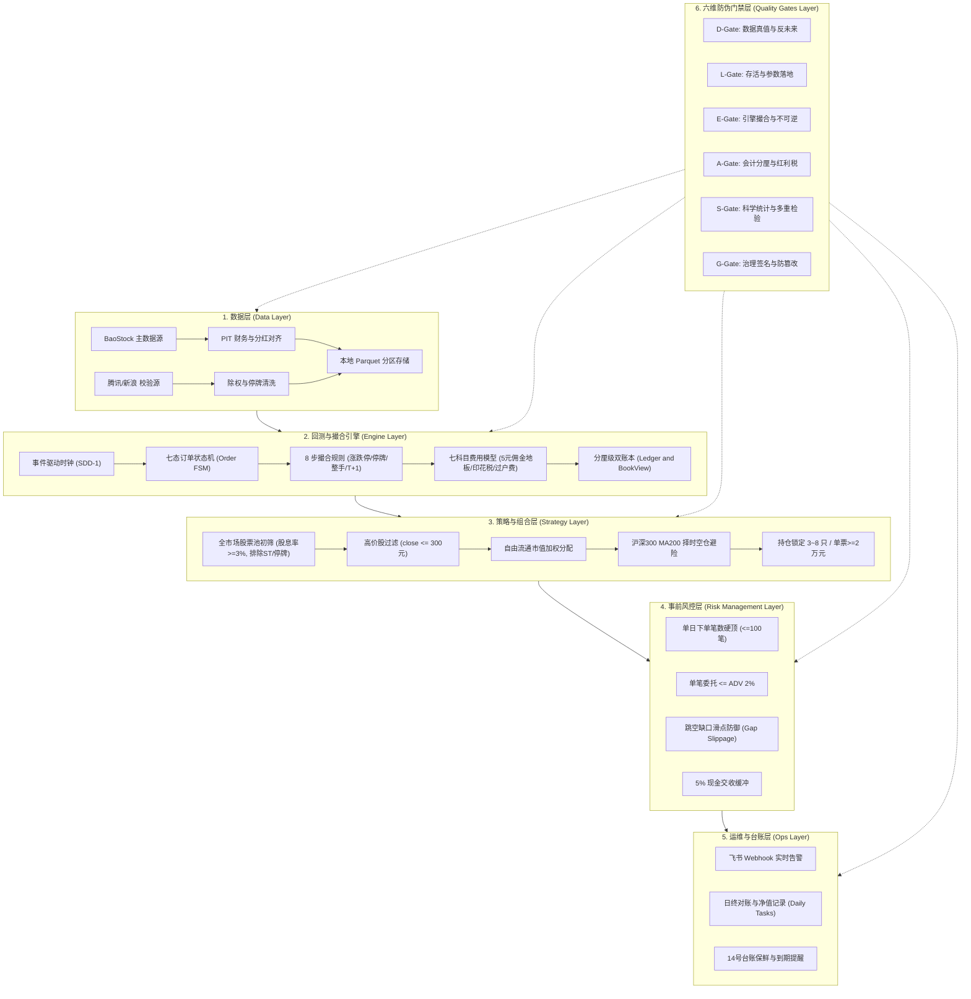

# 程序化交易系统架构说明书（系统说明书）

> **文档版本**: v1.0.0  
> **更新日期**: 2026-09-07  
> **依据文件**: 《A股程序化交易监管细则与个人报备实操指南》（11 号调研报告）、证监会令第 220 号、上证发〔2023〕144 号  
> **适用范围**: 个人程序化交易报备材料必须项（清单必须项 #3）  

---

## 1. 系统基本信息

- **系统名称**: FinAI2.0 A 股中低频量化交易系统（日线纯多头）
- **技术语言与版本**: Python 3.11.5 (64-bit)
- **部署环境**: 单机离线工作站（本地物理部署，无外部云主机中继，直连券商 QMT/PTrade 终端）
- **开发与版本管理**: Git 分布式版本控制（代码仓 `FinAI2.0` 与 计划仓 `research-finai`）
- **当前稳定代码版本**: Commit `4878ffe` (通过 717 项离线与回归自动化测试)
- **核心定位**: 散户 10~15 万初始资金、纯多头、低换手（年化 <400%）、零做空、无高频交易特征（报单速率 <1 笔/分钟）

---

## 2. 系统六层总体架构

---

## 3. 核心子系统与物理防线说明

### 3.1 数据与时钟隔离 (反前视偏差)
1. **先撮合、后信号**: 引擎日内时钟强制锁定先撮合 T 日挂单（按 T+1 开盘价成交），再生成 T+1 交易信号，从物理时序上根除日内未来函数；
2. **点截面 (PIT) 财务与分红**: 严格采用 `pubDate`（公告披露日）对齐财务数据与分红除权预案，绝对禁止使用报告期 `statDate`；
3. **三源比对校验**: 主数据源与腾讯/新浪行情交叉核验，停牌日自动剔除并锁定市值平直，严禁前收价平推脏数据。

### 3.2 撮合引擎与真实摩擦 (反虚假盈利)
1. **七科目精确费用**:
   - 佣金: 万 2.5，单笔最低 5 元硬地板（单笔交易低于 2 万元时摩擦显著上升）；
   - 印花税: 卖出单边征收（严格按 2023-08-28 减半政策 0.5‰ 分段计税）；
   - 过户费: 沪深交易所双边 0.01‰；
   - 经手费与证管费: 独立科目精确到分，ROUND_HALF_UP 四舍五入；
2. **阶梯红利差别化个人所得税**:
   - 持股 < 1 个月: 20% 红利税；
   - 持股 1~12 个月: 10% 红利税；
   - 持股 1 年以上: 0% 免税；
   - FIFO 批次配对追溯持股天数，实扣税款计入账本流水。

### 3.3 组合与风控逻辑
1. **选股标的池初筛**: 全市场剔除 ST、退市整理、停牌股，TTM 股息率 >= 3% 纳入备选；
2. **持仓约束**: 持仓 3~8 只（默认 5 只），单票持仓市值 >= 2 万元，彻底平抑 5 元佣金磨损；
3. **MA200 择时空仓避险**: 以沪深 300 指数为基准，指数收盘价低于 MA200 时触发清仓信号，强制 100% 空仓持有现金，彻底规避系统性股灾。

### 3.4 自动化防伪门禁体系
1. **24 道六维防御门禁**: 涵盖 D（数据）、L（活性）、E（引擎）、A（会计）、S（科学）、G（治理）全维度；
2. **密码学防篡改签名**: 模拟盘/回测记录内嵌 Git Commit SHA、Data Hash、Timestamp 与指标哈希签名，防事后篡改；
3. **双仓硬拦截**: Git Hooks (`pre-commit` 与 `pre-push`) 与 GitHub Actions CI 实行全测试基线防倒退拦截（>= 717 passed）。

---

## 4. 程序化交易报备合规指标对照

| 指标项目 | 本系统实测值 | 交易所/高频认定标准 | 合规判定 |
| :--- | :--- | :--- | :--- |
| **策略类型** | 中低频价值红利 + 趋势空仓择时 | 普通程序化交易 | **合规** |
| **最高申报速率** | 峰值约 **0.2 笔/秒**（日终委托不超过 10 笔） | 高频认定：>= 300 笔/秒 或 >= 5 笔/秒 | **远低于高频线（合规）** |
| **单日最高申报笔数** | 极端调仓日峰值 **<= 20 笔**（持仓 8 只） | 高频认定：单日 >= 20,000 笔 | **远低于高频线（合规）** |
| **撤单率** | **恒为 0%**（中低频日终成交后不撤单） | 异常交易监控：撤单率 > 50% | **零撤单（绝对安全）** |
| **申报席位** | 本地普通个人工作站通过托管券商代报 | 报备时载明登记 | **合规** |
| **杠杆与做空工具** | 纯多头现货股票，无股指期货、无期权、无融资融券 | 杠杆比例受限 | **无杠杆纯多头（合规）** |

---

## 5. 报备审签结论

FinAI2.0 系统架构严格遵守证券市场法规及程序化交易监管要求，交易频率极低、无撤单、底层分级账本完备、对账门禁严密，完全符合 A 股个人程序化交易监管报备标准。
