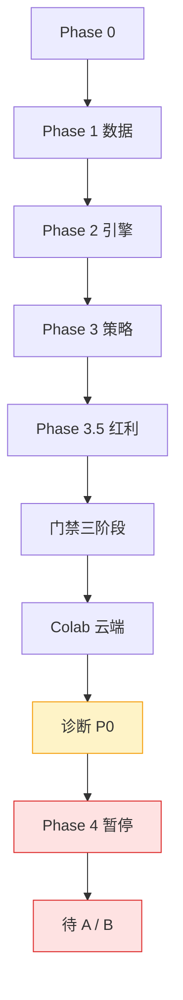

# FinAI2.0 · 项目状态（2026-09-10）

> **交互看板（推荐打开）**：`docs/project_status_flowchart.html`（可缩放 / 可拖动 / 大字号）  
> 基线：`108c06a` · 离线 **725 passed** · FINDING=370 · CI Gate5 已修

## 一句话

**工程与云端已就绪；策略未过关（仓位不足 + 负收益）；Phase 4 暂停，等你拍板 A / B。**

## 现在在哪

| 问题 | 结论 |
|---|---|
| 能否回测 | 能，本地与 Colab 一致 |
| 测试 | 725 全绿 |
| 策略 | CAGR **−3.20%**，总收益 −27.72% |
| P0 | 日均持仓 **0.5–1.8**（目标 5）；空仓 **54.7%** |
| 对比 512890 | 2019/2020/2024 大幅跑输 |
| Phase 4 | **暂停** |

## 阶段主路径

## A / B

- **A** 修仓位 + 降频（保留个股）→ 重跑对比 512890  
- **B** ETF 增强（512890 + MA200）  

建议：先 A；仍跑输再切 B。

## 数据链路

代码 → GitHub；数据 → 本地 zip → Drive → Colab unzip。

## 证据

- 诊断：`docs/diagnosis/t312_full_period_diagnosis.md`  
- 云端控制台：本地 `1.ipynb`（不入库）  
- CI 修复：`108c06a`（pandas NaN / t108）
