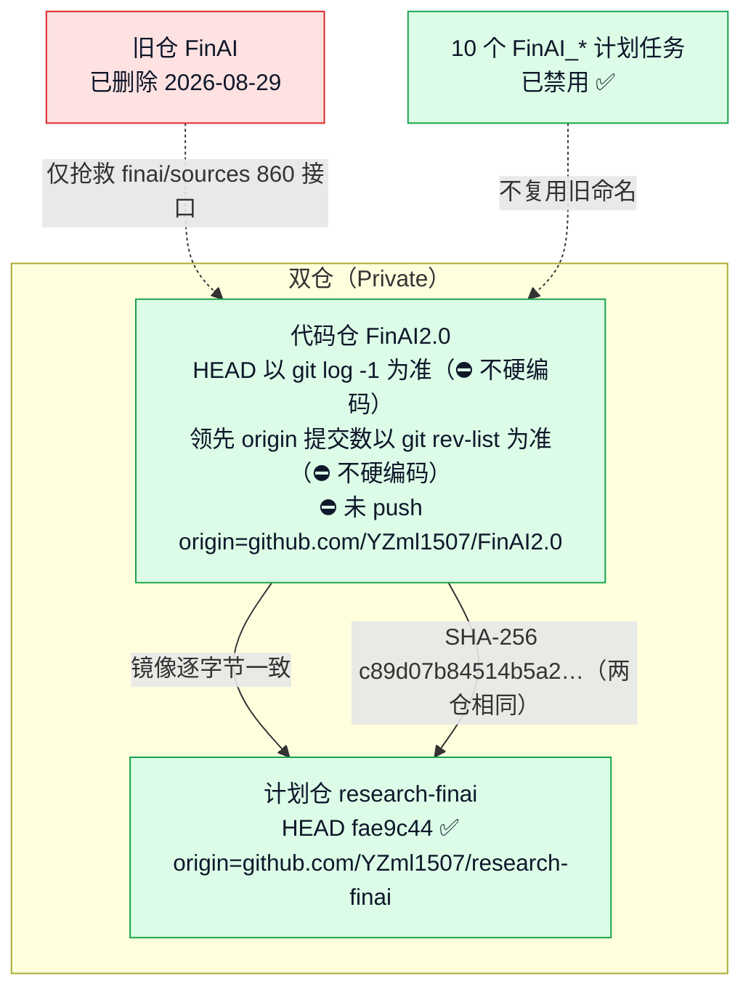
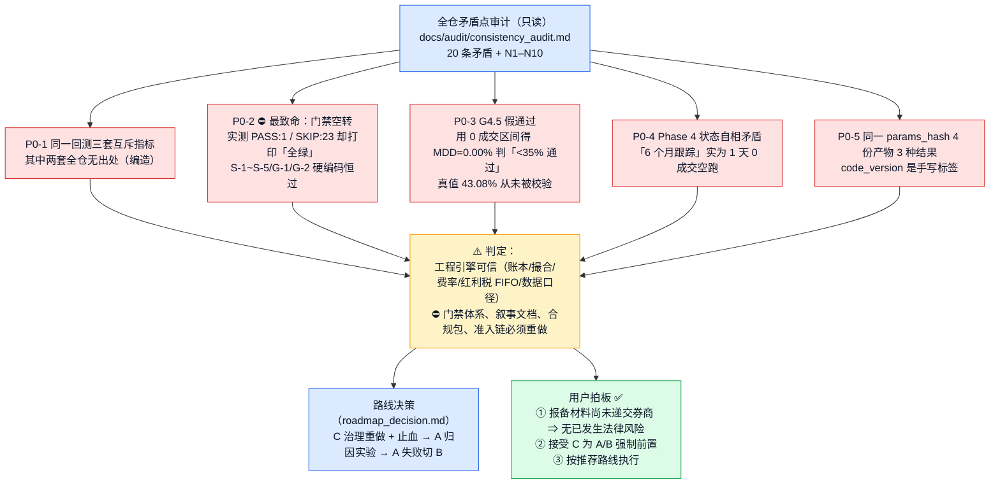
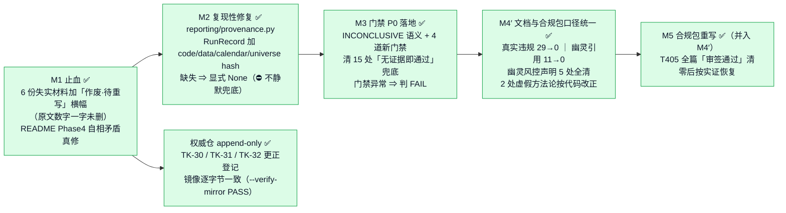
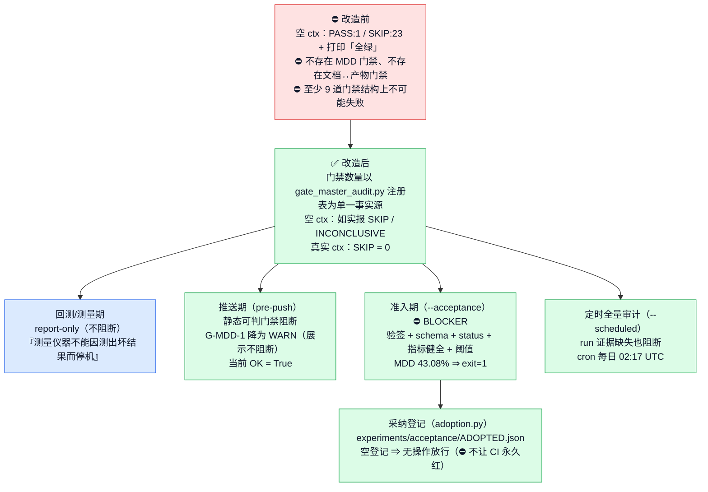
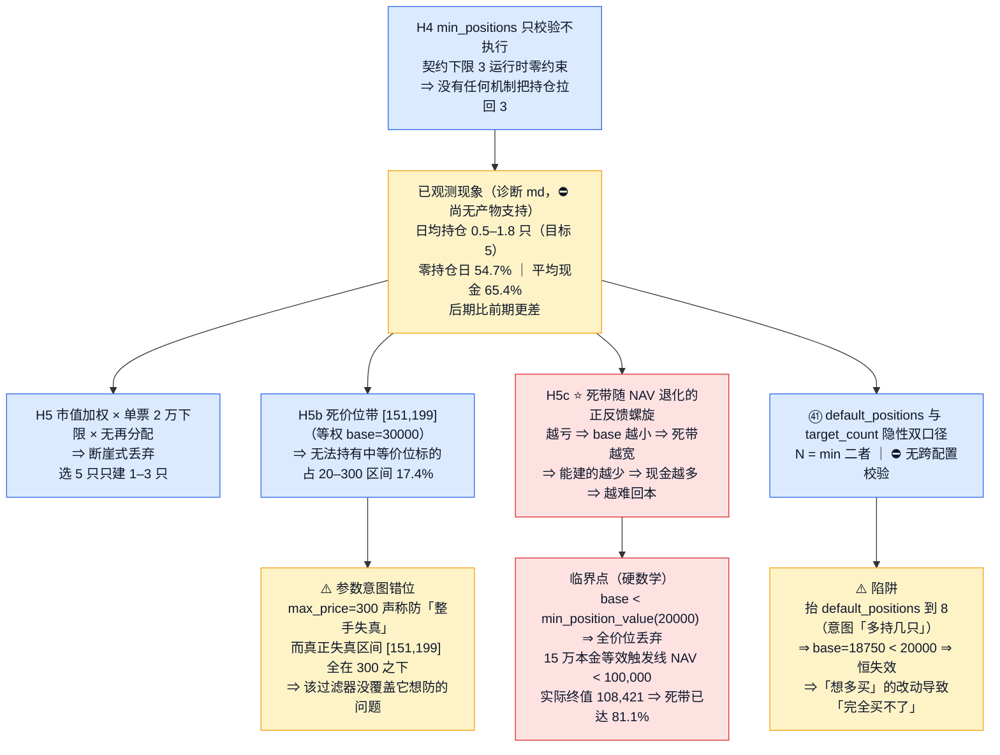
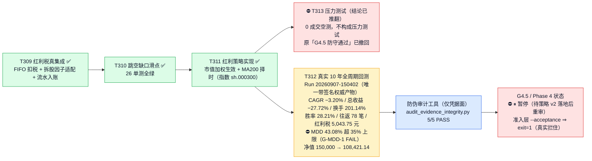
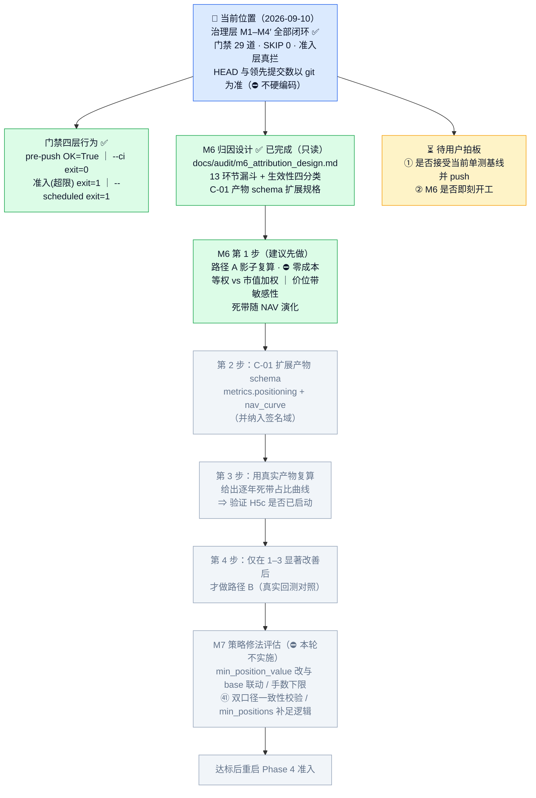

# FinAI2.0 · 项目状态流程图（2026-09-10 22:50 更新）

> 渲染器：支持 mermaid 的 Markdown 查看器（VS Code / Obsidian / GitHub）
> 数据来源：本会话真实命令输出（**非沙箱环境**，`py -3.11`）+ research-finai spec 三件套
> 交互版见：`docs/project_status_flowchart.html`
> ⚠️ 口径纪律：**门禁数量与单测基线一律以单一事实源为准**（`scripts/gates/constants.py` + `gate_master_audit.py` 注册表），⛔ 文档不硬编码；历史快照行以 `gate-doc-ignore` 标注
> ⚠️ 环境坑（会误判）：**沙箱内 `pyarrow` 不可见** ⇒ 全量测试**假报 35 failed**（非回归）、`--ci` 会把 D-1~D-4 从 PASS 误降为 INCONCLUSIVE。跑测试/门禁请用**非沙箱环境**（`py -3.11`）

---

## 一、仓库 / 基建总览

---

## 二、⚠️ 2026-09-10 全仓审计：项目真实状态被推翻并重建

---

## 三、治理层重做（M1–M4′ ✅ 已完成）

---

## 四、门禁体系现状（从「空转装饰」到「真拦」）

### 门禁归属（29 道，完备无重叠）

| 归属 | 数量 | 门禁 |
|---|---|---|
| **推送期（STATIC）** | 12 | D-1~D-4、E-1、E-2、G-1~G-4、G-DOC-1、G-REF-1 |
| **需 run 证据（RUN_EVIDENCE）** | 17 | A-1~A-4、D-5、E-3、G-MDD-1、G-REPRO-1、G-STRESS-1、L-1~L-3、S-1~S-5 |

> 真实 ctx 下：**PASS 14 / FAIL 1 / INCONCLUSIVE 14 / SKIP 0**；唯一 FAIL = `G-MDD-1`（MDD 43.08% > 35%，**真实策略缺陷**）

---

## 五、⭐ A 路策略病因（本轮最重要产出 · 全部零成本函数级复算）

### 死带随 NAV 退化（15 万本金 / 目标 5 只，实测）

| NAV | base | 死带区间 | 占 20–300 区间 |
|---|---|---|---|
| 150,000 | 30,000 | [151, 199] | 17.4% |
| 130,000 | 26,000 | [66, 300] | 43.8% |
| 110,000 | 22,000 | [28, 300] | 77.2% |
| 100,000 | 20,000 | [21, 300] | 97.9% |
| 90,000 | 18,000 | [20, 300] | **100%（完全失效）** |

> 精确丢弃条件：`planned = 100·p·floor(base/(100p)) < min_position_value`
> **结论强度**：以上均为**路径 A 影子复算**（零成本）⇒ 只证「计划层会切断」，⛔ **不得据此宣称「收益会改善」**

---

## 六、Phase 3.5 红利策略执行现状

**唯一事实源铁律**：`experiments/runs/*.json`（带 `anti_tamper_signature`）。
仓内任何 md 的结论性数字一律**不可引用**。

---

## 七、测试基线演进

```mermaid
flowchart LR
  B0["Phase 0 起点<br/>19 passed"] --> B1["Phase 1 数据层<br/>162 passed"]
  B1 --> B2["Phase 2 回测引擎<br/>394 passed"]
  B2 --> B3["Phase 3 策略层<br/>435 passed"]
  B3 --> B35["Phase 3.5 红利切换<br/>524 passed"]
  B35 --> B402["T402 偏差容忍带<br/>616 passed"]
  B402 --> B404["T401/403/404 修复与台账<br/>619 passed"]
  B404 --> B312_OLD["T312 离线测试补充<br/>626 passed"]
  B312_OLD --> B312_NOW["T312 审计与红利税/拆股加权修复<br/>629 passed"]
  B312_NOW --> GATES1["阶段一：六维防御门禁工具包<br/>23 项门禁 + 52 单测<br/>681 passed<!-- gate-doc-ignore: 阶段一历史快照（23 项门禁 / 681 passed 为当时值），⛔ 不改史 -->"]
  GATES1 --> GATES2["阶段二：执行流前置/后置闸门植入<br/>runner.py + 18 集成单测<br/>699 passed"]
  GATES2 --> GATES3["阶段三：CI / Git Hooks 硬化与验签<br/>tamper_guard + 24 门禁 + 18 单测<br/>717 passed"]
  GATES3 --> P4_OLD["Phase 4 准入基建与 T405 报备<br/>725 passed"]
  P4_OLD --> M3_NOW["M3 门禁 P0 落地<br/>760 → 786 passed"]
  M3_NOW --> M2_NOW["M2 复现性 + 三层分层<br/>796 → 828 → 850 passed"]
  M2_NOW --> CUR["M4′ + ㉜–㊴ 收口 ✅（当前）<br/>单测基线真值以单一事实源为准<br/>（scripts/gates/constants.py::TEST_BASELINE_PASSED）<br/>⛔ 文档不硬编码"]
  style B0 fill:#e0e7ff,stroke:#818cf8
  style B1 fill:#e0e7ff,stroke:#818cf8
  style B2 fill:#e0e7ff,stroke:#818cf8
  style B3 fill:#e0e7ff,stroke:#818cf8
  style B35 fill:#e0e7ff,stroke:#818cf8
  style B402 fill:#e0e7ff,stroke:#818cf8
  style B404 fill:#e0e7ff,stroke:#818cf8
  style B312_OLD fill:#e0e7ff,stroke:#818cf8
  style B312_NOW fill:#e0e7ff,stroke:#818cf8
  style GATES1 fill:#e0e7ff,stroke:#818cf8
  style GATES2 fill:#e0e7ff,stroke:#818cf8
  style GATES3 fill:#e0e7ff,stroke:#818cf8
  style P4_OLD fill:#e0e7ff,stroke:#818cf8
  style M3_NOW fill:#dcfce7,stroke:#16a34a,color:#0f172a
  style M2_NOW fill:#dcfce7,stroke:#16a34a,color:#0f172a
  style CUR fill:#dcfce7,stroke:#16a34a,color:#0f172a
```

---

## 八、当前位置与下一步

---

## 九、⚠️ 已知缺口（如实登记，未解决）

| # | 缺口 | 性质 | 归属 |
|---|---|---|---|
| 1 | `G-MDD-1` FAIL（MDD 43.08% > 35%） | **真实策略缺陷**，非门禁缺陷 | M7 策略改进后自然转绿 |
| 2 | 回测仅有 metrics 级产物，**无 trade 级明细** | 定时 CI 中 A/S 维共 7 项仍 WARN | M4+ 落盘该 artifact |
| 3 | **飞书告警仍是 stub**（`ops/feishu_alert.py` 未实现） | 定时审计失败仅让 job 变红 | 需用户决定是否接真实通道 |
| 4 | H1–H5c **全部为待验证假设** | M6 尚未执行 | 见 §八 |
| 5 | `nav_curve` **内存有、未落盘** | 阻断 H5c 时间演化验证 | 已纳入 C-01 规格 |
| 6 | 诊断 md 的持仓/现金三数**无产物支持** | 证据链第一环靠人眼 | C-01 落地后闭环 |
| 7 | 单票集中度上限 / ST 剔除 **均未实现** | 文档已如实标注为待办 | M7 评估 |
| 8 | `accounting/` 为 0 字节占位包 | 双账本实在 `backtest/ledger.py` | M4 文档已如实描述 |

---

## 十、更新历史

| 日期 | 内容 |
|---|---|
| 2026-09-07 | T312 硬伤根治 + 审计 5/5 + 10 年回测（CAGR −3.20%）+ 门禁三阶段 + Phase 4 准入基建 |
| 2026-09-10 上午 | Colab 云端验收 + T312 全周期诊断（P0 仓位不足）+ **Phase 4 暂停** |
| 2026-09-10 下午 | ⚠️ **全仓矛盾点审计**：门禁空转被揭穿（23 SKIP 仍报全绿）+ 编造数字 + 合规包失实；用户拍板 C→A→B |
| 2026-09-10 晚 | **M1 止血 / M2 复现性 / M3 门禁 P0 / M4′ 口径统一** 全部完成；门禁 29 道、SKIP 0、准入层真拦；新增 H5/H5b/H5c 病因发现；M6 归因设计完成（只读） |
