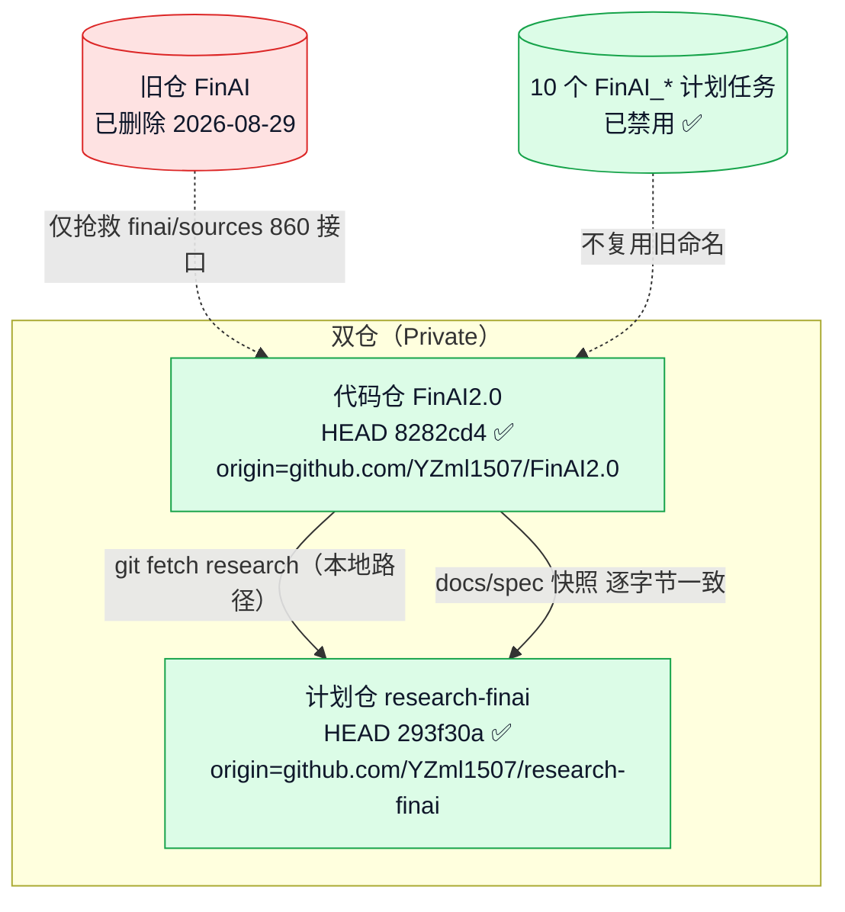
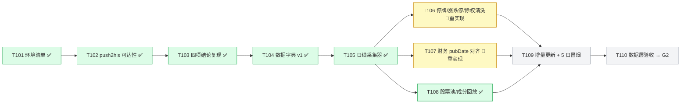
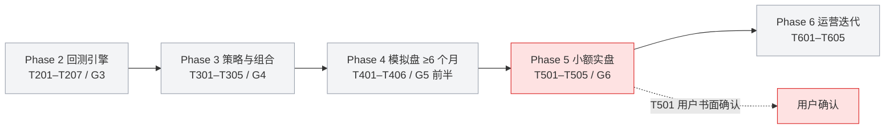

# FinAI2.0 · 项目状态流程图（2026-08-31 复核）

> 渲染器：支持 mermaid 的 Markdown 查看器（VS Code / Obsidian / GitHub）
> 数据来源：本会话真实命令输出 + research-finai spec 三件套
> 交互版见：`docs/project_status_flowchart.html`

## 仓库 / 基建总览

## 门禁与当前阶段

## Phase 1 数据层（当前工作带）

> ✅ **依赖已闭合**：T101–T104 于 2026-08-31 全部勾选。**T105 日线采集器 + T108 股票池/成分回放已入库**（commit `8282cd4`，62 离线单测绿）。🔄 **T106（`data/cleaner.py`）/ T107（`data/financial_pit.py`）正从零重实现**——上批 workflow 子代理中途死亡（worktree 空、无代码可收），本次派子代理重写；离线单测绿后方可在 tasks.md 勾选（⛔ 未绿不勾）。结构已拍板 = Parquet 落盘（`data/daily_bars/{symbol}/{year}.parquet`）+ `data/` 包（collector✅/universe✅；cleaner/financial_pit 实现中）。

## Phase 2–6 路线（未解锁）

## 待用户确认决策点

| 任务 | 内容 | 阻塞？ |
|---|---|---|
| ~~**T001**~~ | 告警通道 ✅ **已拍板 = 飞书**（经 hermes_orchestrator MCP；`.specify/memory/alert_channel.md`） | 已闭环 |
| **T501 / P-5.0** | 用户书面确认实盘（券商 / 金额 / 日期） | 远期，2027 年段 |

## 复核摘要（2026-08-31）

| 项目 | 结果 | 证据 |
|---|---|---|
| 代码仓 HEAD | ✅ `8282cd4`（T105 日线采集器 + T108 股票池/成分回放入库） | 本地 `git rev-parse HEAD` |
| 计划仓 HEAD | ✅ `293f30a`（tasks.md 勾 T105/T108，⛔未勾 T106/T107） | 本地 `git rev-parse HEAD` |
| spec 快照一致 | ✅ `docs/spec/001-…/` 4 文件逐字节一致 | md5 校验（commit c2d14f3/305be79） |
| 远端默认分支 == 本地 | ✅ 一致 | `git ls-remote origin HEAD` 输出相同哈希 |
| GitHub Private | ✅ 两仓均 Private | 凭证凭据（user=YZml1507）+ API 返回 `private=true`；公开 404 |
| 旧仓 FinAI | ✅ 已删除 | `Test-Path D:\Projects\FinAI = False` |
| 10 个计划任务 | ✅ 全部 Disabled | `Get-ScheduledTask` 输出 |
| FINDING 台账 | ✅ 370 行 | `Select-String -Pattern "FINDING-"` |
| 红线路径 | ✅ 7/7 存在 | `Test-Path` 逐个核对 |
| 占位包 6 个 | ✅ 存在 | `accounting/backtest/ops/reporting/strategy/data` |
| 离线单测 | ✅ 62 passed（19 原有 + T105×28 + T108×15） | `py -3.11 -m pytest tests/ …` |
| T001 告警通道 | ✅ 已拍板飞书 | `.specify/memory/alert_channel.md` |
| T101–T104 | ✅ 全部勾选 | tasks.md（research-finai `293f30a`） |
| T105 / T108 | ✅ 已入库并勾选 | commit `8282cd4`；tasks.md `[x]` |
| T106 / T107 | 🔄 从零重实现中 | 上批子代理死亡（worktree 空）；离线绿前不勾 |
| 测试产物残留 | ⚠️ `.pytest_cache` 存在 | 用完即删纪律未执行 |
| research-finai 工作树 | ⚠️ `.gitignore` 一处未提交修改 | 补 `.claude` 忽略 + 去行尾注释 |

---

**维护者备注**：流程图按 CLAUDE.md §5 路线图与 tasks.md 依赖序绘制；节点状态色标：绿=完成、蓝=当前、黄=部分/有条件、灰=待启动、红=阻塞/需用户确认。
