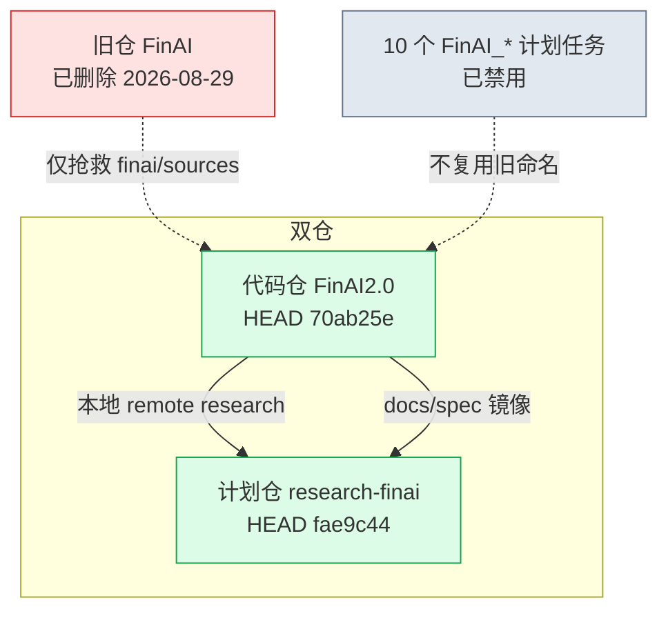
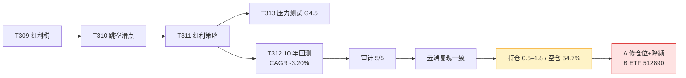
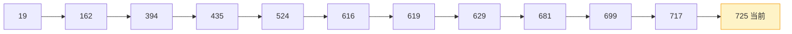
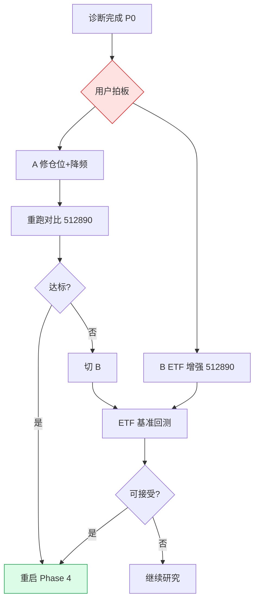
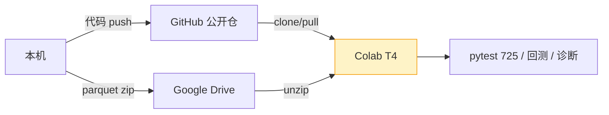

# FinAI2.0 · 项目状态流程图（2026-09-10）

> 交互版：`docs/project_status_flowchart.html`  
> 基线：FinAI2.0 `70ab25e` · research-finai `fae9c44` · 离线 **725 passed** · 母库 FINDING=370  
> **当前位置：策略 v2 决策点 · Phase 4 模拟盘已暂停**

## 1. 仓库与基建

## 2. 门禁与阶段主路径（当前）

```mermaid
flowchart LR
  G0["G0 spec 齐备"] --> R15["R1–R5 清零"] --> UT["725 单测全绿"]
  UT --> P1["Phase 1 数据层"] --> G2["G2 三源验收"]
  G2 --> P2["Phase 2 回测引擎 + G3"] --> P3["Phase 3 策略"]
  P3 --> G4["G4 评审<br/>动量淘汰"] --> P35["Phase 3.5 红利实证"]
  P35 --> A1["门禁阶段一"] --> A2["门禁阶段二"] --> A3["门禁阶段三"]
  A3 --> CLOUD["Colab 云端链路 ✅"]
  CLOUD --> DIAG["T312 诊断 P0 仓位不足"]
  DIAG --> HOLD["Phase 4 ⏸ 待 A/B 拍板"]
  style CLOUD fill:#dbeafe,stroke:#2563eb
  style DIAG fill:#fef3c7,stroke:#f59e0b
  style HOLD fill:#fee2e2,stroke:#dc2626
```

## 3. 红利策略链路 → 诊断

## 4. 诊断结论（2026-09-10）

- **P0**：目标持仓 5 只，实际日均 **0.5–1.8**；零持仓日 **54.7%**；平均现金 **65.4%**
- 2019 / 2020 / 2024 相对 510300 与 **512890** 大幅跑输；防御年（2016/2018/2022）有效
- 红利税占总费用 **51.8%**（摩擦，非主因）
- 全文：`docs/diagnosis/t312_full_period_diagnosis.md`

## 5. 测试基线演进

## 6. 决策树

## 7. 数据与代码链路（已固化）

## 8. 更新历史

| 日期 | 内容 |
|---|---|
| 2026-08-31 | Phase 0–1 |
| 2026-09-01 | Phase 2–3 + G3/G4 |
| 2026-09-02 | Phase 3.5 + G4.5；基线 619 |
| 2026-09-07 | T312 硬伤根治 + 审计 5/5 + 10 年回测（CAGR −3.20%）；门禁三阶段；Phase 4 准入；基线 725 |
| **2026-09-10** | **Colab 云端验收 + T312 诊断（P0 仓位不足）+ Phase 4 暂停**；FinAI2.0 `70ab25e` / research-finai `fae9c44` |
