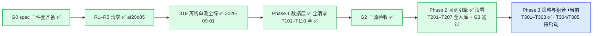
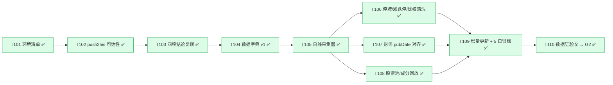
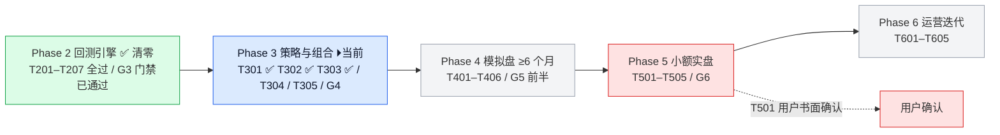

# FinAI2.0 · 项目状态流程图（2026-09-01 复核）

> 渲染器：支持 mermaid 的 Markdown 查看器（VS Code / Obsidian / GitHub）
> 数据来源：本会话真实命令输出 + research-finai spec 三件套
> 交互版见：`docs/project_status_flowchart.html`

## 仓库 / 基建总览

## 门禁与当前阶段

## Phase 1 数据层（已清零 ✅ 2026-08-31）

> ✅ **Phase 1 全清零（2026-08-31）**：T105（`8282cd4`，62 绿）/ T106+T107（`5e08574`，127 绿）/ T110（`2ffbf7b`，152 绿）/ T109（`c5d75bf`，162 绿）全部入库并勾选，G2 门禁通过。结构 = Parquet 落盘（`data/daily_bars/{symbol}/{year}.parquet`）+ `data/` 包（collector✅/cleaner✅/financial_pit✅/universe✅/incremental✅/acceptance✅ 全部入库）。**其后 Phase 2 回测引擎：T201 引擎核心 + T202 五必挂用例已入库**（2026-09-01，commit `8fca14f`，319 离线单测绿）；**T203 费用模型已入库**（2026-09-01，commit `edd8d2f`，352 离线单测绿）；**T204 成交模型已入库**（2026-09-01，commit `ccd693c`，370 离线单测绿）；**T205 绩效指标已入库**（2026-09-01，commit `63f5935`+`7eed8e3`，383 离线单测绿）；**T206 实验 registry 已入库**（2026-09-01，commit `59a127b`，394 离线单测绿）；**T207 门禁 G3 通过**（2026-09-01，commit `0c52168`，验收报告 `docs/t207_g3_gate_acceptance.md`：五必挂 17 例 + 成本逐项核对 vs 07 号全一致 + 红利税评估 ≈0.4%/年上限）。**Phase 2 清零，Phase 3 解锁**。

## Phase 2–6 路线（Phase 2 ✅ 清零 · Phase 3 进行中）

## 待用户确认决策点

| 任务 | 内容 | 阻塞？ |
|---|---|---|
| ~~**T001**~~ | 告警通道 ✅ **已拍板 = 飞书**（经 hermes_orchestrator MCP；`.specify/memory/alert_channel.md`） | 已闭环 |
| **T501 / P-5.0** | 用户书面确认实盘（券商 / 金额 / 日期） | 远期，2027 年段 |

## 复核摘要（2026-09-01）

| 项目 | 结果 | 证据 |
|---|---|---|
| 代码仓 HEAD | ✅ `2711052`（T303 参数扫描入库）+ 本状态标记提交 | 本地 `git rev-parse HEAD` |
| 计划仓 HEAD | ✅ `516b3de`（tasks.md 勾 T303 + TK-17 修订日志） | 本地 `git rev-parse HEAD` |
| spec 快照一致 | ✅ `docs/spec/001-…/tasks.md` 与计划仓逐字节一致 | SHA-256 双端同值（2026-09-01） |
| 两仓已推送 | ✅ FinAI2.0（`964c383..2711052` + 本提交）/ research-finai（`06b49ae..516b3de`） | `git push origin master` 输出 |
| GitHub Private | ✅ 两仓均 Private | 凭证凭据（user=YZml1507） |
| 旧仓 FinAI | ✅ 已删除 | `Test-Path D:\Projects\FinAI = False` |
| 10 个计划任务 | ✅ 全部 Disabled（2026-09-01 复测） | `Get-ScheduledTask` 输出 |
| FINDING 台账 | ✅ 370 行（2026-09-01 复测） | `Select-String -Pattern "FINDING-"` |
| 红线路径 | ✅ 7/7 存在 | `Test-Path` 逐个核对 |
| 占位包 6 个 | ✅ 存在 | `accounting/backtest/ops/reporting/strategy/data` |
| 离线单测 | ✅ **432 passed**（395 + T301×27 + T302×4 + T303×6；2026-09-01 复跑 exit 0） | `py -3.11 -m pytest tests/ …` |
| T001 告警通道 | ✅ 已拍板飞书 | `.specify/memory/alert_channel.md` |
| T101–T104 | ✅ 全部勾选 | tasks.md（research-finai） |
| T105 / T108 | ✅ 已入库并勾选 | commit `8282cd4`；tasks.md `[x]` |
| T106 / T107 | ✅ 已入库并勾选 | commit `5e08574`；tasks.md `[x]` |
| T109 | ✅ 已入库并勾选 | commit `c5d75bf`；tasks.md `[x]` |
| T110 | ✅ 已入库并勾选 | commit `2ffbf7b`；tasks.md `[x]` |
| T201 / T202 | ✅ 已入库并勾选（2026-09-01） | commit `8fca14f`；tasks.md `[x]` + TK-8 |
| T203 费用模型 | ✅ 已入库并勾选（2026-09-01） | commit `edd8d2f`；tasks.md `[x]` + TK-9；07 号逐项核对（黄金算例 10 万往返逐项口径 112.82 元） |
| T204 成交模型 | ✅ 已入库并勾选（2026-09-01） | commit `ccd693c`；tasks.md `[x]` + TK-10；敏感度对比 `docs/t204_price_model_sensitivity.md` |
| T205 绩效指标 | ✅ 已入库并勾选（2026-09-01；含 Calmar 补丁） | commit `63f5935`+`7eed8e3`；tasks.md `[x]` + TK-11 |
| T206 实验 registry | ✅ 已入库并勾选（2026-09-01） | commit `59a127b`；tasks.md `[x]` + TK-12 |
| T207 门禁 G3 | ✅ 通过（2026-09-01） | commit `0c52168`；`docs/t207_g3_gate_acceptance.md`；tasks.md `[x]` + TK-13；**Phase 2 清零，Phase 3 解锁** |
| T204 曲线件 | ✅ FR-BT-6 双件齐备 | `scripts/t204_sensitivity_curve.py` + `docs/t204_sensitivity_curve.svg`；commit `78b3857` |
| T301 组合管理器 | ✅ 已入库并勾选（2026-09-01） | commit `434fa8b`；tasks.md `[x]` + TK-15；`strategy/portfolio.py` 三段纯函数 |
| T302 候选策略 | ✅ 已入库并勾选（2026-09-01） | commit `964c383`；tasks.md `[x]` + TK-16；`strategy/candidates.py` |
| T303 参数稳健性 | ✅ 已入库并勾选（2026-09-01） | commit `2711052`；tasks.md `[x]` + TK-17；`strategy/param_scan.py`（±20% 邻域、悬崖三判据） |
| T304 / T305 | ⬜ 待启动 | T304 跨区间压力 / T305 评审（G4 用户决策点） |
| 测试产物残留 | ✅ 无新增残留 | 测试走 tmp_path；审计临时目录用完即删 |
| research-finai 工作树 | ✅ 干净（`516b3de` 已提交） | `git status` |

---

**维护者备注**：流程图按 CLAUDE.md §5 路线图与 tasks.md 依赖序绘制；节点状态色标：绿=完成、蓝=当前、黄=部分/有条件、灰=待启动、红=阻塞/需用户确认。
