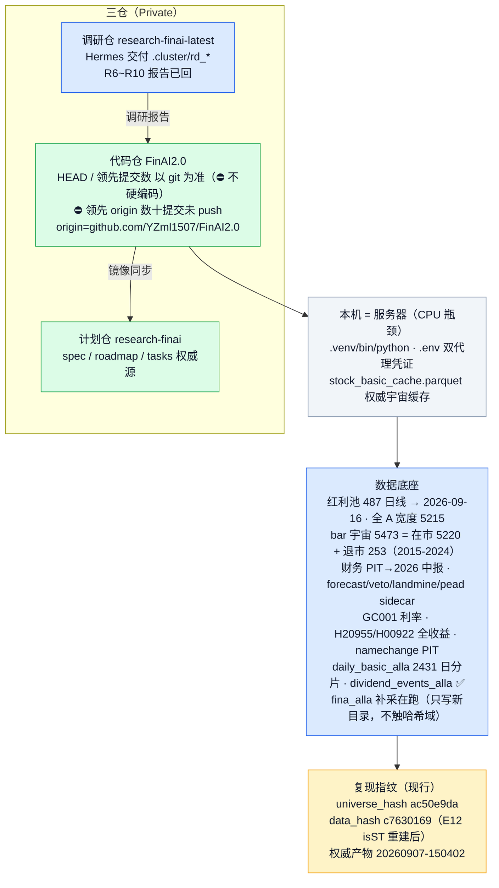
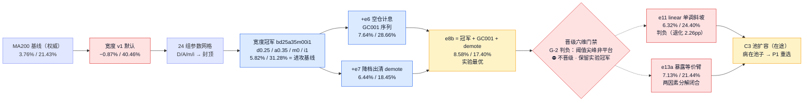
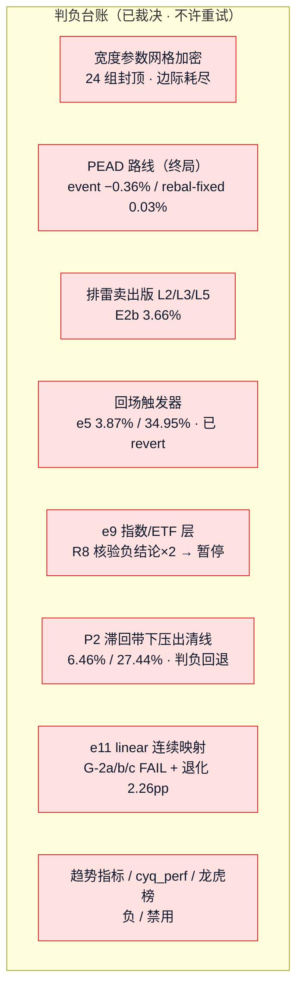
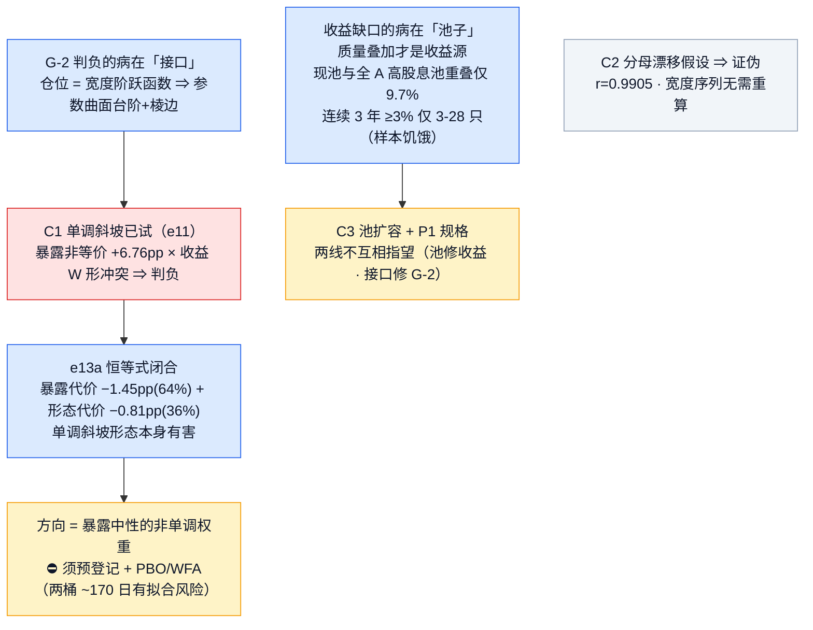
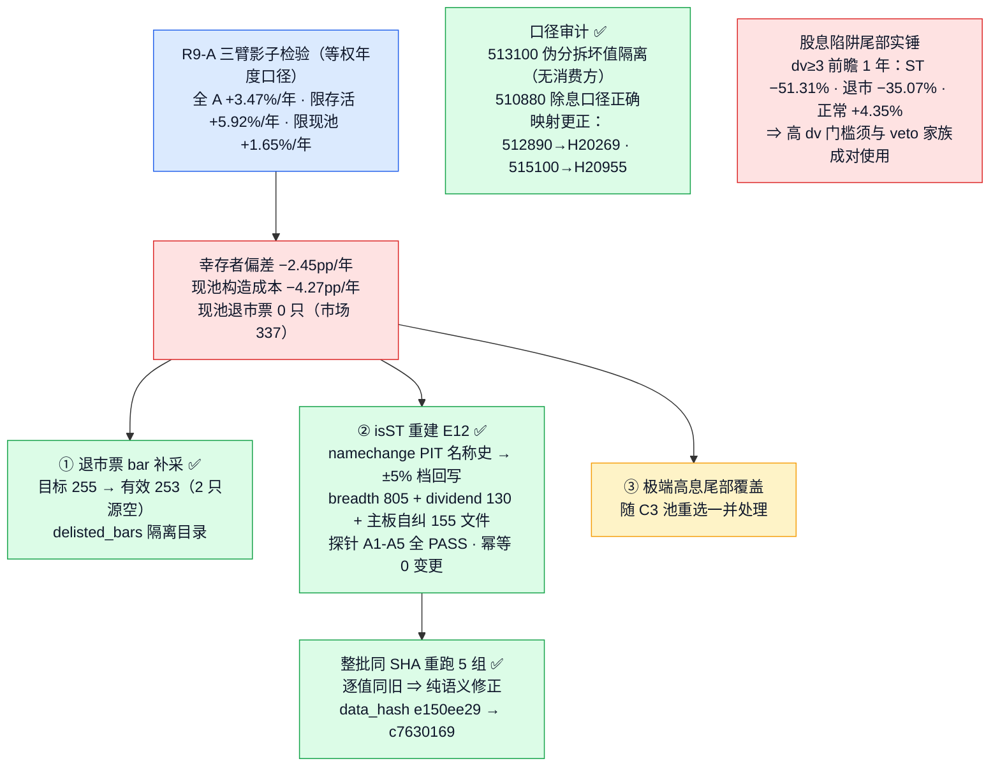
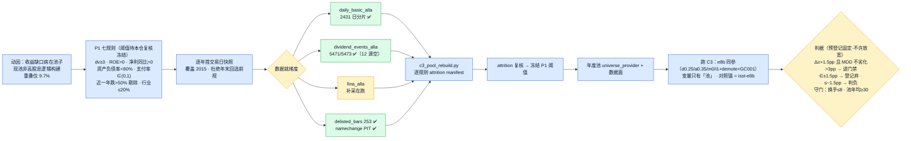
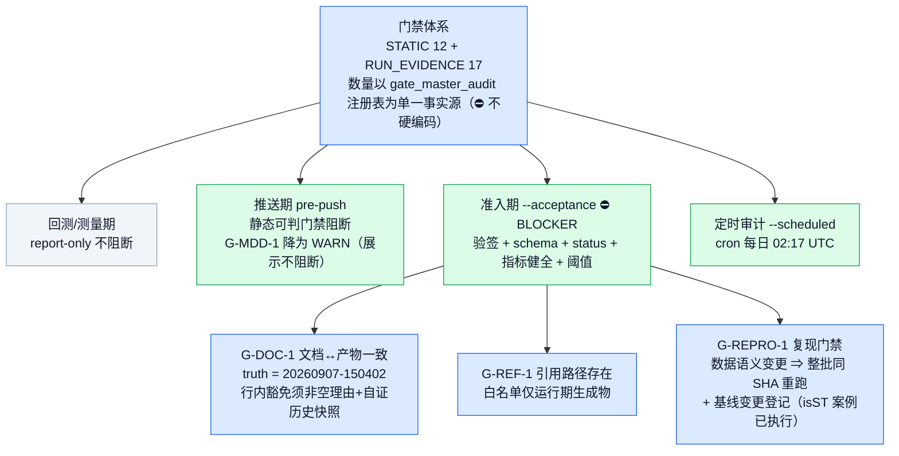
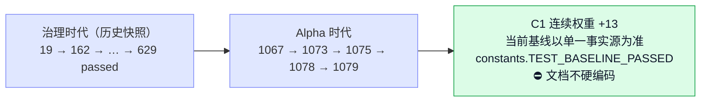

# FinAI2.0 · 项目状态流程图（2026-09-19 14:4x 更新）

> 渲染器：支持 mermaid 的 Markdown 查看器（VS Code / Obsidian / GitHub）
> 交互版见：`docs/project_status_flowchart.html`
> 事实源：`docs/TASK_TRACKER.md`（当前接续，跨窗口唯一事实源）+ `docs/ALPHA3_PLAYBOOK.md`（已裁决结论与纪律）+ `experiments/lab/leaderboard.jsonl`（实验榜单）
> ⚠️ 口径纪律：门禁数量与单测基线一律以单一事实源为准（`scripts/gates/constants.py` + `gate_master_audit.py` 注册表），⛔ 文档不硬编码；历史实测快照行以 `gate-doc-ignore` 标注
> ⚠️ 环境：本机即服务器（4C/7.8G/39G，CPU 是瓶颈）；SSH 单条 <30s、长任务 `setsid nohup`；Python=`.venv/bin/python`

---

## 一、基建总览

---

## 二、策略谱系 · 基线矩阵

### 基线矩阵（数值为实验快照；对照基准恒为进攻基线）

| 构型 | CAGR | MDD | 年化换手 | 往返 | 定位 / 裁决 |
|---|---|---|---|---|---|
| MA200 权威基线 | 3.76% | 21.43% | — | — | 产物 20260915-235155（旧指纹历史快照） |
| 宽度冠军（进攻基线） | 5.82% | 31.28% | 4.16 | 146 | 对照基准 `bd25a35m00i1` |
| e8b（实验最优） | 8.58% | 17.40% | 4.61 | 156 | G-2 判负不晋级，保留实验冠军 |
| e11 linear | 6.32% | 24.40% | 6.45 | 312 | 判负：退化 2.26pp＞1.5pp |
| e13a 暴露等价臂 | 7.13% | 21.44% | 5.71 | 308 | 归因臂：暴露 −1.45pp + 形态 −0.81pp 闭合 |
| isst 整批重跑 ×5 | 逐值同左 | 逐值同左 | 逐值同左 | 逐值同左 | 新指纹 `c7630169` 下逐值同旧＝纯语义修正 |

---

## 三、判负史与归因

### 机制归因链（两病分开治）

---

## 四、数据去偏（去幸存者偏差 + 语义修正）

> 影子口径边界（引用须带）：等权/年度/前 8 只、未扣成本、退市票按最后可用价平仓、
> dv 为年末快照非日频 PIT——不代表可交易收益。

---

## 五、C3 池扩容（主线在途）

> 预登记：`docs/C3_POOL_RESELECT_PREREG.md`（判据已预固定）；宇宙 = bar 5473（在市 5220 + 退市 253），PIT 成员资格按在市日判定；行业标签为当前快照（无 PIT 源，已登记简化）。

---

## 六、门禁体系（从「空转装饰」到「真拦」，Alpha 时代沿用）

### 晋级六维门禁 · e8b 判例（判据升级 C7 在案）

| 维 | 内容 | e8b 结果 |
|---|---|---|
| G-1 留出验证 | holdout 2022-2024 | ✅ 8.35% / 12.89%（零退化） |
| G-2 阈值稳健 | ±10% 扰动平台区 | ❌ 尖峰非平台（10 组 7 塌）⇒ **判负** |
| G-3 成本/本金 | 费率×2 / 10 万本金 | ✅ 7.79% / 8.46% |
| G-5 行为探针 | 执行一致性 | ✅ e7-demote-audit 18 跨界日 0 违规 |
| G-6 复现 | 指纹 + 重锚 | ✅ b-repro 逐值一致 |
| **裁决** | — | ⛔ 不晋级，保留实验冠军身份；瓶颈在阈值稳健性非实现 |

> C7 判据分层（预登记值）：G-2a 平台宽度≥50% · G-2b 退化单调性 · G-2c Lipschitz L×10%≤6.3pp · G-2d PBO / G-2e DSR · G-2g 换手≤8；信号层用 PBO/DSR、构型层用平台宽度，⛔ 两层不许互相替换。

---

## 七、测试基线演进

> 守卫资产：E-1 五必挂真实探针 · `gate-doc-ignore` 按文件分组语义守卫（`tests/test_gate_consistency.py` allowed_counts）· `gate-doc-void` 清单 ≤8 · 排除目录 `docs/audit/` 整片免检可见计数 · dated 日志行单独计数 · C1 权重 13 测 · E12 isST 探针 A1-A5。

---

## 八、当前队列（按序）

| 序 | 事项 | 状态 |
|---|---|---|
| 1 | `fina_alla` 财务 PIT 补采（setsid 后台）→ 完成即跑 `scripts/lab/c3_pool_rebuild.py` → attrition 复核 → 冻结 P1 → 年度池 universe_provider + 数据面 → 跑 C3 | 🔄 在跑 |
| 2 | flowchart `.md` + `.html` 重改（本节即产物） | 🔄 本窗口 |
| 3 | R9/R10 已交付 → 按 PLAYBOOK 口径审计（时序/无前视/成本/多重检验）→ 裁决可预登记方向 → 更新 `docs/EXPANSION_MEMO.md` | ⏳ 待办 |
| 4 | 候选方向：暴露中性非单调权重（须预登记 + PBO/WFA）/ C4 SMA5 联用 / C8 集成 / C7 G-2 判据完整版 | ⏳ 待裁决 |

---

## 九、⚠️ 已知缺口（如实登记，未解决）

| # | 缺口 | 性质 | 处置 |
|---|---|---|---|
| 1 | `G-MDD-1` FAIL（权威产物 43.08%＞35%） | **真实策略缺陷** | 策略层改进后自然转绿 |
| 2 | 退市票 bar 已采 253 只，`feed`/`alive_universe` 未消费新宇宙 | 数据面待接 | C3 数据面一并接入 |
| 3 | 行业标签无 PIT 源（当前快照） | 已登记简化 | C3 预登记 §二 |
| 4 | e8b 阈值面无平台区（±10% 结构性敏感） | 阈值类过拟合特征 | 非单调权重方向（预登记+PBO/WFA） |
| 5 | 飞书告警为 stub（`ops/feishu_alert.py` 未实现） | 如实披露 | 待用户拍板 |
| 6 | 领先 origin 数十提交未 push | 单点风险 | 待用户拍板 |
| 7 | R9/R10 为外部研究证据，尚非本仓终局裁决 | 待审计 | 队列第 3 项 |

---

## 十、历史归档 · 治理时代压缩（仅追溯，不作决策依据）

> **治理时代（2026-08 ~ 09-10）压缩归档**：Phase 0–3.5 清零（数据层 → 事件引擎 → 策略层 → 红利切换）、T312 数据硬伤根治与防伪审计、M1–M4′ 治理重做（门禁空转揭穿 → 真拦）、H5/H5b/H5c 死带病因（路径 A 影子复算）、Phase 4 暂停、MA200 → 宽度择时换轨。
> **追溯指针**：`CLAUDE.md` 工程纪事 · `docs/HANDOFF_20260915.md`（⛔ 已过期，仅追溯）· `docs/audit/*` · TASK_TRACKER 历史节。
> **权威产物锚**：20260907-150402 — CAGR −3.20% / MDD 43.08% / 年化换手 201.14% / 胜率 28.21%（唯一事实源 `experiments/runs/*.json`；仓内任何 md 的结论性数字一律不可引用）。
> ⛔ 本节及全文的历史数字均为快照、不作决策依据；当前事实以 TASK_TRACKER「当前接续」为准。

---

## 更新历史

| 日期 | 内容 |
|---|---|
| 2026-09-10 | 治理时代版本（全仓审计推翻重建：门禁空转揭穿 + M1–M4′ 收口） |
| 2026-09-19 | Alpha 时代重构：谱系基线矩阵 + 判负史归因 + 数据去偏 + C3 在途；治理时代压缩归档至 §十 |
