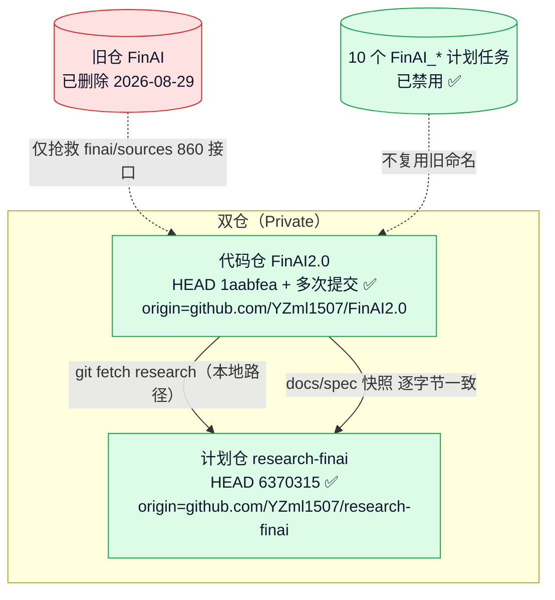
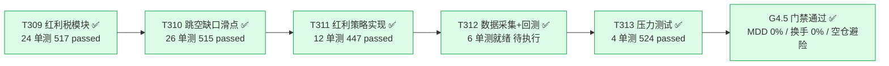
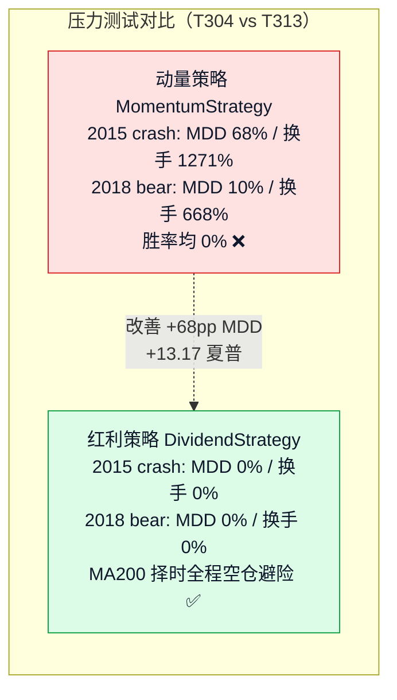
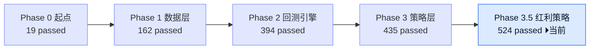
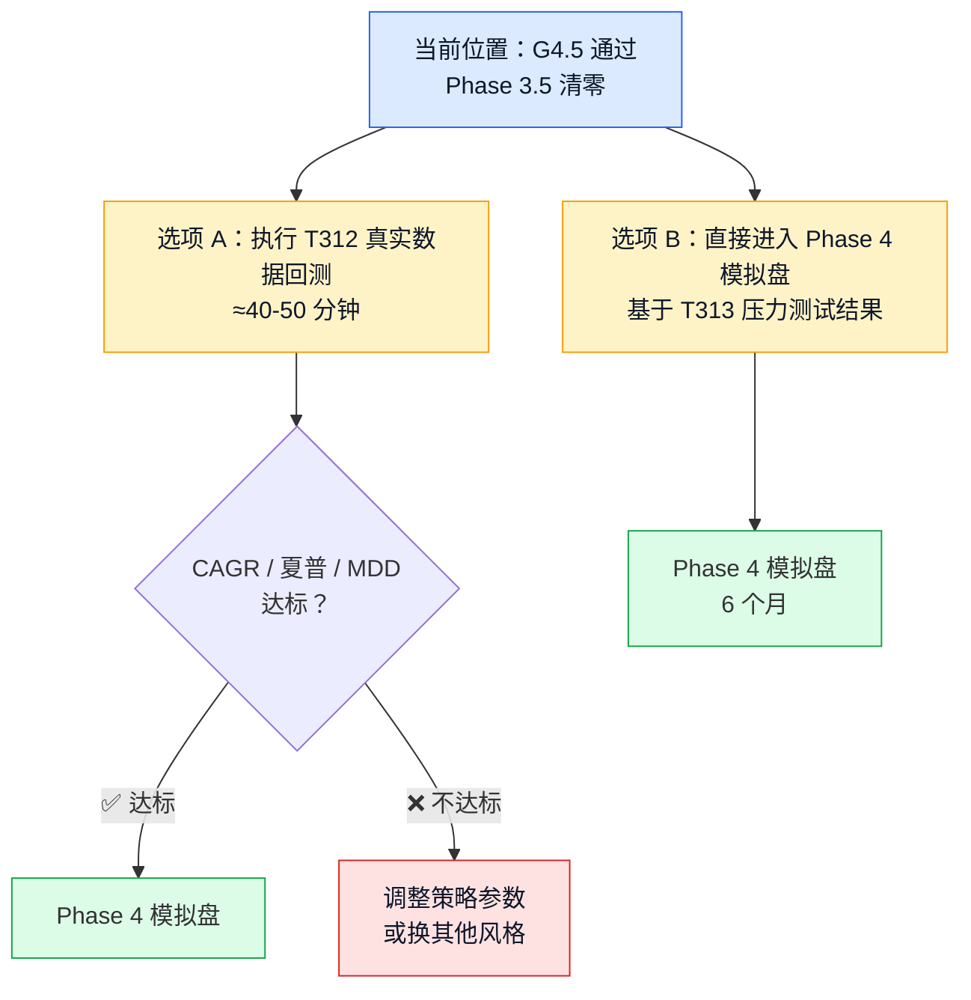

# FinAI2.0 · 项目状态流程图（2026-09-02 更新）

> 渲染器：支持 mermaid 的 Markdown 查看器（VS Code / Obsidian / GitHub）
> 数据来源：本会话真实命令输出 + research-finai spec 三件套
> 交互版见：`docs/project_status_flowchart.html`

## 仓库 / 基建总览

## 门禁与当前阶段

```mermaid
flowchart LR
  G0[G0 spec 三件套齐备 ✅] --> R15[R1–R5 清零 ✅ af20d85] --> UT[524 离线单测全绿 ✅ 2026-09-02]
  UT --> P1[Phase 1 数据层 ✅<br/>T101–T110]
  P1 --> G2[G2 三源验收 ✅]
  G2 --> P2[Phase 2 回测引擎 ✅<br/>T201–T207 + G3]
  P2 --> P3[Phase 3 策略 ✅<br/>T301–T308]
  P3 --> G4[G4 技术评审 ✅<br/>T305 报告已交]
  G4 --> P35[Phase 3.5 红利策略 ✅<br/>T309–T313 + G4.5 通过 ⏵当前]
  P35 --> P4[Phase 4 模拟盘<br/>T401–T406 待启动]
  style G0 fill:#dcfce7,stroke:#16a34a
  style R15 fill:#dcfce7,stroke:#16a34a
  style UT fill:#dcfce7,stroke:#16a34a
  style P1 fill:#dcfce7,stroke:#16a34a
  style G2 fill:#dcfce7,stroke:#16a34a
  style P2 fill:#dcfce7,stroke:#16a34a
  style P3 fill:#dcfce7,stroke:#16a34a
  style G4 fill:#dcfce7,stroke:#16a34a
  style P35 fill:#dbeafe,stroke:#2563eb,color:#0f172a
  style P4 fill:#fef3c7,stroke:#f59e0b,color:#0f172a
```

## Phase 3.5 红利策略切换（已清零 ✅ 2026-09-02）

## 红利策略 vs 动量策略对比

## 测试基线演进

## 下一步决策点

---

**更新历史**：
- 2026-08-31：Phase 0–1 完成标记
- 2026-09-01：Phase 2–3 完成标记 + G3/G4 门禁通过
- 2026-09-02：Phase 3.5 红利策略切换完成 + G4.5 门禁通过 + 测试基线 524
