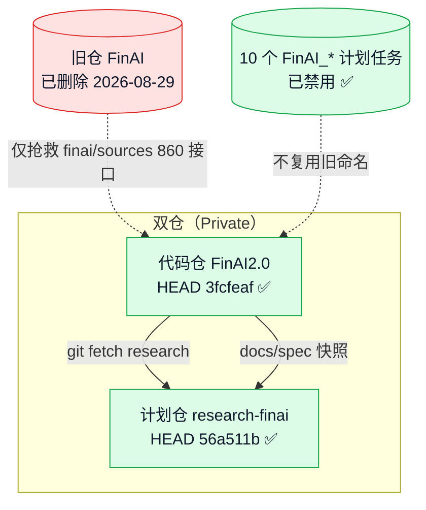
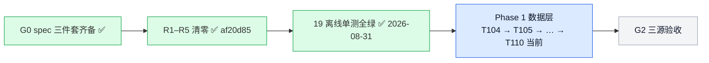
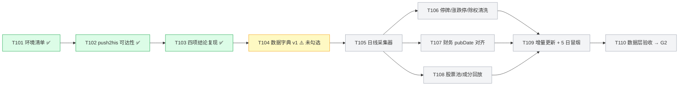
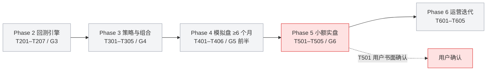

# FinAI2.0 · 项目状态流程图（2026-08-31 复核）

> 渲染器：支持 mermaid 的 Markdown 查看器（VS Code / Obsidian / GitHub）
> 数据来源：本会话真实命令输出 + research-finai spec 三件套
> 交互版见：`docs/project_status_flowchart.html`

## 仓库 / 基建总览

## 门禁与当前阶段

## Phase 1 数据层（当前工作带）

> ⚠️ **依赖缺口**：tasks.md 把 T104 列为 T105 的显式前置（`T105 ... （FR-DATA-7；T101/T104）`），但 T104 至今未勾选。严格按依赖序，Phase 1 的第一步是 **T104 数据字典**，随后才是 T105。

## Phase 2–6 路线（未解锁）

## 待用户确认决策点

| 任务 | 内容 | 阻塞？ |
|---|---|---|
| **T001** | 告警通道（用既有渠道，不注册新账号）→ 写 `.specify/memory` | 阻塞 Phase 1 之前全部 |
| **T501 / P-5.0** | 用户书面确认实盘（券商 / 金额 / 日期） | 远期，2027 年段 |

## 复核摘要（2026-08-31）

| 项目 | 结果 | 证据 |
|---|---|---|
| 代码仓 HEAD | ✅ `3fcfeafdb6…` | 本地 `git rev-parse HEAD` |
| 计划仓 HEAD | ✅ `56a511b3b0…` | 本地 `git rev-parse HEAD` |
| 远端默认分支 == 本地 | ✅ 一致 | `git ls-remote origin HEAD` 输出相同哈希 |
| GitHub Private | ✅ 两仓均 Private | 凭证凭据（user=YZml1507）+ API 返回 `private=true`；公开 404 |
| 旧仓 FinAI | ✅ 已删除 | `Test-Path D:\Projects\FinAI = False` |
| 10 个计划任务 | ✅ 全部 Disabled | `Get-ScheduledTask` 输出 |
| FINDING 台账 | ✅ 370 行 | `Select-String -Pattern "FINDING-"` |
| 红线路径 | ✅ 7/7 存在 | `Test-Path` 逐个核对 |
| 占位包 6 个 | ✅ 存在 | `accounting/backtest/ops/reporting/strategy/data` |
| 离线单测 | ✅ 19 passed | `py -3.11 -m pytest tests/ …` |
| 测试产物残留 | ⚠️ `.pytest_cache` 存在 | 用完即删纪律未执行 |
| research-finai 工作树 | ⚠️ `.gitignore` 一处未提交修改 | 补 `.claude` 忽略 + 去行尾注释 |

---

**维护者备注**：流程图按 CLAUDE.md §5 路线图与 tasks.md 依赖序绘制；节点状态色标：绿=完成、蓝=当前、黄=部分/有条件、灰=待启动、红=阻塞/需用户确认。
